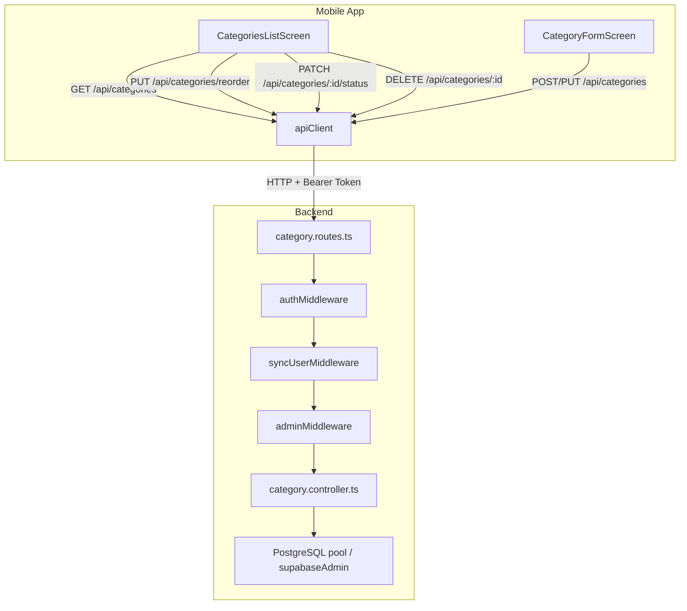

# Design Document: Categories CRUD

## Overview

Este módulo implementa o gerenciamento completo de categorias (CRUD) para o sistema de pedidos. As categorias organizam os itens do cardápio em grupos lógicos e são gerenciadas exclusivamente por administradores. A implementação segue os mesmos padrões arquiteturais já estabelecidos no módulo de itens do cardápio (menu items CRUD), incluindo: controller direto com validação Zod, acesso via `pool` (pg) e `supabaseAdmin`, middleware de role `adminMiddleware`, e telas React Native com Expo Router.

### Decisões de Design

1. **Sem camada de service separada para categorias**: O módulo de menu items usa controller direto sem service layer. Categorias seguirão o mesmo padrão por simplicidade e consistência — a lógica de negócio é simples o suficiente para ficar no controller.
2. **Uso de `pool` (pg) para queries complexas e `supabaseAdmin` para operações simples**: Seguindo o padrão do menu controller que usa ambos.
3. **Migração para adicionar coluna `status`**: A tabela `categories` atual não possui coluna `status`. Uma nova migração adicionará `status TEXT NOT NULL DEFAULT 'ativo' CHECK (status IN ('ativo', 'inativo'))`.
4. **Validação compartilhada via `@order-system/shared`**: Schemas Zod definidos no pacote shared para reutilização entre backend e frontend.
5. **Reordenação atômica via transação SQL**: O endpoint de reorder usa `BEGIN/COMMIT` para garantir atomicidade.

---

## Architecture



### Fluxo de Dados

1. **Request** → `authMiddleware` (valida JWT) → `syncUserMiddleware` (sync user no DB) → `adminMiddleware` (verifica role=admin) → `category.controller`
2. **Controller** valida input com Zod schema, executa lógica de negócio, interage com DB via `pool`/`supabaseAdmin`
3. **Response** retorna JSON padronizado com `statusCode`, `error`, `message` para erros

---

## Components and Interfaces

### Backend

#### Routes: `apps/backend/src/routes/category.routes.ts`

| Método | Rota | Handler | Descrição |
|--------|------|---------|-----------|
| GET | `/api/categories` | `listCategories` | Lista todas as categorias com contagem de itens |
| POST | `/api/categories` | `createCategory` | Cria nova categoria |
| PUT | `/api/categories/:id` | `updateCategory` | Atualiza nome da categoria |
| PUT | `/api/categories/reorder` | `reorderCategories` | Reordena todas as categorias |
| PATCH | `/api/categories/:id/status` | `toggleCategoryStatus` | Ativa/desativa categoria |
| DELETE | `/api/categories/:id` | `deleteCategory` | Exclui categoria |

Todos os endpoints utilizam a cadeia: `authMiddleware → syncUserMiddleware → adminMiddleware`.

#### Controller: `apps/backend/src/controllers/category.controller.ts`

Funções exportadas:
- `listCategories(req, res)` — Query com LEFT JOIN + COUNT em menu_items, ordenação por sort_order ASC, nome ASC
- `createCategory(req, res)` — Valida nome, verifica unicidade (ILIKE), calcula sort_order, insere
- `updateCategory(req, res)` — Valida nome, verifica existência, verifica unicidade excluindo self, atualiza
- `reorderCategories(req, res)` — Valida lista completa, atualiza sort_order em transação
- `toggleCategoryStatus(req, res)` — Verifica existência, valida transição, guarda com contagem de itens ativos
- `deleteCategory(req, res)` — Verifica existência, guarda com contagem de itens, remove

### Shared Package

#### Types: `packages/shared/src/types/category.ts`

```typescript
export type CategoryStatus = 'ativo' | 'inativo';

export interface Category {
  id: string;
  name: string;
  sortOrder: number;
  status: CategoryStatus;
  itemCount: number;
  createdAt: string;
}

export interface CreateCategoryRequest {
  name: string;
}

export interface UpdateCategoryRequest {
  name: string;
}

export interface ReorderCategoriesRequest {
  categoryIds: string[];
}
```

#### Validators: `packages/shared/src/validators/category.validator.ts`

```typescript
import { z } from 'zod';

export const createCategoryRequestSchema = z.object({
  name: z.string()
    .min(1, 'Nome é obrigatório')
    .max(100, 'Nome deve ter entre 1 e 100 caracteres')
    .transform((s) => s.trim())
    .refine((s) => s.length >= 1, 'Nome deve ter entre 1 e 100 caracteres'),
});

export const updateCategoryRequestSchema = z.object({
  name: z.string()
    .min(1, 'Nome é obrigatório')
    .max(100, 'Nome deve ter entre 1 e 100 caracteres')
    .transform((s) => s.trim())
    .refine((s) => s.length >= 1, 'Nome deve ter entre 1 e 100 caracteres'),
});

export const reorderCategoriesRequestSchema = z.object({
  categoryIds: z.array(z.string().uuid()).min(1, 'Lista de categorias não pode estar vazia'),
});
```

### Mobile App

#### Service Layer: `apps/mobile/src/services/types.ts` (adições)

```typescript
// Adições ao ApiClient interface
getCategories(): Promise<Category[]>;
createCategory(data: CreateCategoryRequest): Promise<Category>;
updateCategory(id: string, data: UpdateCategoryRequest): Promise<Category>;
reorderCategories(data: ReorderCategoriesRequest): Promise<Category[]>;
toggleCategoryStatus(id: string, action: 'activate' | 'deactivate'): Promise<Category>;
deleteCategory(id: string): Promise<void>;
```

#### Screens

| Tela | Arquivo | Descrição |
|------|---------|-----------|
| Lista | `src/screens/CategoriesListScreen.tsx` | Lista com drag-and-drop, toggles, botão criar |
| Criar | `src/screens/CategoryFormScreen.tsx` | Formulário com campo nome (reutilizado para edição) |

#### Navigation

- Rota: `app/categories-list.tsx` → renderiza `CategoriesListScreen`
- Rota: `app/category-form.tsx` → renderiza `CategoryFormScreen` (create/edit via params)
- Drawer item: "Categorias" com ícone `folder_open`, visível apenas para role `admin`
- Guard: redirecionamento para `/(tabs)` se role ≠ admin

---

## Data Models

### Tabela `categories` (após migração)

| Coluna | Tipo | Constraints | Descrição |
|--------|------|-------------|-----------|
| id | UUID | PK, DEFAULT gen_random_uuid() | Identificador único |
| name | TEXT | NOT NULL, UNIQUE | Nome da categoria |
| sort_order | INT | NOT NULL, DEFAULT 0 | Posição de exibição |
| status | TEXT | NOT NULL, DEFAULT 'ativo', CHECK IN ('ativo','inativo') | Status ativo/inativo |
| created_at | TIMESTAMPTZ | NOT NULL, DEFAULT NOW() | Data de criação |

### Migração necessária: `012_add_category_status.sql`

```sql
-- Migration 012: Add status column to categories
ALTER TABLE categories
  ADD COLUMN IF NOT EXISTS status TEXT NOT NULL DEFAULT 'ativo'
  CHECK (status IN ('ativo', 'inativo'));
```

### Relacionamentos

- `menu_items.category_id` → `categories.id` (FK existente)
- A contagem de itens é derivada via JOIN, não armazenada

### Impacto no endpoint GET /api/menu existente

O endpoint de listagem do cardápio (`getMenu` em `menu.controller.ts`) deve ser atualizado para filtrar categorias inativas quando `showAll !== 'true'`:

```sql
-- Adição de filtro: WHERE c.status = 'ativo' (quando não showAll)
WHERE mi.status = 'ativo' AND c.status = 'ativo'
```

---

## Correctness Properties

*A property is a characteristic or behavior that should hold true across all valid executions of a system — essentially, a formal statement about what the system should do. Properties serve as the bridge between human-readable specifications and machine-verifiable correctness guarantees.*

### Property 1: Ordering invariant

*For any* set of categories returned by the list endpoint, the categories SHALL be sorted by sort_order in ascending order; for any two categories with equal sort_order, they SHALL be sorted by name in ascending alphabetical order.

**Validates: Requirements 1.2**

### Property 2: Name validation

*For any* string submitted as category name (on create or update), if the string after trimming leading/trailing whitespace has length < 1 or > 100, or consists entirely of whitespace characters, the system SHALL reject the request with HTTP 422.

**Validates: Requirements 2.3, 3.4**

### Property 3: Name uniqueness

*For any* two distinct categories in the system, their names (after trim, compared case-insensitively) SHALL be different. On creation, a duplicate name yields HTTP 409. On update, a name matching another category (excluding self) yields HTTP 409, but submitting the category's own current name (in any case variant) SHALL succeed.

**Validates: Requirements 2.2, 3.2, 3.6**

### Property 4: Creation assigns correct defaults

*For any* valid category name, upon successful creation the resulting category SHALL have: name equal to the trimmed input, sort_order equal to (max existing sort_order + 1) or 0 if no categories exist, and status equal to 'ativo'.

**Validates: Requirements 2.1**

### Property 5: Reorder assigns position-based sort_order

*For any* valid permutation of all existing category IDs submitted to the reorder endpoint, after successful processing, each category's sort_order SHALL equal its zero-based index position in the submitted list.

**Validates: Requirements 4.1**

### Property 6: Reorder list completeness

*For any* list of category IDs submitted to the reorder endpoint, if the list contains duplicate IDs, or does not contain exactly all existing category IDs (missing or extra), the system SHALL reject the request with HTTP 422.

**Validates: Requirements 4.2, 4.5**

### Property 7: Deactivation guard

*For any* category, deactivation SHALL succeed if and only if the category has status 'ativo' AND has zero menu items with status 'ativo'. If the category has at least one active menu item, deactivation SHALL be rejected with HTTP 422.

**Validates: Requirements 5.1, 5.2**

### Property 8: Inactive categories excluded from public menu

*For any* set of categories where some have status 'inativo', the public menu endpoint (GET /api/menu without ?all=true) SHALL never include items grouped under an inactive category name in its response.

**Validates: Requirements 5.7**

### Property 9: Deletion guard

*For any* category, deletion SHALL succeed if and only if the category has zero associated menu items (regardless of item status). If the category has at least one associated menu item, deletion SHALL be rejected with HTTP 422.

**Validates: Requirements 6.1, 6.2**

### Property 10: Access control

*For any* authenticated user with role 'atendente' or 'preparador', any request to any category management endpoint (list, create, update, reorder, toggle status, delete) SHALL be rejected with HTTP 403.

**Validates: Requirements 7.1**

---

## Error Handling

### Padrão de Resposta de Erro

Todas as respostas de erro seguem o formato existente:

```json
{
  "statusCode": 422,
  "error": "VALIDATION_ERROR",
  "message": "Nome deve ter entre 1 e 100 caracteres"
}
```

### Tabela de Erros

| HTTP | Código | Mensagem | Contexto |
|------|--------|----------|----------|
| 401 | UNAUTHORIZED | Token de autenticação não fornecido / Token inválido ou expirado | Sem token ou token inválido |
| 403 | FORBIDDEN | Acesso restrito a administradores | Role ≠ admin |
| 404 | NOT_FOUND | Categoria não encontrada | ID inexistente em update/delete/toggle |
| 409 | CONFLICT | Já existe uma categoria com este nome | Nome duplicado case-insensitive |
| 422 | VALIDATION_ERROR | Nome é obrigatório | Campo name ausente |
| 422 | VALIDATION_ERROR | Nome deve ter entre 1 e 100 caracteres | Nome vazio/whitespace/longo |
| 422 | VALIDATION_ERROR | Lista contém categorias duplicadas | IDs repetidos no reorder |
| 422 | VALIDATION_ERROR | Categoria não encontrada na lista | ID inválido no reorder |
| 422 | VALIDATION_ERROR | A lista deve conter todas as categorias | Lista incompleta no reorder |
| 422 | VALIDATION_ERROR | Lista de categorias não pode estar vazia | Lista vazia no reorder |
| 422 | VALIDATION_ERROR | Categoria possui itens ativos. Desative os itens antes de desativar a categoria | Desativar com itens ativos |
| 422 | VALIDATION_ERROR | Categoria já está inativa | Desativar categoria já inativa |
| 422 | VALIDATION_ERROR | Categoria já está ativa | Reativar categoria já ativa |
| 422 | VALIDATION_ERROR | Categoria possui itens associados. Mova ou exclua os itens antes de excluir a categoria | Deletar com itens |
| 500 | INTERNAL_ERROR | Erro ao processar requisição | Erro inesperado |

### Tratamento no Mobile

- **Loading state**: `ActivityIndicator` durante fetch
- **Error state**: Mensagem de erro + botão "Tentar novamente"
- **Optimistic updates**: Reorder aplica visualmente e reverte em caso de erro
- **Form preservation**: Em caso de erro na criação/edição, formulário mantém dados preenchidos
- **Toast/Alert**: Erros de toggle e delete exibidos via Alert nativo

---

## Testing Strategy

### Property-Based Tests (fast-check + vitest)

O projeto já utiliza `fast-check` v4.9+ com `vitest` para testes de propriedade. Cada property test deve executar no mínimo 100 iterações.

**Configuração**: `numRuns: 100` em cada `fc.assert()`

**Testes de Propriedade a implementar:**

| # | Property | Arquivo |
|---|----------|---------|
| 1 | Ordering invariant | `category-ordering.property.test.ts` |
| 2 | Name validation | `category-name-validation.property.test.ts` |
| 3 | Name uniqueness | `category-uniqueness.property.test.ts` |
| 4 | Creation defaults | `category-creation.property.test.ts` |
| 5 | Reorder sort_order | `category-reorder.property.test.ts` |
| 6 | Reorder list completeness | `category-reorder-validation.property.test.ts` |
| 7 | Deactivation guard | `category-deactivation-guard.property.test.ts` |
| 8 | Inactive excluded from menu | `category-inactive-filter.property.test.ts` |
| 9 | Deletion guard | `category-deletion-guard.property.test.ts` |
| 10 | Access control | `category-access-control.property.test.ts` |

**Tag format**: `Feature: categories-crud, Property {N}: {title}`

### Unit Tests (example-based)

| Cenário | Tipo |
|---------|------|
| Lista vazia exibe empty state | Example |
| Erro de API exibe retry button | Example |
| Formulário pre-preenche nome na edição | Example |
| Diálogo de confirmação de exclusão | Example |
| Cancelar exclusão não dispara API | Example |
| Drawer oculta "Categorias" para não-admin | Example |
| Deep link redireciona não-admin para pedidos | Example |
| Campo name ausente retorna 422 | Edge case |
| ID inexistente retorna 404 | Edge case |
| Lista vazia no reorder retorna 422 | Edge case |
| Desativar categoria já inativa retorna 422 | Edge case |
| Reativar categoria já ativa retorna 422 | Edge case |

### Estratégia de Mocking

- **Backend tests**: Mocks de `pool.query()` e `supabaseAdmin` para simular diferentes estados do banco
- **Mobile tests**: Mock do `apiClient` para simular respostas de sucesso e erro
- **Generators (fast-check)**: Geradores de nomes válidos/inválidos, listas de IDs, conjuntos de categorias com itens
