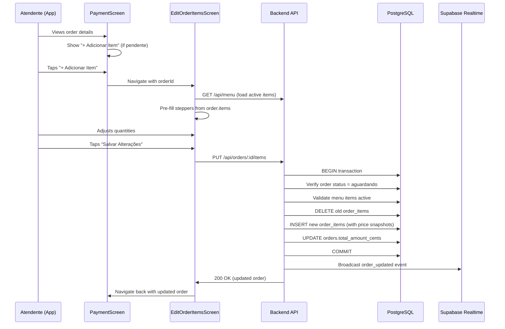
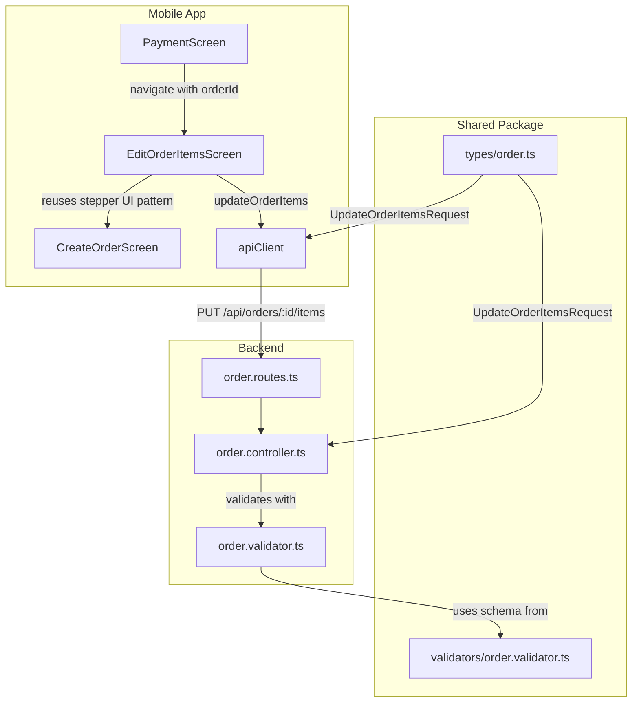

# Design Document: Edit Order Items

## Overview

This feature adds the ability to edit items in an existing order that is still in `aguardando` (waiting) status. Currently, the "+ Adicionar Item" button on the PaymentScreen navigates to a new order creation flow. This design replaces that behavior with an in-place editing flow that reuses the menu item selection UI (steppers) from CreateOrderScreen.

The feature spans three layers:
1. **Backend**: New PUT endpoint `PUT /api/orders/:id/items` to atomically replace order items
2. **Mobile**: New EditOrderItemsScreen reusing stepper components, updated PaymentScreen navigation and button visibility logic
3. **Shared**: New `UpdateOrderItemsRequest` type and `updateOrderItemsRequestSchema` Zod validator

Key design decisions:
- **Full replacement strategy**: The endpoint receives the complete list of desired items and replaces all existing order_items in a single transaction. This avoids complex add/remove/patch semantics and matches the UI where the user sees all items at once.
- **Reuse CreateOrderScreen UI**: The EditOrderItemsScreen reuses the same category-grouped stepper layout, only hiding customer name/origin fields and changing the header and button text.
- **Conditional button visibility**: The "+ Adicionar Item" button is hidden when `paymentStatus === 'pago'`, not just disabled. Realtime events update the state reactively.

## Architecture



### Component Relationship



## Components and Interfaces

### Backend

#### New Route
```
PUT /api/orders/:id/items
```
Added to `order.routes.ts` following existing patterns with `authMiddleware` and `syncUserMiddleware`.

#### New Controller Function: `updateOrderItems`
Location: `apps/backend/src/controllers/order.controller.ts`

Responsibilities:
1. Validate request body with `updateOrderItemsRequestSchema`
2. Look up order by ID, return 404 if not found
3. Check order status is `aguardando`, return 422 if not
4. Validate all menu items exist and are active
5. Check for duplicate menuItemIds, return 422 if found
6. Execute transaction: delete old items → insert new items → update total
7. Broadcast `order_updated` event on `orders:queue` channel
8. Return 200 with updated order (same shape as createOrder response)

### Shared Package

#### New Type: `UpdateOrderItemsRequest`
```typescript
export interface UpdateOrderItemsRequest {
  items: { menuItemId: string; quantity: number }[];
}
```

#### New Validator: `updateOrderItemsRequestSchema`
```typescript
export const updateOrderItemsRequestSchema = z.object({
  items: z
    .array(
      z.object({
        menuItemId: z.string().uuid(),
        quantity: z.number().int().min(1).max(99),
      })
    )
    .min(1)
    .max(50)
    .refine(
      (items) => new Set(items.map(i => i.menuItemId)).size === items.length,
      { message: 'Itens duplicados não são permitidos' }
    ),
});
```

### Mobile App

#### New ApiClient Method
```typescript
interface ApiClient {
  // ... existing methods
  updateOrderItems(orderId: string, data: UpdateOrderItemsRequest): Promise<Order>;
}
```

#### EditOrderItemsScreen
Location: `apps/mobile/src/screens/EditOrderItemsScreen.tsx`

Props: Receives `orderId` from navigation params.

Behavior:
1. On mount: loads menu (via `apiClient.getMenu()`) and resolves order data from navigation/context
2. Pre-fills stepper quantities from `order.items` (only for active menu items)
3. Shows header "Editar Itens" (no customer name or origin fields)
4. Shows real-time total calculation
5. "Salvar Alterações" button sends `PUT /api/orders/:id/items`
6. On success: navigates back to PaymentScreen with updated data
7. On error: shows error message inline

#### PaymentScreen Updates
1. Hide "+ Adicionar Item" when `paymentStatus === 'pago'` (currently always shown)
2. Change navigation target from `/(tabs)/new-order` to the EditOrderItemsScreen route passing `orderId`
3. Subscribe to Realtime payment events to reactively hide button

## Data Models

### Database (no schema changes needed)

The existing tables are sufficient:

**orders table** (existing):
- `id` UUID PK
- `daily_number` INT
- `customer_name` TEXT
- `origin` TEXT
- `status` TEXT (aguardando | preparando | pronto | entregue)
- `payment_status` TEXT (pendente | pago)
- `payment_method` TEXT
- `total_amount_cents` INT
- `order_date` DATE
- `created_at` TIMESTAMPTZ
- `started_at`, `ready_at`, `delivered_at`, `paid_at` TIMESTAMPTZ

**order_items table** (existing):
- `id` UUID PK
- `order_id` UUID FK → orders
- `menu_item_id` UUID FK → menu_items
- `item_name` TEXT (snapshot)
- `unit_price_cents` INT (snapshot)
- `quantity` INT

### Request/Response Shapes

**Request**: `PUT /api/orders/:id/items`
```json
{
  "items": [
    { "menuItemId": "uuid-1", "quantity": 2 },
    { "menuItemId": "uuid-2", "quantity": 1 }
  ]
}
```

**Response** (200): Same shape as existing order responses:
```json
{
  "id": "uuid",
  "dailyNumber": 5,
  "customerName": "Maria",
  "origin": "presencial",
  "status": "aguardando",
  "paymentStatus": "pendente",
  "totalAmountCents": 2500,
  "orderDate": "2024-01-15",
  "createdAt": "...",
  "items": [
    {
      "id": "item-uuid",
      "menuItemId": "uuid-1",
      "itemName": "Pastel de Carne",
      "unitPriceCents": 800,
      "quantity": 2
    }
  ]
}
```

**Error responses** (existing pattern):
```json
{
  "statusCode": 422,
  "error": "VALIDATION_ERROR",
  "message": "Pedido só pode ser editado no status aguardando"
}
```

### Realtime Event

Channel: `orders:queue`
Event: `order_updated`
Payload: Full updated order object (same shape as response)


## Correctness Properties

*A property is a characteristic or behavior that should hold true across all valid executions of a system—essentially, a formal statement about what the system should do. Properties serve as the bridge between human-readable specifications and machine-verifiable correctness guarantees.*

### Property 1: Total Calculation Invariant

*For any* valid set of order items (each with a menuItemId referencing an active menu item and a quantity between 1 and 99), when the items are submitted to the update endpoint for an order in `aguardando` status, the returned `totalAmountCents` SHALL equal the sum of (current `price_cents` from menu_items × quantity) for each submitted item, and each returned item SHALL have `unitPriceCents` equal to the current menu item price at the time of the request.

**Validates: Requirements 1.1, 5.2**

### Property 2: Status Guard

*For any* order whose status is NOT `aguardando` (i.e., `preparando`, `pronto`, or `entregue`) and *for any* valid item list, submitting an update items request SHALL be rejected with HTTP 422, and the order's items and total SHALL remain unchanged.

**Validates: Requirements 1.2, 5.3**

### Property 3: Schema Validation Rejects Invalid Inputs

*For any* items array that violates at least one of: (a) length < 1, (b) length > 50, (c) any item with quantity < 1 or quantity > 99, (d) any item with a non-UUID menuItemId, or (e) duplicate menuItemIds, the `updateOrderItemsRequestSchema` SHALL reject the input (return `success: false`).

**Validates: Requirements 1.3, 1.6, 1.8**

### Property 4: Invalid Menu Items Cause Atomic Rejection

*For any* order in `aguardando` status and *for any* items list containing at least one menuItemId that either does not exist in the menu_items table or references an inactive item, the update request SHALL be rejected with HTTP 422, and the order's existing items and total SHALL remain completely unchanged.

**Validates: Requirements 1.4, 5.4**

### Property 5: Transaction Atomicity on Failure

*For any* valid update request where a database error occurs during the transaction (after BEGIN but before COMMIT), the order's items and total SHALL remain identical to their state before the request was made (rollback guarantee).

**Validates: Requirements 5.1, 5.5**

### Property 6: Stepper Initialization Reflects Active Order Items

*For any* order containing a list of items, and *for any* menu state where some items may be active and others inactive, when the EditOrderItemsScreen initializes, the stepper quantities SHALL match the order's item quantities ONLY for items whose referenced menu item is currently active, and inactive items SHALL not appear in the stepper list.

**Validates: Requirements 3.2, 3.6**

## Error Handling

### Backend Error Responses

| Scenario | HTTP Status | Error Code | Message |
|----------|------------|------------|---------|
| Order not found | 404 | NOT_FOUND | "Pedido não encontrado" |
| Order status ≠ aguardando | 422 | VALIDATION_ERROR | "Pedido só pode ser editado no status aguardando" |
| Empty items or >50 items | 422 | VALIDATION_ERROR | "A lista deve conter entre 1 e 50 itens" |
| Quantity out of range | 422 | VALIDATION_ERROR | "Quantidade deve ser entre 1 e 99" |
| Menu item not found/inactive | 422 | VALIDATION_ERROR | "Item não encontrado ou inativo" |
| Duplicate menuItemIds | 422 | VALIDATION_ERROR | "Itens duplicados não são permitidos" |
| Database transaction failure | 500 | INTERNAL_ERROR | "Erro ao atualizar itens do pedido." |
| Realtime broadcast failure | — | — | Logged server-side, does not affect response |

### Mobile Error Handling

- **Menu load failure**: Show "Erro ao carregar cardápio" message, disable steppers
- **Order data not available**: Show error, prevent interaction
- **Update request failure**: Show backend error message inline below the save button, keep user on edit screen
- **No items selected**: Show "Adicione ao menos um item ao pedido" inline, prevent submit
- **Network timeout**: Show generic error, allow retry

### Error Response Format

Follows existing backend error format:
```json
{
  "statusCode": number,
  "error": "ERROR_CODE",
  "message": "Human-readable message in Portuguese"
}
```

## Testing Strategy

### Property-Based Tests (fast-check, minimum 100 iterations each)

Property-based testing is appropriate for this feature because:
- The core logic involves pure computations (total calculation, validation)
- The input space is large (arbitrary item combinations, quantities, prices)
- Universal properties hold across all valid inputs

**Library**: `fast-check` (already used in the project)
**Location**: `apps/backend/src/__tests__/properties/`
**Configuration**: 100+ iterations per property, following existing test patterns

| Property | Test File | Description |
|----------|-----------|-------------|
| Property 1 | `edit-order-total.property.test.ts` | Verifies total calculation with random item/price combinations |
| Property 2 | `edit-order-status-guard.property.test.ts` | Verifies rejection for non-aguardando statuses |
| Property 3 | `edit-order-validation.property.test.ts` | Verifies schema rejects all invalid input variants |
| Property 4 | `edit-order-invalid-items.property.test.ts` | Verifies atomic rejection when menu items are invalid |
| Property 5 | `edit-order-atomicity.property.test.ts` | Verifies rollback on DB failure (uses mocked pool) |
| Property 6 | `edit-order-stepper-init.property.test.ts` | Verifies stepper initialization filtering logic |

Each test tagged with: `Feature: edit-order, Property {N}: {property_text}`

### Unit Tests (example-based)

| Test | Description |
|------|-------------|
| Update items happy path | Specific example with 2 items, verifies full response shape |
| Order not found returns 404 | Specific UUID that doesn't exist |
| Button visibility: pendente shows button | Render test |
| Button visibility: pago hides button | Render test |
| Navigation passes orderId | Verify router.push params |
| Header shows "Editar Itens" | Render test |
| No customer name/origin fields shown | Render test |
| Loading state during submit | UI state test |
| Error display on failure | Mock API error, verify message shown |

### Integration Tests

| Test | Description |
|------|-------------|
| Realtime event broadcast | Verify Supabase channel receives `order_updated` after successful update |
| Realtime payment event hides button | Simulate realtime event, verify button disappears |
| Full flow: edit → save → verify DB | End-to-end with real DB |
