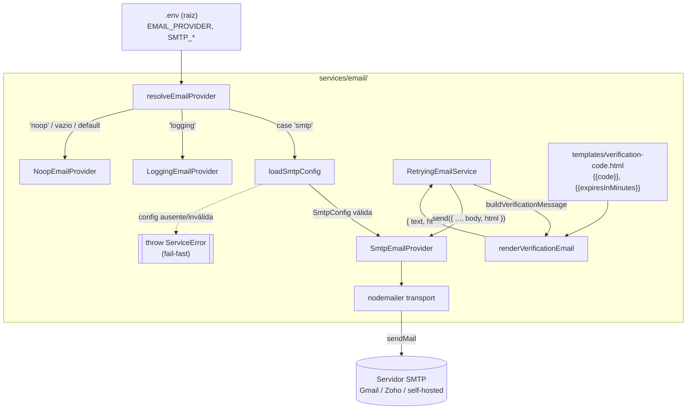
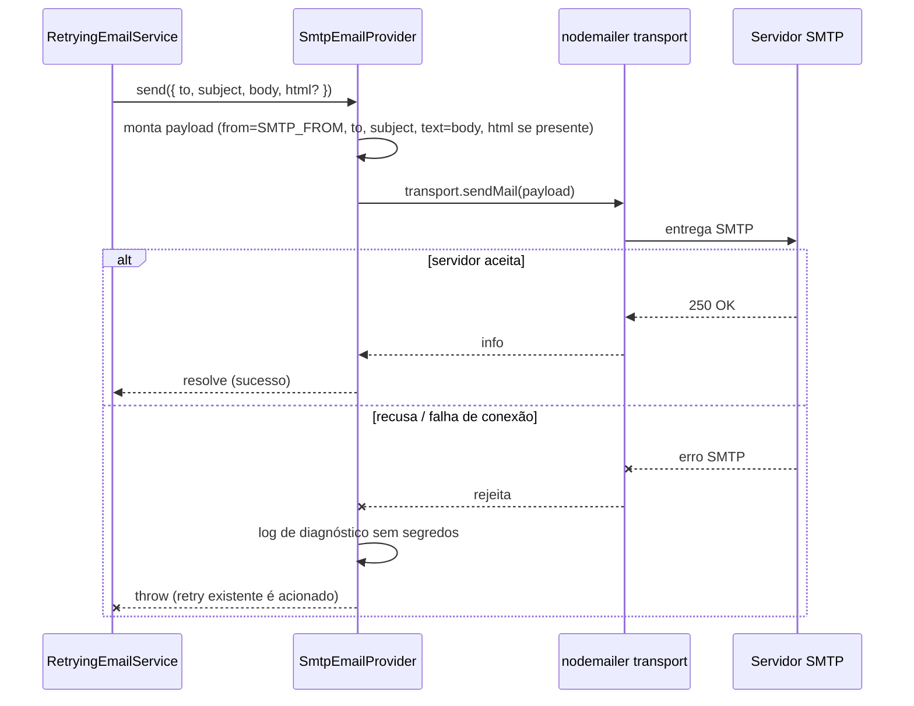

# Design Document

## Overview

Esta feature adiciona um provedor de e-mail **real** ao backend do sistema de pedidos: o `Provedor_SMTP`, uma implementação concreta do contrato `EmailProvider` (já existente em `apps/backend/src/services/email/email.service.ts`) que entrega mensagens através de qualquer servidor SMTP (Gmail, Zoho, self-hosted, etc.) usando a biblioteca [`nodemailer`](https://nodemailer.com/).

Hoje o `EmailService` só dispõe de provedores placeholder (`NoopEmailProvider`, que descarta; `LoggingEmailProvider`, que apenas registra em log). O `Provedor_SMTP` é selecionado por `EMAIL_PROVIDER=smtp` e passa a fazer a entrega efetiva dos códigos de verificação da feature forgot-password.

O desenho respeita rigorosamente as convenções do monorepo e as fronteiras já estabelecidas:

Além da entrega SMTP, esta feature adiciona **envio multipart** do e-mail de verificação: uma versão em **HTML** (renderizada de um arquivo de template) e uma versão em **texto puro** como fallback. O `nodemailer` envia ambas via os campos `html` e `text`; clientes sem suporte a HTML recaem no texto.

- **Assinaturas inalteradas:** `Provedor_SMTP` implementa `EmailProvider.send(message): Promise<void>` — exatamente **uma** tentativa por chamada, lançando erro em falha. Toda a orquestração de retry (até 3 tentativas, ≥ 2s entre elas) e o envio assíncrono (fire-and-forget) já construídos em `RetryingEmailService` continuam valendo sem qualquer alteração.
- **Extensão retrocompatível da `EmailMessage`:** para transportar o HTML sem redesenhar o contrato, a `EmailMessage` ganha um campo **opcional** `html?: string`. Isso mantém estáveis as assinaturas de método de `EmailProvider`/`EmailService` (R5.3) e é retrocompatível: `NoopEmailProvider`/`LoggingEmailProvider` ignoram o campo e mensagens somente-texto continuam válidas. `EmailService`, `EmailProvider` e `RetryingEmailService` não mudam de assinatura; a única mudança estrutural é esse campo opcional.

**Nota sobre `ServiceError` (forward-looking):** o backend ainda não possui um módulo compartilhado de erros — cada serviço declara sua própria classe `ServiceError` local (ver `user.service.ts`, `order.service.ts`, `password-reset.service.ts`). Esta feature segue essa convenção e mantém uma `ServiceError` **local** no módulo de e-mail. Isso é **intencional por ora**; uma spec futura irá centralizar `ServiceError` em um módulo compartilhado do backend, momento em que o módulo de e-mail deverá passar a importá-la. Até lá, a duplicação é deliberada e aceita.
- **Configuração por ambiente:** a `Configuracao_SMTP` vem da `.env` da raiz (carregada via `--env-file=../../.env` nos scripts do `apps/backend` e via `docker-compose` no container). Nenhum código específico por provedor é necessário; validar a entrega real é uma questão de ajustar as variáveis `SMTP_*` e definir `EMAIL_PROVIDER=smtp`.
- **Erros no estilo `ServiceError`:** falhas de configuração usam o padrão de erro do backend, com mensagens em pt-BR.
- **ESM com sufixo `.js` nos imports**, como no restante de `apps/backend`.

**Decisão de projeto central — fail-fast na configuração (R2.3, R2.5):** quando `EMAIL_PROVIDER=smtp` mas a `Configuracao_SMTP` está ausente, incompleta ou inválida (porta fora de faixa, por exemplo), o backend **falha explicitamente na inicialização** — o construtor do `Provedor_SMTP`/o carregador de configuração lança um erro que impede o serviço de subir. **Não** há fallback silencioso para `NoopEmailProvider`. A motivação é visibilidade imediata: um SMTP mal configurado é um erro operacional que deve ser corrigido antes de o serviço aceitar tráfego, e não descoberto tardiamente por e-mails que nunca chegam.

Esta é uma feature de **backend/infraestrutura**: não há nova interface de usuário.

## Architecture

### Componentes



### Fluxo de inicialização (seleção do provedor)

```mermaid
sequenceDiagram
    participant BOOT as Boot do backend
    participant R as resolveEmailProvider
    participant L as loadSmtpConfig
    participant P as SmtpEmailProvider

    BOOT->>R: resolveEmailProvider(process.env.EMAIL_PROVIDER)
    alt EMAIL_PROVIDER == "smtp" (case-insensitive)
        R->>L: loadSmtpConfig(process.env)
        alt variáveis obrigatórias presentes e válidas
            L-->>R: SmtpConfig
            R->>P: new SmtpEmailProvider(config)
            P->>P: nodemailer.createTransport(...)
            P-->>R: instância
            R-->>BOOT: EmailProvider (SMTP)
        else ausente / incompleta / inválida
            L--xBOOT: throw ServiceError (fail-fast; backend não sobe)
        end
    else "logging" / "noop" / vazio / desconhecido
        R-->>BOOT: LoggingEmailProvider / NoopEmailProvider (inalterado)
    end
```

### Fluxo de envio (contrato `EmailProvider`)



### Camadas e responsabilidades

| Camada | Arquivo | Responsabilidade |
| --- | --- | --- |
| Config loader | `services/email/smtp-config.ts` (novo) | Ler e validar `SMTP_*` de `process.env`; retornar `SmtpConfig` tipada ou lançar `ServiceError` (fail-fast). |
| Provider | `services/email/smtp-email.provider.ts` (novo) | Classe `SmtpEmailProvider implements EmailProvider`; encapsula o transport `nodemailer` e implementa `send` (mapeando `body`→`text` e `html`→`html` quando presente). |
| Template (HTML) | `services/email/templates/verification-code.html` (novo) | Arquivo de layout genérico da plataforma com placeholders `{{code}}` e `{{expiresInMinutes}}`. |
| Renderizador | `services/email/templates/verification-email.ts` (novo) | Função `renderVerificationEmail(code)` que lê o template, escapa e substitui placeholders, e retorna `{ text, html }` (o `text` reusa `buildVerificationBody`). |
| Montagem da mensagem | `services/email/email.service.ts` (extensão) | `buildVerificationMessage` passa a incluir também `html` (via `renderVerificationEmail`), preenchendo `body` (texto) e `html`. |
| Seleção | `services/email/email.service.ts` (extensão) | Adicionar `case 'smtp'` em `resolveEmailProvider`; manter `logging`/`noop`/default inalterados. |
| Documentação | `.env.example` (extensão) | Documentar `EMAIL_PROVIDER` e as seis variáveis `SMTP_*` com placeholders seguros e exemplo Gmail. |
| Dependência | `apps/backend/package.json` | Adicionar `nodemailer` (runtime) e `@types/nodemailer` (dev), com versões fixadas. |

**Fronteira preservada:** nenhuma assinatura de método de `EmailProvider`/`EmailService`/`RetryingEmailService` muda. As alterações em código existente são: (1) o acréscimo do campo opcional `html?: string` à interface `EmailMessage`; (2) o enriquecimento de `buildVerificationMessage` para incluir o `html` renderizado; e (3) o acréscimo de um `case 'smtp'` no `switch` de `resolveEmailProvider`. Todas retrocompatíveis.

## Components and Interfaces

### Backend — Config loader (`src/services/email/smtp-config.ts`)

Carregador tipado que lê a `Configuracao_SMTP` de `process.env` e faz a validação fail-fast. As variáveis obrigatórias são `SMTP_HOST`, `SMTP_PORT`, `SMTP_USER`, `SMTP_PASS`, `SMTP_FROM`. `SMTP_SECURE` é opcional (default `false`) e interpretada como booleano.

O backend não possui um módulo compartilhado de erros: cada serviço declara sua própria classe `ServiceError extends Error` (com `statusCode` e `code`), como em `user.service.ts`, `order.service.ts` e `password-reset.service.ts`. Seguindo essa convenção, o módulo de e-mail declara sua própria `ServiceError` **local** em `smtp-config.ts` — sem importar de nenhum módulo compartilhado (que não existe). Conforme a nota forward-looking na Overview, essa localidade é intencional por ora; uma spec futura centralizará `ServiceError` no backend.

```typescript
/** Mesmo formato de ServiceError usado nos demais serviços do backend. */
export class ServiceError extends Error {
  constructor(
    message: string,
    public readonly statusCode: number,
    public readonly code: string,
  ) { super(message); this.name = 'ServiceError'; }
}

export interface SmtpConfig {
  host: string;
  port: number;        // 1..65535
  user: string;
  pass: string;
  from: string;
  secure: boolean;     // true = TLS implícito (porta 465); false = STARTTLS (587)
}

/**
 * Lê e valida a Configuracao_SMTP a partir do ambiente.
 * Fail-fast: lança ServiceError (pt-BR) se qualquer variável obrigatória
 * estiver ausente, vazia ou inválida. NÃO faz fallback para Noop.
 */
export function loadSmtpConfig(env: NodeJS.ProcessEnv = process.env): SmtpConfig;
```

Regras de validação (todas produzem `ServiceError` com `statusCode` e `code` `SMTP_CONFIG_ERROR` e mensagem em pt-BR):

- **Obrigatórias ausentes/vazias:** `SMTP_HOST`, `SMTP_USER`, `SMTP_PASS`, `SMTP_FROM` não podem ser `undefined`, `''` ou apenas espaços em branco (R2.3).
- **Porta:** `SMTP_PORT` deve ser inteiro; após `Number.parseInt`, precisa estar em `1..65535`. Não numérico ou fora de faixa → erro fail-fast em pt-BR (R2.5).
- **Secure:** `SMTP_SECURE` é interpretada de forma tolerante: `'true'`/`'1'` → `true`; `'false'`/`'0'`/ausente → `false`. Qualquer outro valor não vazio é rejeitado com erro em pt-BR (evita configuração ambígua).

Exemplos de mensagens (pt-BR):

- `Configuração SMTP inválida: a variável SMTP_HOST é obrigatória e não pode estar vazia.`
- `Configuração SMTP inválida: SMTP_PORT deve ser um número de porta válido entre 1 e 65535.`

### Backend — Extensão da `EmailMessage` (`src/services/email/email.service.ts`)

A interface `EmailMessage` recebe um campo **opcional** `html?: string`. Extensão retrocompatível: provedores existentes ignoram o campo e mensagens somente-texto continuam válidas (R5.3).

```typescript
export interface EmailMessage {
  to: string;
  subject: string;
  body: string;       // corpo em texto puro (fallback SEMPRE presente)
  html?: string;      // corpo HTML opcional (multipart quando presente)
}
```

### Backend — Template e Renderizador (`src/services/email/templates/`)

O e-mail de verificação passa a ter uma versão HTML, renderizada de um arquivo de template genérico da plataforma. **Sem branding por tenant.**

**Arquivo de template** (`templates/verification-code.html`) — layout genérico com placeholders no formato `{{nome}}`:

```html
<!doctype html>
<html lang="pt-BR">
  <body style="font-family: Arial, Helvetica, sans-serif; color: #222;">
    <h2>Redefinição de senha</h2>
    <p>Use o código abaixo para redefinir sua senha:</p>
    <p style="font-size: 28px; font-weight: bold; letter-spacing: 4px;">{{code}}</p>
    <p>Este código expira em {{expiresInMinutes}} minutos.</p>
    <p>Se você não solicitou a redefinição, ignore este e-mail.</p>
  </body>
</html>
```

**Renderizador** (`templates/verification-email.ts`) — lê o template, substitui os placeholders por valores **escapados** e devolve tanto o texto puro quanto o HTML:

```typescript
import { readFileSync } from 'node:fs';
import { fileURLToPath } from 'node:url';
import { buildVerificationBody } from '../email.service.js';

/** Minutos de validade do código, refletindo o Prazo_Validade (15 min). */
export const VERIFICATION_EXPIRES_IN_MINUTES = 15;

/** Escapa caracteres especiais de HTML nos valores substituídos (R6.6). */
export function escapeHtml(value: string): string {
  return value
    .replace(/&/g, '&amp;')
    .replace(/</g, '&lt;')
    .replace(/>/g, '&gt;')
    .replace(/"/g, '&quot;')
    .replace(/'/g, '&#39;');
}

/** Substitui todas as ocorrências de {{key}} pelos valores escapados. */
function applyPlaceholders(template: string, values: Record<string, string>): string {
  return template.replace(/\{\{(\w+)\}\}/g, (_match, key: string) =>
    key in values ? escapeHtml(values[key]) : `{{${key}}}`,
  );
}

// Template lido do arquivo .html ao lado deste módulo.
const TEMPLATE_PATH = fileURLToPath(new URL('./verification-code.html', import.meta.url));
const TEMPLATE_HTML = readFileSync(TEMPLATE_PATH, 'utf8');

/**
 * Renderiza o e-mail de verificação em texto puro e HTML.
 * O texto reusa `buildVerificationBody` (fallback SEMPRE presente);
 * o HTML vem do template com {{code}} e {{expiresInMinutes}} substituídos.
 */
export function renderVerificationEmail(code: string): { text: string; html: string } {
  return {
    text: buildVerificationBody(code),
    html: applyPlaceholders(TEMPLATE_HTML, {
      code,
      expiresInMinutes: String(VERIFICATION_EXPIRES_IN_MINUTES),
    }),
  };
}
```

Observações de projeto:

- **Fallback sempre presente (R4.4):** `text` deriva de `buildVerificationBody` (inalterado), garantindo que a versão texto exista mesmo que o HTML falhe/seja ignorado.
- **Placeholders (R4.5):** `{{code}}` → Codigo_Verificacao; `{{expiresInMinutes}}` → `15`. Ambos aparecem no HTML; o texto já contém o código e "15 minutos" via `buildVerificationBody`.
- **Escaping (R6.6):** `applyPlaceholders` aplica `escapeHtml` a **todo** valor substituído. O código é numérico e seguro, mas o escaping é regra geral de robustez para qualquer valor futuro.
- **Template em arquivo, não inline (R4 / Template_Email):** o HTML vive em `verification-code.html`, lido uma vez na carga do módulo.

**Montagem da mensagem** — `buildVerificationMessage` passa a preencher também o `html`:

```typescript
export function buildVerificationMessage(to: string, code: string): EmailMessage {
  const { text, html } = renderVerificationEmail(code);
  return {
    to,
    subject: VERIFICATION_SUBJECT,
    body: text,   // texto puro via buildVerificationBody (fallback)
    html,         // HTML renderizado do template
  };
}
```

### Backend — SmtpEmailProvider (`src/services/email/smtp-email.provider.ts`)

```typescript
import nodemailer, { type Transporter } from 'nodemailer';
import type { EmailProvider, EmailMessage } from './email.service.js';
import type { SmtpConfig } from './smtp-config.js';

/**
 * Provedor de e-mail baseado em SMTP genérico (nodemailer).
 * Implementa o contrato EmailProvider: uma tentativa por chamada de send;
 * lança em falha para que o RetryingEmailService aplique a política de retry.
 */
export class SmtpEmailProvider implements EmailProvider {
  private readonly transport: Transporter;
  private readonly from: string;

  constructor(config: SmtpConfig) {
    this.from = config.from;
    this.transport = nodemailer.createTransport({
      host: config.host,
      port: config.port,
      secure: config.secure, // R2.4: true = TLS implícito; false = STARTTLS
      auth: { user: config.user, pass: config.pass },
    });
  }

  async send(message: EmailMessage): Promise<void> {
    try {
      await this.transport.sendMail({
        from: this.from,          // R3.4 / R4.1: remetente da Configuracao_SMTP
        to: message.to,           // preserva integralmente (R4.2)
        subject: message.subject, // preserva integralmente (R4.2)
        text: message.body,       // corpo em texto puro — fallback SEMPRE presente (R3.5, R4.2)
        // R3.5/R3.6: inclui a parte HTML apenas quando presente; caso contrário, somente-texto.
        ...(message.html ? { html: message.html } : {}),
      });
    } catch (err) {
      // Diagnóstico sem segredos (R6.1, R6.3): host + código/resposta SMTP quando houver.
      // NÃO loga SMTP_PASS, body, nem o código de verificação.
      logSmtpError(err, this.transportHostForLog());
      throw err; // propaga para acionar o retry existente (R3.3)
    }
  }
}
```

Observações de projeto:

- **Uma tentativa por chamada (R3.1):** `send` chama `transport.sendMail` exatamente uma vez. A repetição é responsabilidade exclusiva do `RetryingEmailService`.
- **Sucesso (R3.2, R4.3):** se `sendMail` resolve, `send` resolve — o `RetryingEmailService` considera a tentativa aceita e não repete.
- **Falha (R3.3):** qualquer rejeição/exceção de `sendMail` (recusa do servidor, timeout, DNS, auth) propaga como `throw`, disparando o retry.
- **Multipart HTML + texto (R3.5, R3.6, R4.2):** quando a `EmailMessage` traz `html`, o payload inclui `text` (fallback) **e** `html`, produzindo uma mensagem multipart; quando `html` está ausente, o envio é somente-texto (comportamento anterior). Assunto, corpo texto e corpo HTML vêm intactos da `EmailMessage` montada pelo `EmailService`; o provedor não os altera.
- **Reuso de transport:** o transport é criado uma vez no construtor e reutilizado entre envios (pool interno do `nodemailer`), evitando handshake TLS por mensagem.

### Backend — Integração no `resolveEmailProvider` (`src/services/email/email.service.ts`)

Única alteração em código existente. O `case 'smtp'` carrega a configuração e instancia o provedor; se `loadSmtpConfig` lançar, o erro propaga (fail-fast na inicialização, pois `resolveEmailProvider()` é chamado ao montar `emailService`).

```typescript
import { SmtpEmailProvider } from './smtp-email.provider.js';
import { loadSmtpConfig } from './smtp-config.js';

export function resolveEmailProvider(
  providerName: string | undefined = process.env.EMAIL_PROVIDER,
): EmailProvider {
  switch ((providerName ?? '').toLowerCase()) {
    case 'smtp':
      return new SmtpEmailProvider(loadSmtpConfig()); // fail-fast se config inválida
    case 'logging':
      return new LoggingEmailProvider();
    case 'noop':
    case '':
      return new NoopEmailProvider();
    default:
      console.warn(
        `[EmailService] EMAIL_PROVIDER "${providerName}" não reconhecido; usando NoopEmailProvider.`,
      );
      return new NoopEmailProvider();
  }
}
```

Os casos `logging`, `noop`, vazio e desconhecido permanecem **exatamente** como estão hoje (R1.2, R1.3, R1.4, R5.1, R5.2, R5.3).

### Dependência — `nodemailer`

- Adicionar `nodemailer` às `dependencies` e `@types/nodemailer` às `devDependencies` de `apps/backend/package.json`.
- **Versões fixadas** (exatas, sem `^`/`~`), coerente com a convenção do repo (ex.: `express`, `pg`, `zod` estão pinados). A versão exata é resolvida ao instalar; o design apenas exige o pin.

## Data Models

Esta feature **não introduz novas tabelas nem migrações**. Não há modelo de dados persistido: o `Provedor_SMTP` é stateless entre envios (o único estado é o transport `nodemailer` em memória) e o template é lido de um arquivo estático.

A `EmailMessage` existente é estendida de forma retrocompatível com o campo opcional `html?: string`:

```typescript
interface EmailMessage {
  to: string;
  subject: string;
  body: string;    // texto puro — fallback SEMPRE presente
  html?: string;   // HTML opcional (multipart quando presente)
}
```

O único "modelo" novo em memória é a estrutura de configuração SMTP:

```typescript
interface SmtpConfig {
  host: string;
  port: number;    // 1..65535
  user: string;
  pass: string;    // credencial — nunca logada
  from: string;
  secure: boolean;
}
```

## Correctness Properties

*A property is a characteristic or behavior that should hold true across all valid executions of a system — essentially, a formal statement about what the system should do. Properties serve as the bridge between human-readable specifications and machine-verifiable correctness guarantees.*

A maior parte desta feature é integração com um serviço externo (o servidor SMTP) e configuração de infraestrutura — território de testes de exemplo/integração, não de PBT. Ainda assim, três áreas têm lógica pura com espaço de entrada amplo e são adequadas a testes baseados em propriedades: o **carregador de configuração** (`loadSmtpConfig`), a **montagem do payload** a partir da `EmailMessage` e o **renderizador do e-mail de verificação** (`renderVerificationEmail`/`escapeHtml`). As propriedades abaixo cobrem esses pontos; as demais garantias (entrega real, retry, seleção de provedor) são cobertas por testes de exemplo/integração descritos na Testing Strategy.

### Property 1: Configuração incompleta sempre falha (fail-fast)

*Para qualquer* ambiente em que pelo menos uma das variáveis obrigatórias (`SMTP_HOST`, `SMTP_USER`, `SMTP_PASS`, `SMTP_FROM`) esteja ausente, vazia ou composta apenas de espaços, `loadSmtpConfig` deve lançar um `ServiceError` em pt-BR e nunca retornar uma `SmtpConfig`.

**Validates: Requirements 2.3**

### Property 2: Porta inválida sempre falha

*Para qualquer* valor de `SMTP_PORT` que não represente um inteiro na faixa de 1 a 65535 (não numérico, ≤ 0, > 65535, fracionário), `loadSmtpConfig` deve lançar um `ServiceError` em pt-BR, mesmo quando todas as demais variáveis obrigatórias forem válidas.

**Validates: Requirements 2.5**

### Property 3: Configuração válida faz parse fiel

*Para qualquer* conjunto de variáveis com todas as obrigatórias preenchidas e `SMTP_PORT` na faixa válida, `loadSmtpConfig` deve retornar uma `SmtpConfig` cujos campos correspondam exatamente aos valores de entrada, com `port` numérico e `secure` refletindo `SMTP_SECURE` (default `false` quando ausente).

**Validates: Requirements 2.1, 2.2, 2.4**

### Property 4: Payload preserva conteúdo da mensagem

*Para qualquer* `EmailMessage` (`to`, `subject`, `body` arbitrários, com `html` presente ou ausente), o payload passado a `transport.sendMail` deve conter `to`, `subject` e `text` idênticos aos campos da mensagem, `from` igual ao `SMTP_FROM` da configuração, e o campo `html` presente no payload **se e somente se** `message.html` estiver presente (com valor idêntico) — sem remover nem alterar assunto, corpo texto ou corpo HTML.

**Validates: Requirements 3.4, 3.5, 3.6, 4.2**

### Property 5: Falha do transport propaga

*Para qualquer* erro lançado/rejeitado por `transport.sendMail`, a chamada `send` do `Provedor_SMTP` deve rejeitar (propagar o erro), e não resolver silenciosamente.

**Validates: Requirements 3.3**

### Property 6: E-mail renderizado contém o código e a expiração em texto e HTML

*Para qualquer* Codigo_Verificacao de 6 dígitos, o resultado de `renderVerificationEmail(code)` deve produzir um `text` e um `html` que ambos contêm o código e a indicação de expiração em 15 minutos (o número `15`).

**Validates: Requirements 4.4, 4.5**

### Property 7: Fallback em texto sempre presente

*Para qualquer* Codigo_Verificacao válido, `renderVerificationEmail(code).text` deve ser uma string não vazia igual a `buildVerificationBody(code)`, garantindo que a versão em texto puro esteja sempre disponível como fallback, independentemente do HTML.

**Validates: Requirements 4.4**

### Property 8: Substituição de placeholders escapa valores

*Para qualquer* valor substituído que contenha caracteres especiais de HTML (`&`, `<`, `>`, `"`, `'`), o HTML renderizado não deve conter esses caracteres na forma bruta oriunda do valor, mas sim suas entidades escapadas — de modo que valores substituídos nunca introduzam marcação HTML.

**Validates: Requirements 6.6**

## Error Handling

O tratamento segue o padrão existente: falhas de configuração usam `ServiceError(message, statusCode, code)` com mensagem em pt-BR; falhas de envio propagam para o `RetryingEmailService`.

| Situação | Momento | Comportamento |
| --- | --- | --- |
| `EMAIL_PROVIDER=smtp` + variável obrigatória ausente/vazia | Inicialização | `loadSmtpConfig` lança `ServiceError` (`SMTP_CONFIG_ERROR`, pt-BR); backend **não sobe** (fail-fast). Sem fallback para Noop. (R2.3) |
| `SMTP_PORT` inválida (não numérica / fora de 1–65535) | Inicialização | `ServiceError` em pt-BR; fail-fast. (R2.5) |
| `SMTP_SECURE` com valor ambíguo | Inicialização | `ServiceError` em pt-BR; fail-fast. |
| Servidor SMTP recusa / conexão falha durante `send` | Envio | `send` lança; `RetryingEmailService` aplica retry (até 3x, ≥ 2s). (R3.3) |
| Todas as tentativas de envio falham | Envio | Comportamento inalterado do `RetryingEmailService`: invalida o código e loga internamente. (feature forgot-password) |

**Fail-fast, não fallback:** a escolha por derrubar a inicialização (em vez de recorrer ao `NoopEmailProvider`) é deliberada. Um operador que define `EMAIL_PROVIDER=smtp` está afirmando a intenção de entregar e-mails; uma configuração inválida é um defeito operacional que deve ser exposto imediatamente, não mascarado por um provedor que descarta silenciosamente as mensagens.

**Diagnóstico de erro de envio (R6.3):** ao capturar uma falha de `sendMail`, o provedor registra informações úteis para investigação — como o `host` SMTP e, quando disponível, o código/resposta de erro do servidor (`err.responseCode`, `err.code`) — **sem** incluir `SMTP_PASS`, o corpo da mensagem ou o código de verificação.

## Testing Strategy

### Abordagem dual

- **Testes de propriedade (property-based):** cobrem a lógica pura de configuração e montagem de payload (Properties 1–5), com no mínimo 100 iterações cada.
- **Testes de exemplo/unitários:** cobrem seleção de provedor, comportamento do transport mockado e integração com o `RetryingEmailService`.
- **Validação manual (fora da suíte automatizada):** a entrega real via Gmail/provedor SMTP verdadeiro é um passo **manual**, feito ajustando as variáveis `SMTP_*` e `EMAIL_PROVIDER=smtp` (R7). Não é um teste automatizado — depende de credenciais e de um servidor externo real.

### Biblioteca e configuração

- Backend: `fast-check` + `vitest` (mesma stack de `apps/backend/src/__tests__/`). **Não** implementar PBT do zero.
- O transport do `nodemailer` é **mockado** nos testes unitários e de propriedade (via `vi.mock('nodemailer')` ou injeção), para não abrir conexões reais e manter os testes rápidos e determinísticos.
- Cada teste de propriedade roda no mínimo **100 iterações** e é anotado com um comentário no formato **Feature: email-delivery, Property {n}: {texto da propriedade}**.
- Cada propriedade é implementada por um **único** teste de propriedade.

### Mapa propriedade → teste (arquivos sugeridos em `src/__tests__/properties/`)

| Propriedade | Arquivo de teste |
| --- | --- |
| 1 (config incompleta falha) | `smtp-config-fail-fast.property.test.ts` |
| 2 (porta inválida falha) | `smtp-config-port-validation.property.test.ts` |
| 3 (config válida faz parse fiel) | `smtp-config-valid-parse.property.test.ts` |
| 4 (payload preserva conteúdo, incl. html) | `smtp-provider-payload.property.test.ts` |
| 5 (falha do transport propaga) | `smtp-provider-error-propagation.property.test.ts` |
| 6 (código e expiração em texto e HTML) | `verification-email-render.property.test.ts` |
| 7 (fallback texto sempre presente) | `verification-email-text-fallback.property.test.ts` |
| 8 (placeholders escapam valores) | `verification-email-escaping.property.test.ts` |

### Testes de exemplo / unitários (`src/__tests__/unit/`)

- **Seleção de provedor** (`smtp-provider-resolution.test.ts`):
  - `EMAIL_PROVIDER=smtp` com config válida → `resolveEmailProvider` retorna instância de `SmtpEmailProvider` (R1.1).
  - `EMAIL_PROVIDER=SMTP` (maiúsculas) → mesma resolução, confirmando case-insensitive (R1.1).
  - `EMAIL_PROVIDER=smtp` com config inválida → `resolveEmailProvider` lança (fail-fast) (R2.3).
  - `noop` / ausente / vazio → `NoopEmailProvider` (R1.2, R5.2).
  - `logging` → `LoggingEmailProvider` (R1.3, R5.1).
  - valor desconhecido → `NoopEmailProvider` + `console.warn` (R1.4).
- **Envio via transport mockado** (`smtp-provider-send.test.ts`):
  - transport resolve → `send` resolve (R3.1, R3.2).
  - transport rejeita → `send` rejeita (R3.3) e não vaza `SMTP_PASS`/body/html/código nos logs (R6.1–R6.3, R6.5).
  - mensagem com `html` presente → payload inclui `html` além de `text` (multipart) (R3.5).
  - mensagem sem `html` → payload contém apenas `text`, sem chave `html` (somente-texto) (R3.6).
  - `secure: true` é repassado a `createTransport` quando `SMTP_SECURE` habilitada (R2.4).
- **Montagem da mensagem de verificação** (`verification-message.test.ts`):
  - `buildVerificationMessage(to, code)` retorna `body` (texto via `buildVerificationBody`) e `html` (renderizado), ambos contendo o código (R4.4, R4.5).
- **Não regressão** (R9): a suíte existente da feature forgot-password (`email.service` e demais) deve continuar passando sem modificação de comportamento observável de `NoopEmailProvider`, `LoggingEmailProvider` e `RetryingEmailService`.

### Validação manual de entrega real (R7)

Documentada no `.env.example` e no README de operação: definir `EMAIL_PROVIDER=smtp` e as variáveis `SMTP_*` apontando para um provedor real (ex.: Gmail com Senha_De_App), disparar um forgot-password e confirmar o recebimento na caixa de entrada. Este passo **não** integra a suíte automatizada.

## Security Considerations

- **Credenciais nunca em log (R6.1, R6.3):** `SMTP_PASS` e demais valores da `Configuracao_SMTP` nunca são escritos em log. Mensagens de erro de configuração citam o **nome** da variável problemática, nunca seu valor. Logs de erro de envio incluem, no máximo, `host` e código/resposta SMTP.
- **Conteúdo sensível em produção (R6.2, R6.5):** em `Ambiente_Producao` (`NODE_ENV=production`), o provedor não registra o corpo em texto, o corpo HTML nem o código de verificação. Em desenvolvimento, mantém-se a discrição consistente com o `LoggingEmailProvider`.
- **Escaping de valores substituídos (R6.6):** o Renderizador_Email aplica `escapeHtml` a todo valor inserido nos placeholders do template. O Codigo_Verificacao é numérico (6 dígitos) e intrinsecamente seguro; o escaping é adotado como regra geral de robustez para impedir que qualquer valor substituído introduza marcação HTML ou vetores de injeção.
- **Mínimo de destinatário/assunto (R6.4):** o log de diagnóstico limita-se ao necessário, coerente com o comportamento já adotado pelos provedores existentes.
- **TLS (R2.4):** `SMTP_SECURE=true` usa TLS implícito (tipicamente porta 465); `SMTP_SECURE=false` usa STARTTLS (tipicamente porta 587). A escolha fica a cargo do operador conforme o provedor.
- **Fail-fast reduz janela de erro silencioso:** derrubar a inicialização em config inválida evita o cenário perigoso de "achar que e-mails estão sendo enviados" quando não estão.
- **Segredos fora do `.env.example`:** o `.env.example` traz apenas placeholders; credenciais reais vivem no `.env` local/secret manager, fora do versionamento.

### Documentação do `.env.example` (R8)

Bloco a ser acrescentado ao `.env.example` da raiz, na seção Backend:

```dotenv
# --- E-mail (transacional) ---
# Seleciona o provedor de e-mail: noop (padrão, descarta) | logging (dev) | smtp (entrega real)
EMAIL_PROVIDER=noop

# Configuração SMTP (obrigatória quando EMAIL_PROVIDER=smtp).
# Fail-fast: se EMAIL_PROVIDER=smtp e faltar alguma obrigatória, o backend NÃO sobe.
# Exemplo de referência para Gmail (use uma Senha de App, não a senha da conta):
#   SMTP_HOST=smtp.gmail.com
#   SMTP_PORT=587
#   SMTP_SECURE=false           # 587 = STARTTLS; use true (TLS implícito) na porta 465
#   SMTP_USER=sua-conta@gmail.com
#   SMTP_PASS=<app-password>    # senha de app; NUNCA a senha real da conta
#   SMTP_FROM="Pastel das Meninas <sua-conta@gmail.com>"
SMTP_HOST=
SMTP_PORT=587
SMTP_SECURE=false
SMTP_USER=
SMTP_PASS=
SMTP_FROM=
```

## Requirements Traceability

| Requisito | Critérios | Elementos de design |
| --- | --- | --- |
| R1 — Seleção do provedor SMTP | 1.1–1.4 | `resolveEmailProvider` (case `'smtp'`, case-insensitive; `logging`/`noop`/default inalterados); teste `smtp-provider-resolution` |
| R2 — Configuração SMTP por env | 2.1–2.5 | `loadSmtpConfig` + `SmtpConfig`, validação fail-fast (obrigatórias e porta), `secure` para TLS; Properties 1–3; Error Handling |
| R3 — Envio via SMTP (contrato) | 3.1–3.6 | `SmtpEmailProvider.send` (uma tentativa, resolve/throw, payload from/to/subject/text + html quando presente); Properties 4, 5; teste `smtp-provider-send` |
| R4 — Entrega real do código (multipart) | 4.1–4.6 | `buildVerificationMessage` monta `body` (texto) + `html` (template); `renderVerificationEmail`/`escapeHtml` substituem `{{code}}`/`{{expiresInMinutes}}`; fallback texto sempre presente; Properties 4, 6, 7, 8; testes `verification-message`/`verification-email-*` |
| R5 — Compatibilidade retroativa | 5.1–5.3 | `resolveEmailProvider` mantém `noop`/`logging`/default; assinaturas de `EmailProvider`/`EmailService`/`resolveEmailProvider` estáveis; `EmailMessage` com `html?` opcional retrocompatível; testes de resolução |
| R6 — Segurança de credenciais/conteúdo | 6.1–6.6 | `logSmtpError` sem segredos, gate por `NODE_ENV=production` (texto e html), diagnóstico mínimo, `escapeHtml` no renderizador; Security Considerations; Property 8; teste `smtp-provider-send` |
| R7 — Validação com SMTP real | 7.1–7.3 | Config puramente por env (`SMTP_*` + `EMAIL_PROVIDER=smtp`), `SMTP_PASS` aceita Senha_De_App; passo de validação **manual** |
| R8 — Documentação `.env.example` | 8.1–8.3 | Bloco `EMAIL_PROVIDER` + `SMTP_*` com placeholders e exemplo Gmail |
| R9 — Não regressão | 9.1–9.2 | Única mudança é o `case 'smtp'`; transport mockado nos testes; suíte forgot-password preservada |
