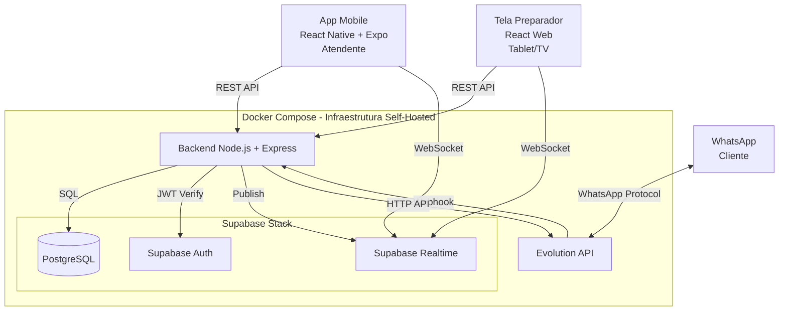
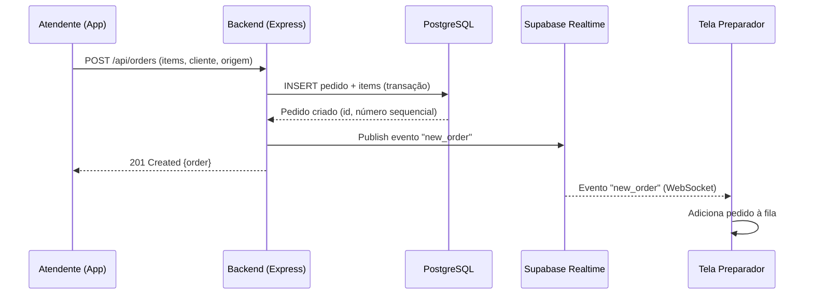
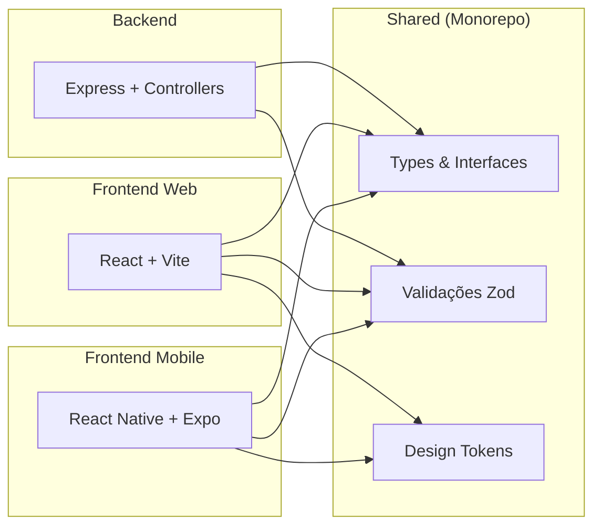
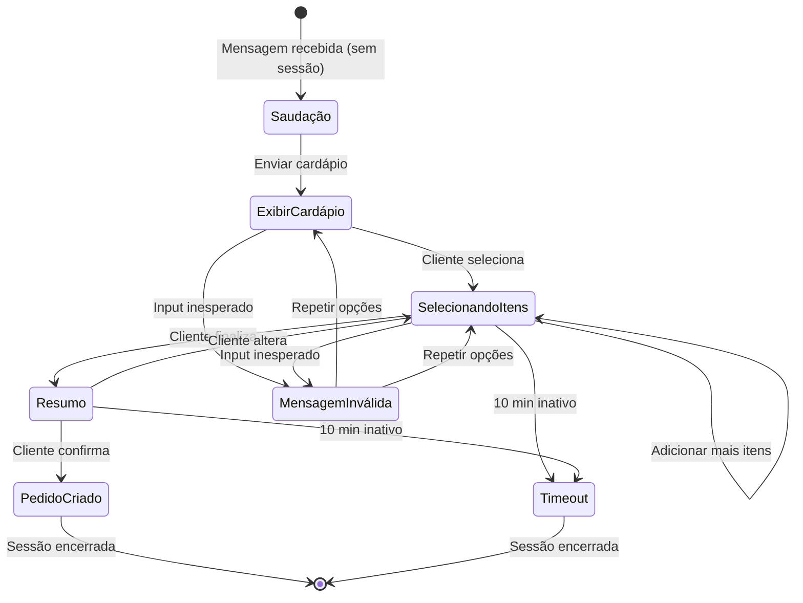
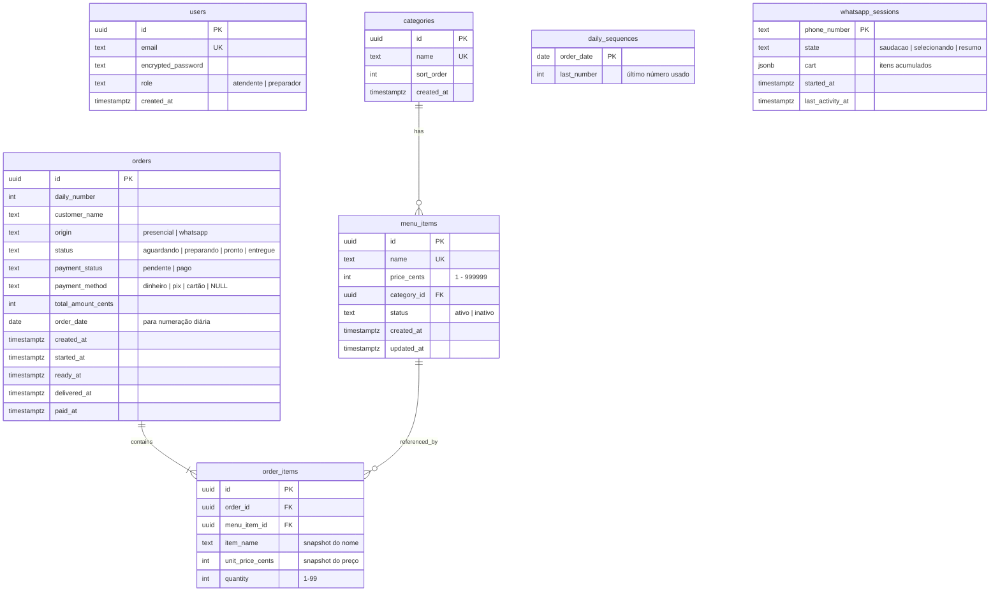
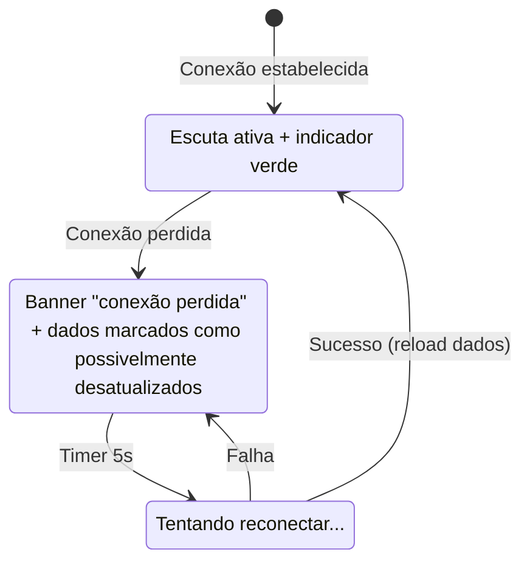

# Design Document: Food Truck Order System

## Overview

Sistema de pedidos MVP para food truck de pastéis, composto por três camadas principais: um app mobile React Native (atendente), uma interface web React (preparador) e um backend Node.js + Express. Toda a infraestrutura roda self-hosted via Docker Compose, utilizando Supabase (PostgreSQL, Auth, Realtime) e Evolution API para integração com WhatsApp.

### Objetivos de Design

- **Simplicidade operacional**: Um único `docker compose up` inicializa todo o sistema
- **Zero custo externo**: Todas as dependências são open source e self-hosted
- **Tempo real**: Preparador e atendente veem atualizações instantâneas via Supabase Realtime
- **White label ready**: Design system com tokens centralizados permite reidentificação visual
- **Prototipação rápida**: Modo protótipo com mocks permite validar UX antes do backend

### Decisões Técnicas Chave

| Decisão | Justificativa |
|---------|---------------|
| Supabase self-hosted | PostgreSQL + Auth + Realtime em uma stack unificada, sem custo |
| Express (não Fastify) | Ecossistema mais maduro, mais fácil encontrar referências |
| React Native + Expo | Deploy simplificado, hot reload, build sem Xcode/Android Studio |
| Evolution API | Única solução open source madura para WhatsApp API |
| Monorepo com workspaces | Compartilhar tipos, validações e tokens entre frontend e backend |

---

## Architecture

### Diagrama de Sistema (High-Level)



### Diagrama de Fluxo de Pedido



### Camadas da Aplicação



---

## Components and Interfaces

### Estrutura do Monorepo

```
order-system/
├── docker-compose.yml
├── .env.example
├── packages/
│   └── shared/
│       ├── src/
│       │   ├── types/           # Interfaces TypeScript compartilhadas
│       │   ├── validators/      # Schemas Zod de validação
│       │   └── constants/       # Enums, status, configurações
│       └── package.json
├── apps/
│   ├── mobile/                  # React Native + Expo (atendente)
│   │   ├── src/
│   │   │   ├── components/      # Componentes do Design System
│   │   │   ├── screens/         # Telas do app
│   │   │   ├── services/        # API client + mock layer
│   │   │   ├── hooks/           # Custom hooks (auth, realtime)
│   │   │   ├── theme/           # theme.config.ts + ThemeProvider
│   │   │   └── mocks/           # Dados mockados para protótipo
│   │   └── app.json
│   ├── web/                     # React + Vite (preparador)
│   │   ├── src/
│   │   │   ├── components/      # Componentes do Design System
│   │   │   ├── pages/           # Telas (fila, login)
│   │   │   ├── services/        # API client + mock layer
│   │   │   ├── hooks/           # Custom hooks (auth, realtime)
│   │   │   ├── theme/           # theme.config.ts + ThemeProvider
│   │   │   └── mocks/           # Dados mockados para protótipo
│   │   └── vite.config.ts
│   └── backend/                 # Node.js + Express
│       ├── src/
│       │   ├── controllers/     # Route handlers
│       │   ├── services/        # Business logic
│       │   ├── repositories/    # Data access (Supabase client)
│       │   ├── middleware/      # Auth, validation, error handling
│       │   ├── bot/             # WhatsApp bot logic (Evolution API)
│       │   ├── realtime/        # Publish events to Realtime
│       │   └── config/          # Environment config, timezone
│       ├── migrations/          # SQL migrations
│       └── seed/                # Seed inicial do cardápio
└── docs/
    └── design-system.md         # Documentação do Design System
```

### API REST - Endpoints Principais

| Método | Rota | Descrição | Auth |
|--------|------|-----------|------|
| POST | `/api/auth/login` | Login com email/senha | Não |
| POST | `/api/auth/logout` | Encerrar sessão | Sim |
| GET | `/api/menu` | Listar cardápio (itens ativos) | Sim |
| POST | `/api/menu` | Criar item no cardápio | Sim |
| PUT | `/api/menu/:id` | Atualizar item | Sim |
| PATCH | `/api/menu/:id/status` | Ativar/desativar item | Sim |
| GET | `/api/orders` | Listar pedidos (filtros: status, data) | Sim |
| POST | `/api/orders` | Criar novo pedido | Sim |
| PATCH | `/api/orders/:id/status` | Avançar status do pedido | Sim |
| POST | `/api/orders/:id/payment` | Registrar pagamento | Sim |
| GET | `/api/summary/today` | Resumo do dia | Sim |
| POST | `/api/webhook/evolution` | Webhook da Evolution API | API Key |

### Interfaces TypeScript Compartilhadas (packages/shared)

```typescript
// packages/shared/src/types/order.ts

export type OrderStatus = 'aguardando' | 'preparando' | 'pronto' | 'entregue';
export type PaymentStatus = 'pendente' | 'pago';
export type OrderOrigin = 'presencial' | 'whatsapp';
export type PaymentMethod = 'dinheiro' | 'pix' | 'cartão';

export interface OrderItem {
  menuItemId: string;
  name: string;
  quantity: number;        // 1-99
  unitPrice: number;       // preço no momento da criação (centavos)
}

export interface Order {
  id: string;
  dailyNumber: number;     // Número sequencial do dia
  customerName: string;
  origin: OrderOrigin;
  status: OrderStatus;
  paymentStatus: PaymentStatus;
  paymentMethod?: PaymentMethod;
  items: OrderItem[];
  totalAmount: number;     // Em centavos
  createdAt: string;       // ISO 8601
  startedAt?: string;
  readyAt?: string;
  deliveredAt?: string;
  paidAt?: string;
}

export interface CreateOrderRequest {
  customerName: string;
  origin: OrderOrigin;
  items: { menuItemId: string; quantity: number }[];
}

export interface UpdateOrderStatusRequest {
  status: OrderStatus;
}

export interface RegisterPaymentRequest {
  paymentMethod: PaymentMethod;
}
```

```typescript
// packages/shared/src/types/menu.ts

export type MenuItemStatus = 'ativo' | 'inativo';

export interface MenuItem {
  id: string;
  name: string;
  price: number;           // Em centavos
  category: string;
  status: MenuItemStatus;
  createdAt: string;
  updatedAt: string;
}

export interface CreateMenuItemRequest {
  name: string;            // 1-100 caracteres
  price: number;           // 1 - 999999 centavos (R$0,01 - R$9.999,99)
  category: string;
}

export interface UpdateMenuItemRequest {
  name?: string;
  price?: number;
  category?: string;
}
```

```typescript
// packages/shared/src/types/summary.ts

export interface DailySummary {
  date: string;                    // YYYY-MM-DD
  totalOrders: number;
  paidOrders: number;
  pendingOrders: number;
  paidTotal: number;               // centavos
  pendingTotal: number;            // centavos
  byPaymentMethod: {
    dinheiro: number;              // centavos
    pix: number;
    cartão: number;
  };
}
```

```typescript
// packages/shared/src/types/theme.ts

export interface  {
  businessName: string;
  logo: string;                    // URL ou path local
  colors: {
    primary: string;
    secondary: string;
    background: string;
    text: string;
    success: string;
    warning: string;
    error: string;
    aguardando: string;            // Status colors
    preparando: string;
    pronto: string;
  };
  typography: {
    fontFamily: string;
    sizes: {
      xs: number;
      sm: number;
      md: number;
      lg: number;
      xl: number;
      xxl: number;
    };
    weights: {
      regular: number;
      medium: number;
      bold: number;
    };
  };
  spacing: {
    xs: number;
    sm: number;
    md: number;
    lg: number;
    xl: number;
  };
  borderRadius: {
    sm: number;
    md: number;
    lg: number;
    full: number;
  };
}
```

### Componentes do Design System

```typescript
// Componentes base disponibilizados pelo Design System

// Button - variantes: primary, secondary, outline, danger
// Input - com label, error state, mask (moeda)
// Card - container para pedidos na fila
// Badge - indicadores de status (aguardando, preparando, pronto, pago, pendente)
// FilterChips - grupo de chips selecionáveis para filtro de status na fila de pedidos
// Modal - confirmação de ações (pagamento, cancelamento)
// Typography - Text, Heading com tokens aplicados
// Layout - Screen, Header, ScrollContainer, Grid
```

### Camada de Serviço / Mock (Pattern)

```typescript
// apps/mobile/src/services/api-client.ts

import { mockClient } from '../mocks/mock-client';
import { realClient } from './real-client';

const PROTOTYPE_MODE = process.env.PROTOTYPE_MODE === 'true';

export const apiClient = PROTOTYPE_MODE ? mockClient : realClient;
```

O padrão acima garante que a mesma interface é usada em modo protótipo e produção, com zero alteração nos componentes de UI.

### Integração WhatsApp - Bot Flow



---

## Data Models

### Diagrama ER (PostgreSQL)



### Índices Importantes

```sql
-- Busca de pedidos ativos para a fila
CREATE INDEX idx_orders_active ON orders (status, created_at)
  WHERE status IN ('aguardando', 'preparando');

-- Resumo do dia
CREATE INDEX idx_orders_date ON orders (order_date);

-- Numeração sequencial por dia (constraint de unicidade)
CREATE UNIQUE INDEX idx_orders_daily_number ON orders (order_date, daily_number);

-- Busca de item por nome (case-insensitive, para validação de duplicatas)
CREATE UNIQUE INDEX idx_menu_items_name ON menu_items (LOWER(name))
  WHERE status = 'ativo';

-- Sessões WhatsApp ativas (para timeout)
CREATE INDEX idx_whatsapp_sessions_activity ON whatsapp_sessions (last_activity_at);
```

### Mecanismo de Numeração Sequencial

```sql
-- Função para obter próximo número do dia (com lock)
CREATE OR REPLACE FUNCTION next_daily_number(p_date DATE)
RETURNS INT AS $$
DECLARE
  v_number INT;
BEGIN
  INSERT INTO daily_sequences (order_date, last_number)
  VALUES (p_date, 1)
  ON CONFLICT (order_date)
  DO UPDATE SET last_number = daily_sequences.last_number + 1
  RETURNING last_number INTO v_number;
  
  RETURN v_number;
END;
$$ LANGUAGE plpgsql;
```

### Valores Monetários

Todos os valores monetários são armazenados em **centavos** (integer) para evitar problemas de ponto flutuante. A conversão para exibição (R$ X,XX) ocorre apenas na camada de apresentação.

### Fuso Horário

- O banco de dados armazena todos os timestamps em UTC (`timestamptz`)
- O campo `order_date` é calculado convertendo `created_at` para `America/Sao_Paulo`
- O backend usa a biblioteca `date-fns-tz` para conversões de timezone
- O resumo do dia filtra por `order_date` (já convertido para o fuso local)

### Configuração de Realtime

O Supabase Realtime é configurado para escutar alterações nas tabelas:
- `orders` — INSERT e UPDATE (novos pedidos e mudanças de status/pagamento)

O backend publica eventos em canais nomeados:
- `orders:queue` — Eventos de fila (novos pedidos, mudança de status)
- `orders:payment` — Eventos de pagamento

### Filtro de Status na Fila (App Mobile)

O App do atendente exibe no topo da tela de fila um grupo de FilterChips com os status disponíveis:
- Chips: `Aguardando`, `Preparando`, `Pronto`, `Entregue`
- **Padrão**: `Aguardando`, `Preparando` e `Pronto` selecionados; `Entregue` desmarcado
- O atendente pode ativar/desativar chips individualmente para filtrar a visualização
- Quando `Entregue` é selecionado, os pedidos entregues do dia são carregados ordenados por `delivered_at` decrescente
- A Tela do Preparador **não** possui este filtro (exibe apenas `aguardando` e `preparando`)


---

## Correctness Properties

*Uma propriedade é uma característica ou comportamento que deve ser verdadeiro em todas as execuções válidas de um sistema — essencialmente, uma declaração formal sobre o que o sistema deve fazer. Propriedades servem como ponte entre especificações legíveis por humanos e garantias de correção verificáveis por máquina.*

### Property 1: Contraste WCAG AA para temas

*Para qualquer* configuração de tema válida, todas as combinações de cor de texto sobre cor de fundo devem atender ao ratio de contraste mínimo WCAG AA (4.5:1 para texto normal, 3:1 para texto grande).

**Validates: Requirements 1.8**

### Property 2: Criação de item válido no cardápio

*Para qualquer* item de cardápio com nome (1–100 caracteres não-vazios), preço (1–999999 centavos) e categoria válida existente, a criação deve ser bem-sucedida e retornar o item com status `ativo`.

**Validates: Requirements 4.1**

### Property 3: Unicidade case-insensitive de nome no cardápio

*Para quaisquer* dois itens de cardápio onde `LOWER(nome1) === LOWER(nome2)`, a criação do segundo item deve ser rejeitada com HTTP 409, independente da combinação de maiúsculas/minúsculas.

**Validates: Requirements 4.2**

### Property 4: Atualização de item preserva identidade

*Para qualquer* item existente no cardápio e qualquer payload de atualização válido (nome, preço ou categoria), a atualização deve manter o mesmo ID do item e alterar apenas os campos informados, preservando os demais inalterados.

**Validates: Requirements 4.5**

### Property 5: Ordenação de cardápio por categoria e nome

*Para qualquer* conjunto de itens ativos no cardápio, a lista retornada deve estar agrupada por categoria e, dentro de cada categoria, os itens devem estar ordenados alfabeticamente pelo nome.

**Validates: Requirements 4.8**

### Property 6: Filtro de itens ativos

*Para qualquer* estado do cardápio contendo itens com status misto (`ativo`/`inativo`), tanto a seleção de itens no App quanto o cardápio exibido pelo Bot devem conter exclusivamente itens com status `ativo`.

**Validates: Requirements 5.5, 11.1**

### Property 7: Criação de pedido com estado inicial correto

*Para qualquer* pedido válido (nome do cliente 1–100 caracteres, origem `presencial` ou `whatsapp`, ao menos 1 item com quantidade 1–99), a criação deve resultar em status `aguardando` e pagamento `pendente`.

**Validates: Requirements 5.1**

### Property 8: Cálculo do valor total do pedido

*Para qualquer* conjunto de itens de pedido com preços e quantidades, o valor total calculado deve ser exatamente igual à soma de `(preço_unitário × quantidade)` para cada item, sem erros de arredondamento.

**Validates: Requirements 5.2**

### Property 9: Ordenação cronológica da fila

*Para qualquer* conjunto de pedidos com status `aguardando` ou `preparando`, a fila exibida (tanto na Tela do Preparador quanto no App) deve estar ordenada por `created_at` crescente (mais antigo primeiro).

**Validates: Requirements 6.1, 6.5**

### Property 10: Completude de exibição do cartão de pedido

*Para qualquer* pedido válido na fila, o cartão renderizado deve conter: número sequencial do dia, nome do cliente, origem, lista completa de itens com nome e quantidade, e status atual.

**Validates: Requirements 6.3**

### Property 11: Transições de estado válidas registram timestamps

*Para qualquer* pedido, quando uma transição válida na sequência `aguardando → preparando → pronto → entregue` é executada, o Backend deve registrar o timestamp correspondente (`started_at`, `ready_at`, ou `delivered_at`) e publicar o evento no Realtime.

**Validates: Requirements 7.1, 7.2, 7.3**

### Property 12: Transições de estado inválidas são rejeitadas

*Para qualquer* pedido com status S e qualquer status-alvo T onde T não é o próximo válido na sequência `aguardando → preparando → pronto → entregue`, a transição deve ser rejeitada com HTTP 422.

**Validates: Requirements 7.4**

### Property 13: Registro de pagamento para pedidos pendentes

*Para qualquer* pedido com `payment_status = 'pendente'` e qualquer forma de pagamento válida (`dinheiro`, `pix` ou `cartão`), o registro de pagamento deve ser bem-sucedido, atualizar o status para `pago` e registrar o timestamp.

**Validates: Requirements 8.1**

### Property 14: Rejeição de pagamento duplicado (Idempotência)

*Para qualquer* pedido com `payment_status = 'pago'`, qualquer tentativa de registrar pagamento novamente deve ser rejeitada com HTTP 409, independente da forma de pagamento informada.

**Validates: Requirements 8.2**

### Property 15: Fronteira de data do resumo por fuso horário

*Para qualquer* conjunto de pedidos com timestamps próximos à meia-noite (fuso America/Sao_Paulo), o resumo do dia deve incluir corretamente apenas pedidos cujo `created_at` convertido para America/Sao_Paulo caia dentro do dia consultado (00:00–23:59).

**Validates: Requirements 9.1**

### Property 16: Invariante de agregação do resumo

*Para qualquer* conjunto de pedidos em um dia, deve valer que: `totalPedidos = pedidosPagos + pedidosPendentes`, `somaTotal = somaPagos + somaPendentes`, e `somaPagos = byPaymentMethod.dinheiro + byPaymentMethod.pix + byPaymentMethod.cartão`.

**Validates: Requirements 9.2, 9.3**

### Property 17: Acumulação correta do carrinho do Bot

*Para qualquer* sequência de seleções válidas de itens durante o fluxo do Bot, o carrinho acumulado deve conter cada item com a quantidade correta, e o total exibido no resumo deve ser igual à soma de `(preço × quantidade)` de todos os itens.

**Validates: Requirements 10.3**

### Property 18: Formatação do cardápio no Bot

*Para qualquer* conjunto de itens ativos, a mensagem formatada pelo Bot deve agrupar itens por categoria e exibir cada item com nome e preço no formato "R$ X,XX" (com vírgula como separador decimal e duas casas).

**Validates: Requirements 11.2**

### Property 19: Numeração sequencial diária sem lacunas e sem duplicatas

*Para qualquer* sequência de pedidos criados no mesmo dia (inclusive concorrentemente), cada pedido deve receber um `daily_number` único e sequencial iniciando em 1, sem lacunas e sem duplicatas. Para o primeiro pedido de um novo dia, a numeração deve reiniciar em 1.

**Validates: Requirements 12.1, 12.3**

---

## Error Handling

### Estratégia por Camada

| Camada | Estratégia |
|--------|-----------|
| **Frontend (App/Web)** | Try-catch em chamadas API, exibição de toast/alert com mensagem amigável, retry automático para erros de rede |
| **Backend (Express)** | Middleware centralizado de error handling, logs estruturados, respostas padronizadas |
| **Banco de dados** | Transações com rollback em caso de falha, constraints do banco como última linha de defesa |
| **Realtime** | Detecção de desconexão, indicador visual, reconexão automática com reload de estado |
| **WhatsApp Bot** | Timeout de sessão, tratamento de mensagens inesperadas, fallback para mensagem de ajuda |

### Formato Padrão de Resposta de Erro (Backend)

```typescript
interface ApiError {
  statusCode: number;
  error: string;          // Código do erro (ex: "INVALID_TRANSITION")
  message: string;        // Mensagem legível em português
  details?: unknown;      // Dados adicionais (ex: campo com erro)
}
```

### Mapeamento de Erros HTTP

| Código | Uso |
|--------|-----|
| 400 | Request malformada (JSON inválido, campos faltantes) |
| 401 | Não autenticado |
| 403 | Sem permissão para a ação |
| 409 | Conflito (nome duplicado, pedido já pago, número sequencial) |
| 422 | Validação de negócio falhou (status inválido, preço inválido) |
| 500 | Erro interno inesperado |

### Tratamento de Conexão Realtime



### Validação em Duas Camadas

1. **Frontend (Zod)**: Validação imediata antes de enviar ao backend (feedback rápido ao usuário)
2. **Backend (Zod + DB constraints)**: Revalidação de todos os inputs + constraints do banco como safety net

Os schemas Zod são compartilhados via `packages/shared/src/validators/` garantindo que as regras de validação sejam as mesmas em ambas as camadas.

### Rate Limiting (Login)

- Implementado no backend via middleware com store em memória (Map)
- 5 tentativas falhadas consecutivas por IP → bloqueio de 15 minutos
- Contador resetado após login bem-sucedido
- Em produção: considerar Redis para ambiente multi-instância (futuro)

---

## Testing Strategy

### Visão Geral

O sistema utiliza uma abordagem dual de testes:
- **Testes unitários**: Verificam exemplos específicos, edge cases e condições de erro
- **Testes de propriedade (PBT)**: Verificam propriedades universais em inputs gerados aleatoriamente

### Ferramentas

| Camada | Framework | Lib PBT |
|--------|-----------|---------|
| Backend (Node.js) | Vitest | fast-check |
| Frontend Mobile (React Native) | Jest + React Native Testing Library | fast-check |
| Frontend Web (React) | Vitest + Testing Library | fast-check |
| E2E | Detox (mobile), Playwright (web) | — |

### Configuração de Property-Based Tests

- Biblioteca: **fast-check** (JavaScript/TypeScript)
- Mínimo de **100 iterações** por teste de propriedade
- Cada teste de propriedade deve referenciar a propriedade do design document
- Formato de tag: `Feature: food-truck-order-system, Property {número}: {texto da propriedade}`

### Distribuição de Testes por Tipo

**Testes de Propriedade (PBT)** — Validam as 19 propriedades de correção definidas acima:
- Cálculos (total do pedido, agregações do resumo, acumulação de carrinho)
- Máquina de estados (transições válidas/inválidas de pedido)
- Invariantes (ordenação de fila, numeração sequencial, filtro de ativos)
- Formatação (cardápio do bot, preços em R$)
- Validação (unicidade de nomes, contraste WCAG)

**Testes Unitários (Exemplo-based)** — Cobrem:
- Comportamento específico de login/logout
- Modo protótipo ativo/inativo
- Exibição de indicadores visuais de status
- Comportamento de UI para erros
- Edge cases: nome vazio, preço zero, lista de itens vazia

**Testes de Integração** — Cobrem:
- Fluxo completo de criação de pedido (API → DB → Realtime)
- Autenticação com Supabase Auth
- Webhook da Evolution API
- Latência de entrega de eventos Realtime
- Reconexão após desconexão

**Testes de Smoke** — Cobrem:
- docker-compose.yml inicializa todos os serviços
- .env.example contém todas as variáveis
- Tema carrega corretamente
- Design system documenta todos os tokens

### Estrutura de Testes

```
apps/
├── backend/
│   └── src/
│       ├── __tests__/
│       │   ├── properties/       # Testes de propriedade
│       │   │   ├── order-total.property.test.ts
│       │   │   ├── status-transitions.property.test.ts
│       │   │   ├── daily-number.property.test.ts
│       │   │   ├── summary-aggregation.property.test.ts
│       │   │   └── menu-validation.property.test.ts
│       │   ├── unit/             # Testes unitários
│       │   │   ├── controllers/
│       │   │   └── services/
│       │   └── integration/      # Testes de integração
│       │       ├── orders.integration.test.ts
│       │       └── realtime.integration.test.ts
├── mobile/
│   └── src/
│       └── __tests__/
│           ├── properties/       # Testes de propriedade (formatação, ordenação)
│           └── components/       # Testes de componentes
└── web/
    └── src/
        └── __tests__/
            ├── properties/       # Testes de propriedade (fila, display)
            └── components/       # Testes de componentes
```

### Prioridade de Implementação de Testes

1. **Alta**: Properties 8, 11, 12, 16, 19 (cálculos críticos e máquina de estados)
2. **Média**: Properties 2, 3, 5, 6, 7, 9, 13, 14, 15 (validações e filtros)
3. **Baixa**: Properties 1, 4, 10, 17, 18 (formatação e display)
