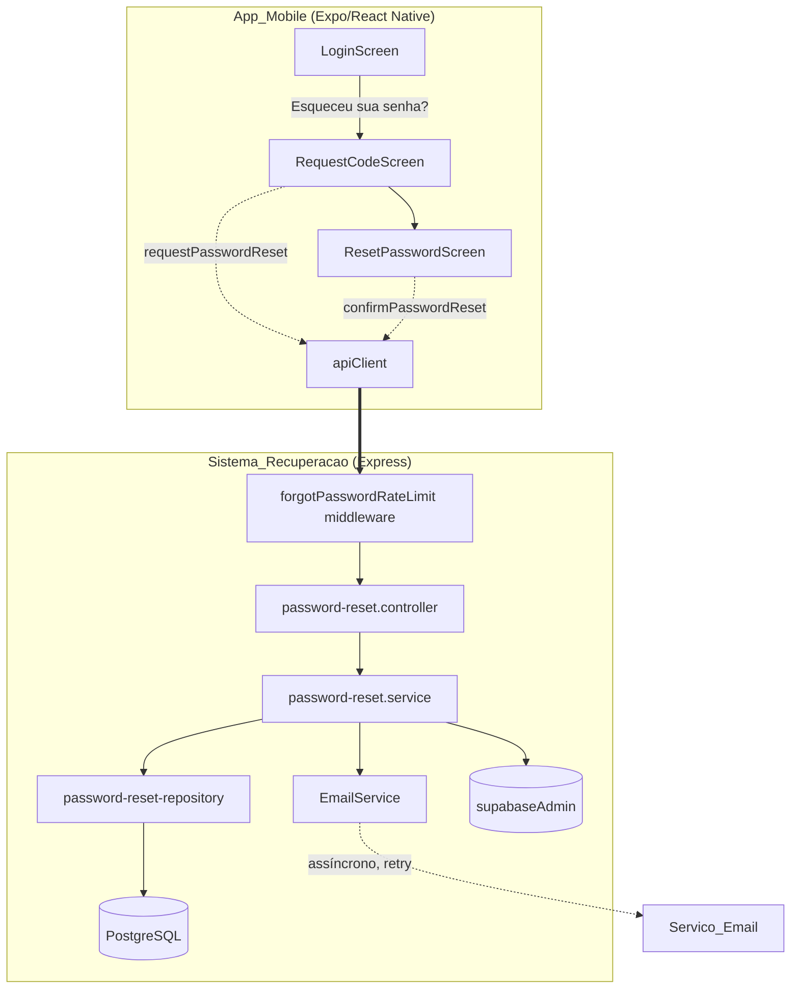
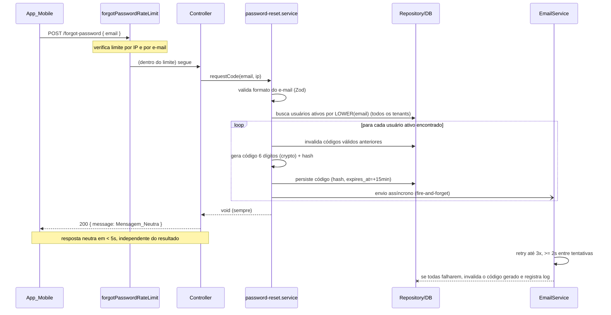
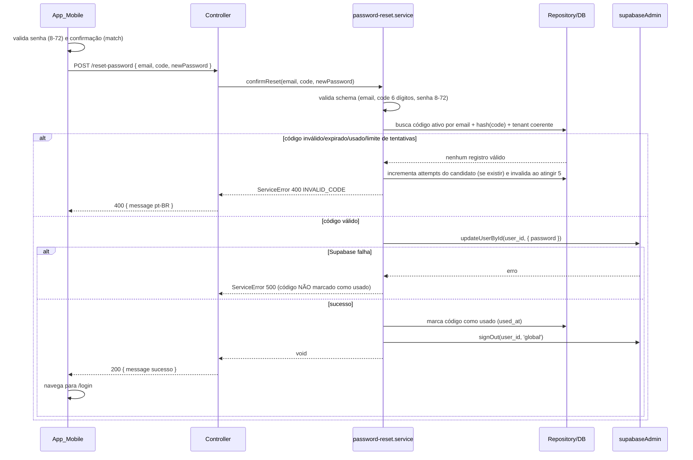

# Design Document

## Overview

Esta feature adiciona um fluxo self-service de **"Esqueceu sua senha?"** ao `App_Mobile`, permitindo que um usuário não autenticado recupere o acesso à sua conta em três etapas: (1) acionar o ponto de entrada na tela de login, (2) solicitar um `Codigo_Verificacao` numérico enviado por e-mail e (3) informar o código junto de uma nova senha.

O desenho reaproveita as convenções já estabelecidas no `apps/backend`:

- Arquitetura em camadas `routes/ → controllers/ → services/`, com validação Zod em `validation/` e proteções transversais em `middleware/`.
- Autenticação apoiada no Supabase, com dois clientes em `src/config/supabase.ts`: `supabase` (anon) e `supabaseAdmin` (service role). A troca de senha usa `supabaseAdmin.auth.admin.updateUserById(id, { password })` e a invalidação de sessões usa `supabaseAdmin.auth.admin.signOut(id, 'global')` — exatamente o padrão de `user.service.resetPassword`.
- Erros de domínio via `ServiceError(message, statusCode, code)` com mensagens em pt-BR.
- Rate limiting em memória, no estilo de `rate-limit.middleware.ts`.

**Restrições de segurança que orientam todo o desenho:**

1. **Não enumeração de contas (`Mensagem_Neutra`):** a resposta ao endpoint de solicitação de código é idêntica em conteúdo, formato e janela de tempo, independentemente de o e-mail existir, estar inativo, a entrega ter falhado ou o rate limit ter sido atingido.
2. **Código imprevisível:** 6 dígitos numéricos gerados via `crypto` (CSPRNG), armazenados apenas como hash.
3. **Validade restrita:** expira em 15 minutos, uso único, máximo de 5 tentativas incorretas, e um novo código invalida os anteriores do mesmo usuário.
4. **Escopo por tenant:** um código só vale para o par `user_id + tenant_id` ao qual foi emitido.

**Decisão de projeto — contexto multi-tenant sem sessão:** como o fluxo é público (sem `tenantMiddleware`), não há `tenant_id` resolvido no request. O `TenantRepository` exige tenant por construção e, portanto, não pode ser usado aqui. O `Sistema_Recuperacao` acessa o banco por um repositório dedicado (`password-reset-repository.ts`) que fala diretamente com o `pool` de `config/database.ts` — a mesma exceção arquitetural já concedida ao runner de migrações e ao provisionamento. Toda consulta desse repositório é sempre parametrizada por `(email)` na geração e por `(user_id, tenant_id)` na validação, preservando o isolamento por tenant de forma explícita.

## Architecture

### Componentes



### Fluxo 1 — Solicitação de código (POST /api/auth/forgot-password)



### Fluxo 2 — Validação e redefinição (POST /api/auth/reset-password)



### Camadas e responsabilidades

| Camada | Arquivo | Responsabilidade |
| --- | --- | --- |
| Route | `routes/auth.routes.ts` (extensão) | Registra `POST /forgot-password` (com rate limit dedicado) e `POST /reset-password` (público). |
| Middleware | `middleware/forgot-password-rate-limit.middleware.ts` | Limite por IP **e** por e-mail dentro da `Janela_Solicitacao` (15 min). |
| Controller | `controllers/password-reset.controller.ts` | Traduz HTTP ↔ serviço; garante `Mensagem_Neutra` no fluxo de solicitação; mapeia `ServiceError` no fluxo de redefinição. |
| Service | `services/password-reset.service.ts` | Regras de negócio: geração, invalidação, validação, atualização de senha, orquestração de e-mail. |
| Repository | `db/password-reset-repository.ts` | Acesso direto ao `pool` para operações cross-tenant e sobre `password_reset_codes`. |
| Email | `services/email/email.service.ts` | Abstração `EmailService` (interface) + implementação com retry e envio assíncrono. |
| Validation | `validation/password-reset.validation.ts` | Schemas Zod (e-mail, código, senha). |

## Components and Interfaces

### Backend — Validation (`src/validation/password-reset.validation.ts`)

Reaproveita o estilo exato de `user.validation.ts`.

```typescript
import { z } from 'zod';

export const forgotPasswordSchema = z.object({
  email: z.string()
    .max(254, 'Formato de e-mail inválido')
    .email('Formato de e-mail inválido'),
});

export const resetPasswordSchema = z.object({
  email: z.string()
    .max(254, 'Formato de e-mail inválido')
    .email('Formato de e-mail inválido'),
  code: z.string()
    .regex(/^\d{6}$/, 'Código inválido'),
  newPassword: z.string()
    .min(8, 'A senha deve ter entre 8 e 72 caracteres')
    .max(72, 'A senha deve ter entre 8 e 72 caracteres'),
});
```

### Backend — Repository (`src/db/password-reset-repository.ts`)

Acesso direto ao `pool` (exceção arquitetural documentada; fluxo sem tenant resolvido).

```typescript
export interface ActiveUser {
  id: string;
  tenant_id: string;
  email: string;
  status: 'ativo' | 'inativo';
}

export interface PasswordResetCodeRow {
  id: string;
  user_id: string;
  tenant_id: string;
  code_hash: string;
  expires_at: Date;
  used_at: Date | null;
  attempts: number;
  created_at: Date;
}

export interface PasswordResetRepository {
  /** Retorna TODOS os usuários (qualquer tenant) cujo LOWER(email) casa. */
  findUsersByEmail(email: string): Promise<ActiveUser[]>;
  /** Invalida (marca como usado) todos os códigos ainda válidos de um usuário+tenant. */
  invalidateActiveCodes(userId: string, tenantId: string): Promise<void>;
  /** Insere um novo código já com hash e expires_at. */
  insertCode(input: {
    userId: string; tenantId: string; codeHash: string; expiresAt: Date;
  }): Promise<PasswordResetCodeRow>;
  /** Busca o código ativo mais recente do e-mail (join users) — candidato à validação. */
  findActiveCodeForEmail(email: string): Promise<PasswordResetCodeRow | null>;
  /** Incrementa attempts; se atingir 5, marca como invalidado. Retorna a linha atualizada. */
  registerFailedAttempt(codeId: string): Promise<PasswordResetCodeRow>;
  /** Marca o código como usado (used_at = now). */
  markUsed(codeId: string): Promise<void>;
  /** Marca um código específico como invalidado (usado para rollback de falha de e-mail). */
  invalidateCode(codeId: string): Promise<void>;
}
```

Observações de projeto:

- `findUsersByEmail` retorna usuários de **todos** os tenants que compartilham o e-mail; o serviço trata cada um de forma independente (R8.3). Apenas usuários `ativo` geram código; os `inativo` são ignorados silenciosamente (R2.6).
- A validação (`findActiveCodeForEmail`) faz `JOIN users` e considera "ativo" = `used_at IS NULL AND expires_at > NOW() AND attempts < 5`, ordenando pelo `created_at` mais recente. O escopo de tenant é preservado porque o registro carrega `(user_id, tenant_id)` e a comparação de hash amarra o código ao usuário correto (R8.5).

### Backend — EmailService (`src/services/email/email.service.ts`)

Abstração para permitir plugar um provedor concreto depois via configuração de ambiente. O envio é **assíncrono / fire-and-forget** para não bloquear a resposta de 5s.

```typescript
export interface EmailMessage {
  to: string;
  subject: string;
  body: string;
}

/** Contrato do provedor de e-mail. Uma tentativa de envio; lança em falha. */
export interface EmailProvider {
  send(message: EmailMessage): Promise<void>;
}

export interface EmailService {
  /**
   * Envia o código de forma assíncrona com retry (até 3 tentativas,
   * >= 2s entre elas). NÃO lança para o chamador. Em falha total,
   * executa onAllAttemptsFailed (invalida o código) e registra log.
   */
  sendVerificationCode(params: {
    to: string;
    code: string;
    onAllAttemptsFailed: () => Promise<void>;
  }): void;
}
```

Detalhes:

- Corpo padrão inclui o código e a instrução de que ele **expira em 15 minutos** (R9.1). Ex.: `"Seu código de verificação é 048213. Ele expira em 15 minutos."`
- Retry: até 3 tentativas com intervalo mínimo de 2s (R9.2). Em falha nas 3, chama `onAllAttemptsFailed` (que invalida o código via `invalidateCode`) e registra o erro internamente sem expor a causa (R7 do Requisito 2 / R9.3).
- A seleção do provedor é resolvida por env (ex.: `EMAIL_PROVIDER`); enquanto nenhum provedor real estiver configurado, um `NoopEmailProvider`/`LoggingEmailProvider` mantém o fluxo funcional em desenvolvimento.

### Backend — Service (`src/services/password-reset.service.ts`)

```typescript
export class ServiceError extends Error {
  constructor(
    message: string,
    public readonly statusCode: number,
    public readonly code: string,
  ) { super(message); this.name = 'ServiceError'; }
}

/** Gera código de 6 dígitos (com zeros à esquerda) via CSPRNG. */
export function generateCode(): string; // crypto.randomInt(0, 1_000_000) → padStart(6,'0')

/** Hash do código para armazenamento (nunca texto puro). */
export function hashCode(code: string): string; // ex.: sha256 hex

/**
 * Fluxo de solicitação. NUNCA lança por ausência/inatividade de usuário,
 * falha de e-mail ou rate limit — o controller sempre responde Mensagem_Neutra.
 * Lança ServiceError apenas para e-mail em formato inválido (validação).
 */
export async function requestCode(email: string): Promise<void>;

/**
 * Fluxo de redefinição. Valida código (existência, expiração, uso, tentativas,
 * escopo de tenant) e política de senha; atualiza via supabaseAdmin; marca
 * usado; invalida sessões. Lança ServiceError em qualquer recusa.
 */
export async function confirmReset(input: {
  email: string; code: string; newPassword: string;
}): Promise<void>;
```

Regras internas relevantes:

- `requestCode`: valida formato → busca usuários → para cada usuário **ativo**: invalida códigos anteriores, gera+hasheia+persiste, dispara envio assíncrono. Retorna sempre `void`.
- `confirmReset`: valida schema → localiza código candidato por e-mail → confere `hashCode(code) === row.code_hash` **e** que o `tenant_id` do registro casa com o do usuário resolvido. Em falha, `registerFailedAttempt`; ao atingir 5, código é invalidado. Em sucesso, `updateUserById` → só então `markUsed` → `signOut('global')`.

### Backend — Controller (`src/controllers/password-reset.controller.ts`)

```typescript
const NEUTRAL_MESSAGE =
  'Se o e-mail estiver cadastrado, enviamos instruções para redefinir a senha.';

export async function forgotPassword(req, res): Promise<void>;
// - Valida corpo com forgotPasswordSchema; se inválido → 400 VALIDATION_ERROR (pt-BR).
// - Caso válido: chama requestCode dentro de try/catch amplo; SEMPRE responde
//   200 { message: NEUTRAL_MESSAGE }, mesmo em erro interno, para preservar neutralidade.

export async function resetPassword(req, res): Promise<void>;
// - Valida corpo com resetPasswordSchema; erros → 400 VALIDATION_ERROR.
// - Chama confirmReset; sucesso → 200 { message: 'Senha redefinida com sucesso.' };
//   ServiceError → mapeia statusCode/code/message.
```

O middleware de rate limit responde a estouros com **a mesma `Mensagem_Neutra` e status 200** no endpoint de solicitação, para não vazar sinal de enumeração (R4.4). O requisito R4.1/R4.2 pede "resposta de erro indicando limite excedido, com mensagem em pt-BR"; para conciliar com a neutralidade obrigatória de R4.4 e R9.5, adotamos a `Mensagem_Neutra` como corpo visível e registramos o motivo (`rate_limited`) apenas em log/telemetria interna, mantendo conteúdo/formato/tempo indistinguíveis.

### Backend — Route (extensão de `src/routes/auth.routes.ts`)

```typescript
// POST /api/auth/forgot-password — público, rate limit dedicado (IP + e-mail)
router.post('/forgot-password', forgotPasswordRateLimit, forgotPassword);

// POST /api/auth/reset-password — público (validação por código)
router.post('/reset-password', resetPassword);
```

### Backend — Rate limit (`src/middleware/forgot-password-rate-limit.middleware.ts`)

Segue o padrão in-memory `Map` de `rate-limit.middleware.ts`, com duas chaves independentes: IP e e-mail (normalizado, `LOWER`). Reutiliza a semântica de janela; a janela é a `Janela_Solicitacao` de 15 min (R4). Limite de 5 por janela para cada dimensão.

```typescript
interface Bucket { timestamps: number[]; } // registra solicitações dentro da janela
export const ipBuckets = new Map<string, Bucket>();
export const emailBuckets = new Map<string, Bucket>();
// Ao processar: remove timestamps fora da janela (reset natural por expiração — R4.3),
// conta as restantes; se >= 5 em qualquer dimensão → bloqueia (responde neutro).
// Uma solicitação recusada NÃO grava novo timestamp nem altera códigos (R4.5).
```

**Limitação de projeto (documentada):** o store é em memória por instância, coerente com o rate limit de login já existente. Em cenário multi-instância, os contadores não são compartilhados; a mitigação (store distribuído, ex.: Redis) fica registrada como consideração futura, sem bloquear o MVP.

### Mobile — apiClient (extensão de `services/types.ts` e `services/real-client.ts`)

Métodos **não autenticados** (usam `fetch` direto, como `login`, não `authFetch`).

```typescript
// types.ts (ApiClient)
requestPasswordReset(email: string): Promise<void>;
confirmPasswordReset(email: string, code: string, newPassword: string): Promise<void>;
```

```typescript
// real-client.ts
async requestPasswordReset(email) {
  // POST /api/auth/forgot-password — trata falha de rede (status 0) como no login.
  // Não diferencia sucesso/erro de negócio: a resposta é sempre neutra.
}
async confirmPasswordReset(email, code, newPassword) {
  // POST /api/auth/reset-password — em !ok, lança NetworkError com body.message (pt-BR).
}
```

### Mobile — Telas e rotas

- **LoginScreen** (`src/screens/LoginScreen.tsx`): adicionar controle acionável "Esqueceu sua senha?" (um `Button variant="link"`/pressable) visível sem rolagem, abaixo do botão Entrar. `onPress` navega para `/forgot-password` via `router.push`; em falha de navegação, permanece na tela e exibe erro (R1.4).
- **RequestCodeScreen** (`src/screens/RequestCodeScreen.tsx`) + rota `app/forgot-password.tsx`: campo de e-mail + botão "Enviar código". Ao enviar, chama `requestPasswordReset`; exibe a `Mensagem_Neutra` e navega para a tela de redefinição.
- **ResetPasswordScreen** (`src/screens/ResetPasswordScreen.tsx`) + rota `app/reset-password.tsx`: campos código, nova senha e confirmação. Validação client-side (match + comprimento 8-72) antes de enviar (R5.6, R7.4). Em sucesso, exibe confirmação e navega para `/login` (R5.5).

Ambas as rotas ficam fora do grupo `(tabs)`/autenticado, como `login.tsx`. Não basta ficar fora do grupo autenticado: o Portao_Autenticacao em `src/hooks/useAuth.tsx` redireciona para `/login` qualquer rota cujo primeiro segmento não esteja em `PUBLIC_GROUPS`. Portanto, para satisfazer R1.3/R1.5, `forgot-password` e `reset-password` DEVEM ser adicionados a `PUBLIC_GROUPS` em `useAuth.tsx`, e ambas as telas DEVEM ser registradas no `Stack` raiz em `app/_layout.tsx` (`<Stack.Screen name="forgot-password" />` e `<Stack.Screen name="reset-password" />`), seguindo o mesmo padrão de `login`.

## Data Models

### Nova migração — `apps/backend/migrations/011_create_password_reset_codes.sql`

Segue o padrão das migrações existentes (SQL numerado, FK composta por tenant, como em `order_items`).

```sql
-- Migration 011: Create password_reset_codes table (tenant-scoped)
CREATE TABLE IF NOT EXISTS password_reset_codes (
  id UUID PRIMARY KEY DEFAULT gen_random_uuid(),
  user_id UUID NOT NULL,
  tenant_id UUID NOT NULL,
  code_hash TEXT NOT NULL,               -- hash do código; nunca texto puro (R3.4)
  expires_at TIMESTAMPTZ NOT NULL,       -- geração + 15 min (R3.3)
  used_at TIMESTAMPTZ,                   -- nulo enquanto não utilizado/invalidado (R3.7)
  attempts INT NOT NULL DEFAULT 0,       -- tentativas incorretas; limite 5 (R3.6/R6.4)
  created_at TIMESTAMPTZ NOT NULL DEFAULT NOW(),
  -- FK composta garante coerência de tenant com o usuário (R8.2/R8.5)
  CONSTRAINT password_reset_codes_user_tenant_fk
    FOREIGN KEY (user_id, tenant_id) REFERENCES users(id, tenant_id) ON DELETE CASCADE
);

-- Busca do código ativo por usuário+tenant (validação e invalidação)
CREATE INDEX IF NOT EXISTS password_reset_codes_user_tenant_active_idx
  ON password_reset_codes (user_id, tenant_id, created_at)
  WHERE used_at IS NULL;

-- Suporte à busca por expiração (limpeza / seleção de candidato)
CREATE INDEX IF NOT EXISTS password_reset_codes_expires_idx
  ON password_reset_codes (expires_at);
```

Notas:

- A FK composta `(user_id, tenant_id)` referencia `users(id, tenant_id)` — a mesma constraint `users_id_tenant_unique` já criada na migração 002 — garantindo que um código nunca fique associado a um usuário de outro tenant.
- `used_at` cobre dois estados de "não mais válido": usado com sucesso (R3.7) e invalidado (por novo código R3.5, por 5 tentativas R3.6/R6.4, ou por falha de e-mail R2.7). Um código é "ativo" quando `used_at IS NULL AND expires_at > NOW() AND attempts < 5`.

### Tipos TypeScript

```typescript
// db/password-reset-repository.ts
export interface PasswordResetCodeRow {
  id: string;
  user_id: string;
  tenant_id: string;
  code_hash: string;
  expires_at: Date;
  used_at: Date | null;
  attempts: number;
  created_at: Date;
}

export interface ActiveUser {
  id: string;
  tenant_id: string;
  email: string;
  status: 'ativo' | 'inativo';
}
```

## Correctness Properties

*A property is a characteristic or behavior that should hold true across all valid executions of a system — essentially, a formal statement about what the system should do. Properties serve as the bridge between human-readable specifications and machine-verifiable correctness guarantees.*

As propriedades abaixo resultam da consolidação da análise de prework (eliminando redundâncias entre critérios que descrevem o mesmo comportamento). Cada uma será implementada por um único teste baseado em propriedades, com no mínimo 100 iterações.

### Property 1: Resposta de solicitação indistinguível (não enumeração)

*Para qualquer* e-mail em formato válido, a resposta do endpoint de solicitação de código deve ter conteúdo, formato e código de status idênticos, independentemente de o e-mail corresponder a um usuário ativo, inativo, inexistente, ou de a solicitação ter sido recusada por rate limit ou de o envio de e-mail ter falhado.

**Validates: Requirements 2.2, 2.5, 2.6, 4.4, 9.3, 9.5**

### Property 2: E-mails inválidos são rejeitados sem gerar código

*Para qualquer* string que não seja um e-mail em formato válido (incluindo vazia ou com mais de 254 caracteres), o `Sistema_Recuperacao` deve rejeitar a solicitação com erro de validação em pt-BR e nenhum `Codigo_Verificacao` deve ser gerado nem persistido.

**Validates: Requirements 2.3**

### Property 3: Solicitação sem usuário ativo não gera código

*Para qualquer* e-mail que não corresponda a nenhum usuário `ativo` (inexistente ou apenas `inativo`), o `Sistema_Recuperacao` não deve persistir nenhum `Codigo_Verificacao`.

**Validates: Requirements 2.5, 2.6**

### Property 4: Geração de código bem-formado

*Para qualquer* geração de `Codigo_Verificacao`, o código produzido deve casar exatamente com `^[0-9]{6}$` (6 dígitos, com zeros à esquerda permitidos), o valor persistido deve ser o hash do código (nunca o texto puro) e `expires_at` deve ser exatamente 15 minutos após `created_at`.

**Validates: Requirements 2.4, 3.1, 3.3, 3.4**

### Property 5: No máximo um código ativo por usuário/tenant

*Para qualquer* usuário e tenant, após a geração de um novo `Codigo_Verificacao`, todos os códigos anteriores ainda válidos desse mesmo `(user_id, tenant_id)` devem ficar invalidados, restando no máximo um código ativo.

**Validates: Requirements 3.5**

### Property 6: Limite de tentativas invalida o código

*Para qualquer* `Codigo_Verificacao`, ao atingir 5 tentativas incorretas de validação, o código deve ser invalidado e toda tentativa subsequente deve ser recusada com mensagem em pt-BR.

**Validates: Requirements 3.6, 6.4**

### Property 7: Código é de uso único

*Para qualquer* `Codigo_Verificacao` utilizado com sucesso para redefinir a senha, ele deve ser marcado como utilizado e qualquer reuso posterior deve ser recusado.

**Validates: Requirements 3.7, 5.3, 6.3**

### Property 8: Falha total de e-mail invalida o código gerado

*Para qualquer* solicitação em que o `Servico_Email` falhe em todas as 3 tentativas de envio, o `Codigo_Verificacao` correspondente deve terminar invalidado, sem que a resposta ao cliente deixe de ser a `Mensagem_Neutra`.

**Validates: Requirements 2.7, 9.3**

### Property 9: Rate limit por e-mail

*Para qualquer* sequência de solicitações do mesmo e-mail que atinja 5 dentro da `Janela_Solicitacao` de 15 minutos, toda solicitação adicional desse e-mail no restante da janela deve ser recusada sem gerar novo `Codigo_Verificacao`.

**Validates: Requirements 2.8, 4.1**

### Property 10: Rate limit por IP

*Para qualquer* sequência de solicitações originadas do mesmo endereço IP que atinja 5 dentro da `Janela_Solicitacao` de 15 minutos, toda solicitação adicional desse IP no restante da janela deve ser recusada.

**Validates: Requirements 4.2**

### Property 11: Reset da janela de rate limit

*Para qualquer* e-mail ou IP, uma vez encerrada a `Janela_Solicitacao` de 15 minutos, a contagem de solicitações deve reiniciar em 0 e novas solicitações voltam a ser aceitas.

**Validates: Requirements 4.3**

### Property 12: Recusa por rate limit não altera estado

*Para qualquer* solicitação recusada por rate limit, o conjunto de `Codigo_Verificacao` válidos e de solicitações já registradas deve permanecer inalterado.

**Validates: Requirements 4.5**

### Property 13: Redefinição bem-sucedida é correta e isolada

*Para qualquer* `Codigo_Verificacao` válido, não expirado, não utilizado e dentro do limite de tentativas, submetido com uma nova senha válida (8–72 caracteres), o `Sistema_Recuperacao` deve atualizar a senha exclusivamente do usuário associado ao código, sem afetar qualquer outro usuário.

**Validates: Requirements 5.2, 6.5, 8.2**

### Property 14: Códigos inválidos não alteram a senha

*Para qualquer* `Codigo_Verificacao` inválido (não corresponde ao armazenado), expirado, já utilizado, ou cujo par e-mail+código não resolve um usuário, o `Sistema_Recuperacao` deve recusar a redefinição com mensagem em pt-BR sem alterar nenhuma senha.

**Validates: Requirements 5.7, 6.1, 6.2, 8.4**

### Property 15: Falha do Supabase preserva o código não utilizado

*Para qualquer* falha na atualização de senha via Supabase, o `Sistema_Recuperacao` deve retornar erro em pt-BR e o `Codigo_Verificacao` deve permanecer não marcado como utilizado.

**Validates: Requirements 5.8**

### Property 16: Política de comprimento de senha

*Para qualquer* nova senha com comprimento fora do intervalo de 8 a 72 caracteres inclusive (incluindo vazia), o `Sistema_Recuperacao` deve recusar a redefinição com a mensagem em pt-BR indicando que a senha deve ter entre 8 e 72 caracteres.

**Validates: Requirements 7.1, 7.2, 7.3**

### Property 17: Validação client-side de senha

*Para qualquer* par (nova senha, confirmação) em que as senhas difiram, ou em que o comprimento esteja fora de 8–72 caracteres, o `App_Mobile` deve bloquear o envio da solicitação de redefinição.

**Validates: Requirements 5.6, 7.4**

### Property 18: Escopo de tenant do código

*Para qualquer* `Codigo_Verificacao` emitido para um par `(usuario, tenant)`, ele deve ser válido apenas para aquele usuário e tenant; aplicá-lo a um usuário de tenant diferente deve ser recusado, e quando o mesmo e-mail existe em múltiplos tenants cada usuário recebe e valida seu próprio código de forma independente.

**Validates: Requirements 3.2, 8.1, 8.3, 8.5**

### Property 19: Mensagem de e-mail contém código e expiração

*Para qualquer* `Codigo_Verificacao`, o corpo da mensagem de e-mail solicitada deve conter o código e a instrução de que ele expira em 15 minutos.

**Validates: Requirements 9.1**

### Property 20: Política de retry de envio

*Para qualquer* falha temporária de envio, o `Servico_Email` deve ser acionado no máximo 3 vezes, com intervalo mínimo de 2 segundos entre tentativas, parando assim que uma tentativa for aceita.

**Validates: Requirements 9.2**

## Error Handling

O tratamento segue o padrão existente: o serviço lança `ServiceError(message, statusCode, code)` com mensagem em pt-BR e o controller mapeia para `{ statusCode, error: code, message }`.

**Regra de neutralidade no fluxo de solicitação:** `forgotPassword` **não** propaga erros de negócio (usuário inexistente/inativo, falha de e-mail, rate limit). Só o erro de **validação de formato** produz status diferente (400). Todos os demais resultados retornam `200` com a `Mensagem_Neutra`.

| Situação | statusCode | code | message (pt-BR) |
| --- | --- | --- | --- |
| Solicitação/redefinição com e-mail em formato inválido | 400 | `VALIDATION_ERROR` | `Formato de e-mail inválido` |
| Código com formato inválido (não 6 dígitos) | 400 | `VALIDATION_ERROR` | `Código inválido` |
| Nova senha fora de 8–72 caracteres | 400 | `VALIDATION_ERROR` | `A senha deve ter entre 8 e 72 caracteres` |
| Código inválido / expirado / já utilizado | 400 | `INVALID_CODE` | `Código inválido ou expirado` |
| Código com limite de tentativas atingido | 400 | `INVALID_CODE` | `Código inválido ou expirado` |
| Par e-mail+código não resolve usuário / tenant divergente | 400 | `INVALID_CODE` | `Código inválido ou expirado` |
| Falha ao atualizar senha no Supabase | 500 | `INTERNAL_ERROR` | `Erro ao redefinir senha` |
| Solicitação de código (qualquer resultado de negócio) | 200 | — | `Se o e-mail estiver cadastrado, enviamos instruções para redefinir a senha.` |
| Redefinição concluída | 200 | — | `Senha redefinida com sucesso.` |

Nota de segurança: as recusas por código inválido, expirado ou já usado compartilham a **mesma** mensagem genérica (`Código inválido ou expirado`) para não revelar em qual estado o código se encontra.

**Falha de e-mail:** registrada internamente (log) com identificação do código, sem expor a causa ao cliente; o código é invalidado (Property 8). **Falha de navegação no mobile (R1.4):** capturada na `LoginScreen`, mantém a tela atual e exibe mensagem de erro local.

## Testing Strategy

### Abordagem dual

- **Testes de propriedade (property-based):** cobrem as 20 propriedades acima, validando comportamento universal sobre todo o espaço de entradas (e-mails, códigos, senhas, sequências de solicitações, combinações de tenants).
- **Testes de exemplo/integração:** cobrem interações de UI, presença de elementos, latência/assincronia e verificação de chamadas (mocks).

### Biblioteca e configuração

- Backend: `fast-check` + `vitest` (mesma stack dos testes já presentes em `apps/backend/src/__tests__/properties/`). **Não** implementar PBT do zero.
- Cada teste de propriedade roda no mínimo **100 iterações**.
- Cada teste é anotado com um comentário no formato **Feature: forgot-password, Property {n}: {texto da propriedade}**.
- Cada propriedade é implementada por um **único** teste de propriedade.
- Supabase (`supabaseAdmin`) e o `EmailProvider` são mockados nos testes de propriedade para isolar a lógica e manter custo baixo; timers falsos (`vi.useFakeTimers`) para retry (Property 20) e janelas de rate limit (Properties 9–11).

### Mapa propriedade → teste (arquivos sugeridos em `src/__tests__/properties/`)

| Propriedade | Arquivo de teste |
| --- | --- |
| 1 (neutralidade) | `forgot-password-neutral-response.property.test.ts` |
| 2 (e-mail inválido) | `forgot-password-email-validation.property.test.ts` |
| 3 (sem usuário ativo) | `forgot-password-no-active-user.property.test.ts` |
| 4 (geração) | `password-reset-code-generation.property.test.ts` |
| 5 (um ativo por usuário) | `password-reset-single-active-code.property.test.ts` |
| 6 (limite de tentativas) | `password-reset-attempts-limit.property.test.ts` |
| 7 (uso único) | `password-reset-single-use.property.test.ts` |
| 8 (falha de e-mail invalida) | `password-reset-email-failure.property.test.ts` |
| 9, 10, 11, 12 (rate limit) | `forgot-password-rate-limit.property.test.ts` |
| 13 (sucesso isolado) | `password-reset-success.property.test.ts` |
| 14 (recusa não altera senha) | `password-reset-invalid-code.property.test.ts` |
| 15 (falha Supabase) | `password-reset-supabase-failure.property.test.ts` |
| 16 (política de senha) | `password-reset-password-policy.property.test.ts` |
| 18 (escopo de tenant) | `password-reset-tenant-scope.property.test.ts` |
| 19 (conteúdo do e-mail) | `password-reset-email-content.property.test.ts` |
| 20 (retry) | `password-reset-email-retry.property.test.ts` |

### Testes de exemplo / integração

- **UI mobile** (`apps/mobile`): render e presença do controle "Esqueceu sua senha?" (R1.1); navegação ao acionar (R1.2/R1.4); rota pública acessível (R1.3); campos das telas de solicitação e redefinição (R2.1, R5.1); confirmação + navegação para login no sucesso (R5.5); Property 17 (validação client-side) pode ser property-based com `fast-check` no util de validação e complementada por teste de interação.
- **Chamada de signOut** (R5.4): teste de exemplo com mock verificando `signOut(userId, 'global')` no sucesso.
- **Assincronia/latência** (R9.4): teste de exemplo com provider lento confirmando que a resposta retorna sem aguardar o envio.
- **Smoke**: rota `forgot-password` registrada fora do grupo autenticado (R1.3).

## Security Considerations

- **Não enumeração de contas:** conteúdo, formato e status da resposta de solicitação são invariantes (Property 1). O tempo de resposta é mantido dentro do mesmo limite de 5s ao delegar o envio de e-mail de forma assíncrona; nenhuma ramificação de negócio altera o corpo/status. Recusas por rate limit também retornam a `Mensagem_Neutra`.
- **Segredos:** o código nunca é armazenado em texto puro — apenas o hash (`code_hash`), comparado por `hashCode(entrada)` na validação (Property 4). Logs de falha de e-mail referenciam o código por `id`/`user_id`, nunca o valor em claro.
- **Aleatoriedade:** geração via `crypto.randomInt` (CSPRNG do Node), evitando `Math.random`.
- **Uso único e expiração curta:** 15 minutos, uso único e limite de 5 tentativas reduzem a janela de ataque por adivinhação (Properties 6, 7). Espaço de 10^6 combinações + 5 tentativas ⇒ probabilidade de acerto ≤ 5·10⁻⁶ por código.
- **Isolamento multi-tenant:** FK composta `(user_id, tenant_id)` e validação que amarra o código ao usuário correto impedem uso cross-tenant (Property 18).
- **Rate limiting:** por IP e por e-mail, mitigando spam de e-mail, abuso e enumeração. Limitação conhecida: store em memória por instância (não compartilhado entre réplicas) — mitigação futura via store distribuído.
- **Invalidação de sessões:** após a redefinição, `signOut('global')` encerra todas as sessões ativas do usuário, protegendo contas potencialmente comprometidas.
- **Parametrização de SQL:** todas as consultas do `password-reset-repository` usam parâmetros vinculados (`$1`, ...), evitando injeção.

## Requirements Traceability

| Requisito | Critérios | Elementos de design |
| --- | --- | --- |
| R1 — Ponto de entrada no login | 1.1–1.4 | `LoginScreen` (controle + navegação + erro), rota `app/forgot-password.tsx` pública, `RequestCodeScreen` |
| R2 — Solicitação de código | 2.1–2.8 | `RequestCodeScreen`, `forgotPasswordSchema`, `password-reset.service.requestCode`, `forgot-password-rate-limit`, `EmailService`, controller neutro; Properties 1–4, 8, 9 |
| R3 — Geração do código | 3.1–3.7 | `generateCode`/`hashCode`, `password_reset_codes` (code_hash, expires_at, attempts, used_at), `invalidateActiveCodes`; Properties 4–7, 18 |
| R4 — Rate limiting | 4.1–4.5 | `forgot-password-rate-limit.middleware` (buckets IP+e-mail), controller neutro; Properties 9–12, 1 |
| R5 — Validação e nova senha | 5.1–5.8 | `ResetPasswordScreen`, `resetPasswordSchema`, `confirmReset`, `supabaseAdmin.updateUserById`/`signOut`; Properties 13–16, exemplos R5.4/R5.5 |
| R6 — Validade e uso do código | 6.1–6.5 | `findActiveCodeForEmail`, `registerFailedAttempt`, `markUsed`; Properties 6, 7, 13, 14 |
| R7 — Política de senha | 7.1–7.4 | `resetPasswordSchema` (min 8/max 72), validação client-side no `ResetPasswordScreen`; Properties 16, 17 |
| R8 — Escopo multi-tenant | 8.1–8.5 | FK composta `(user_id, tenant_id)`, `findUsersByEmail` cross-tenant, validação por tenant; Property 18 |
| R9 — Entrega de e-mail e falhas | 9.1–9.5 | `EmailService` (corpo, retry 3x/≥2s, assíncrono), `onAllAttemptsFailed` → `invalidateCode`, resposta neutra; Properties 19, 20, 1, 8 |
