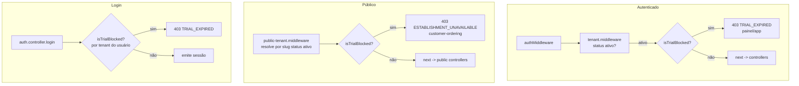

# Design — landing-onboarding

## Overview

Esta feature entrega dois blocos coesos, ancorados no código já existente do
monorepo:

1. **Frontend (`apps/web`, Vite + React 19):** o app deixa de ser o painel do
   operador (roteamento por estado via `useAuth()` em `App.tsx`) e passa a servir
   **apenas rotas públicas** — uma `Landing_Page` de divulgação (R1) e um
   `Signup_Form` de onboarding self-service (R3–R7). Introduzimos `react-router`
   (`Web_Router`, R2), removemos com segurança `LoginPage`/`QueuePage` e os hooks
   de autenticação órfãos (`AuthProvider`/`useAuth`, `useRealtime`, `api-client`,
   `real-client`), e direcionamos qualquer rota não pública para a `Landing_Page`
   (R2.3). O `Operator_PWA` (`order.foodtruck.app.br`) **não é tocado** (R2.4).

2. **Backend (`apps/backend`, Express 4 ESM):** três endpoints públicos
   platform-level — `POST /api/signup` (multipart, R9), `GET /api/signup/color-presets`
   (R6.1) e `GET /api/signup/slug-availability` (R5) — mais um `Signup_Service`
   que valida com Zod, aplica rate-limit por IP, faz upload da logo ao bucket S3
   `order-system-assets` (R7, R8) e **reaproveita** o serviço transacional/idempotente
   `provisionTenant` (`tenant-provision.service.ts`) para criar o tenant (R10).
   Uma migration `015` adiciona a `tenants` as colunas de `Trial_Period`,
   conversão e `Contato_Comercial` (R11), e o `Trial_Guard` estende os middlewares
   `tenant.middleware` e `public-tenant.middleware` para bloquear tenants com teste
   expirado e não convertido (R12).

O design **preserva as invariantes já validadas** do `provisionTenant`
(atomicidade, idempotência por `provisioning_key`, validação de slug apenas para
tenant novo) e do fluxo `routes → controller → service`, e mantém o envelope de
erro central `{ statusCode, error, message }` (`errorHandler`). O `Signup_Service`
é, como o `provisionTenant`, um serviço **platform-level** (fora de escopo de
tenant), portanto pode usar `pool` diretamente onde necessário — sem violar a regra
do `tenantRepository`, cuja exceção de arquitetura já cobre esse tipo de operação
que *cria* tenants.

### Decisões em aberto — valores propostos

| Decisão | Valor proposto | Justificativa |
| --- | --- | --- |
| Comprimento mínimo de senha (R3.6) | **8** (máx. 72) | Alinhado ao já usado em `user.validation.ts` (`min(8).max(72)`); 72 é o limite do bcrypt que o Supabase usa. Reaproveita mensagem existente. |
| Tamanho máximo da logo (R7.4) | **2 MB** (`2 * 1024 * 1024` bytes) | Logo de marca é leve; 2 MB cobre PNG/WEBP de alta resolução sem abrir espaço para abuso do endpoint público. Constante nomeada `MAX_LOGO_BYTES`. |
| Rate-limit do signup (R9.4/R9.5) | janela **15 min**, máx. **5** req/IP | Endpoint público que cria recursos custosos (tenant + Supabase + Evolution). 5/15min limita abuso mas não atrapalha reenvio idempotente legítimo. Constantes `SIGNUP_RATE_LIMIT_WINDOW_MS`/`SIGNUP_RATE_LIMIT_MAX`. |
| Formato do telefone (R3.4) | **E.164 flexível BR**: `^\+?[1-9]\d{9,14}$` após remover espaços/`()`/`-` | Persistimos os dígitos normalizados (com `+` opcional); aceita entrada com máscara BR na UI mas normaliza no backend. Backend é a autoridade final. |
| Limite de dias do `Trial_Warning` (R13) | **7 dias** | Constante compartilhada `TRIAL_WARNING_DAYS` em `@order-system/shared`. Uma semana dá tempo hábil de decisão comercial. |
| Coluna de conversão (R11.2/R12.6) | **`subscription_status TEXT NOT NULL DEFAULT 'trial' CHECK (subscription_status IN ('trial','active','canceled'))`** | Um único enum textual é mais expressivo que um booleano `converted_at`: distingue trial de assinante e de cancelado, mantendo ortogonalidade com `status` (`ativo`/`inativo`). "Convertido" ≡ `subscription_status = 'active'`. |
| Colunas de contato (R11.2) | **`contact_name TEXT`**, **`contact_phone TEXT`** | Nomes descritivos, distintos do admin. `contact_phone` guarda os dígitos normalizados E.164. |
| `trial_ends_at` (R11) | **`trial_ends_at TIMESTAMPTZ`** (nulável) | Nulável para não quebrar tenants legados (que não têm trial) — o `Trial_Guard` trata `NULL` como "sem trial" ⇒ não bloqueia por trial. |
| Nome do preset de cardápio genérico (R6.7) | `presets/generic-menu.json` + `src/presets/generic-menu.ts` (`genericMenuPreset`) | Segue o padrão do par `pastel-das-meninas.{json,ts}` existente. |
| Arquivos de Color_Preset (R6.8) | `presets/colors/*.json` (ex.: `classico.json`, `vibrante.json`, `noturno.json`) | Diretório próprio para separar presets de CORES dos de cardápio; carregados pelo `color-presets` loader. |
| Como registrar Contato_Comercial + `trial_ends_at` (R10.1/R11) | **`provisionTenant` estendido** com campos opcionais `contact`, `trialEndsAt`, `subscriptionStatus`, persistidos **dentro da mesma transação** e aplicados **somente na criação** (nunca no hit idempotente) | Preserva atomicidade e idempotência num único ponto transacional. Um `UPDATE` pós-provisionamento fora da tx abriria janela de inconsistência e exigiria lógica extra de "não sobrescrever no reenvio". Ver "Alterações no `provisionTenant`". |

## Architecture

### Camadas backend (fluxo obrigatório)

```
POST /api/signup (multipart)
  routes/signup.routes.ts
    → signupRateLimiter (express-rate-limit, por IP)      [R9.4/R9.5]
    → multipart parser (memória, 1 arquivo, MAX_LOGO_BYTES)[R7]
    → asyncHandler(signupController)
        controllers/signup.controller.ts                   [HTTP ↔ serviço]
          → parseBody(signupSchema, camposMesclados)        [R9.2/R9.3]
          → signupService.signup({ ...campos, logo })       [R3–R11]
                services/signup.service.ts                   [regra de negócio]
                  → resolve preset de cores (color-presets loader) [R6]
                  → upload logo (s3-logo-upload util)               [R7/R8]
                  → monta theme (deepMergeTheme base)               [R6.6]
                  → provisionTenant({ ..., contact, trialEndsAt })  [R10/R11]
          → responde 201 (novo) / 200 (idempotente)          [R9.6/R10.5]

GET /api/signup/color-presets  → signupController.listColorPresets [R6.1]
GET /api/signup/slug-availability?slug= → signupController.checkSlug [R5]

errorHandler central mapeia ServiceError → { statusCode, error, message } [R9.8]
```

### Fluxo de signup (sequência)

```mermaid
sequenceDiagram
    participant U as Signup_Form (apps/web)
    participant R as signup.routes
    participant C as signup.controller
    participant S as signup.service
    participant S3 as s3-logo-upload
    participant P as provisionTenant
    participant DB as Postgres (tx)

    U->>R: POST /api/signup (multipart: campos + logo)
    R->>R: signupRateLimiter (IP)  [R9.4]
    alt limite excedido
        R-->>U: 429 TOO_MANY_REQUESTS  [R9.5]
    end
    R->>R: multipart parser (1 arquivo, <= 2MB)  [R7.4]
    R->>C: asyncHandler(signupController)
    C->>C: parseBody(signupSchema)  [R9.2/R9.3 -> 422]
    C->>S: signup(input)
    S->>S: valida ASSETS_S3_BUCKET / ASSETS_PUBLIC_BASE_URL  [R8.1/R8.4]
    S->>S: resolve Color_Preset por id  [R6.3 -> 422]
    opt logo presente e válida
        S->>S3: putObject(tenant-assets/{slug}/logo.{ext})  [R8.2]
        alt falha de upload
            S3-->>S: erro
            S-->>C: ServiceError UPLOAD_FAILED  [R8.5] (sem chamar P)
        end
        S3-->>S: ok -> Logo_Public_Url  [R8.3]
    end
    S->>S: theme = colors(preset) + businessName  [R6.6]
    S->>S: trialEndsAt = now + 30 dias  [R11.1]
    S->>P: provisionTenant({provisioningKey=slug, ..., contact, trialEndsAt})
    P->>DB: BEGIN; idempotência por provisioning_key
    alt slug já existe (idempotente)
        DB-->>P: tenant existente (preserva trial/contato)  [R10.4/R11.3]
        P-->>S: { idempotentHit: true }
        S-->>C: resultado
        C-->>U: 200 { tenantId, slug, trialEndsAt }  [R10.5]
    else tenant novo
        DB->>DB: valida slug; INSERT tenants(+trial+contato)+menu+admin
        DB-->>P: COMMIT
        P-->>S: { idempotentHit: false }
        C-->>U: 201 { tenantId, slug, trialEndsAt }  [R9.6]
    end
```

### Trial_Guard (extensão dos middlewares)

O `Trial_Guard` **não é um novo enum de `status`** — um tenant em teste
permanece `status = 'ativo'` (R12.6). Ele é uma função pura reutilizável
`isTrialBlocked({ trialEndsAt, subscriptionStatus, now })` aplicada em dois
pontos existentes, logo após a resolução do tenant:



`isTrialBlocked` retorna `true` **se e somente se** `subscription_status !== 'active'`
E `trial_ends_at` não for nulo E `trial_ends_at <= now` (R12.5/R12.6). Tenant sem
`trial_ends_at` (legado) e não convertido **não** é bloqueado por trial (mantém o
comportamento atual). O login (R12.1) resolve o tenant do usuário e aplica o mesmo
predicado antes de emitir a sessão.

## Components and Interfaces

### Backend

- **`routes/signup.routes.ts`** — monta `POST /api/signup`,
  `GET /api/signup/color-presets`, `GET /api/signup/slug-availability`; encadeia
  `signupRateLimiter` (só no POST), o parser multipart (só no POST) e envolve cada
  handler em `asyncHandler`. Registrado em `index.ts` como
  `app.use('/api/signup', signupRoutes)`, **sem** auth e **sem** `tenantMiddleware`
  (R9.1).
- **`controllers/signup.controller.ts`** — traduz HTTP↔serviço. No POST: mescla
  `req.body` (campos texto do multipart) + `req.file` (logo) num objeto, valida com
  `parseBody(signupSchema, ...)` (lança `ServiceError` 422 `VALIDATION_ERROR`,
  R9.3), chama `signupService.signup`, responde 201/200 (R9.6/R10.5). Nos GETs:
  delega ao serviço e responde. **Sem** try/catch que engula erros (R2 checklist).
- **`services/signup.service.ts`** (`Signup_Service`, platform-level) — orquestra:
  1. valida env `ASSETS_S3_BUCKET`/`ASSETS_PUBLIC_BASE_URL` (R8.1/R8.4);
  2. resolve o `Color_Preset` por id (R6.3);
  3. normaliza telefone e computa `trialEndsAt = now + 30d` (R11.1);
  4. faz upload da logo (se houver) e deriva `Logo_Public_Url` (R7/R8);
  5. monta `theme = { colors: preset.colors, businessName }` (R6.6);
  6. chama `provisionTenant` com `contact` e `trialEndsAt` (R10.1);
  7. mapeia `ProvisioningValidationError → 422` e `ProvisioningError → 500`
     (R10.2/R10.3), reexportando `ServiceError`.
- **`services/s3-logo-upload.ts`** — util que envia a logo ao bucket via
  `@aws-sdk/client-s3` (`PutObjectCommand`), autenticado pelo IAM role da EC2 (sem
  credenciais em env), com chave `tenant-assets/{slug}/logo.{ext}` e `ContentType`
  correto; deriva a `Logo_Public_Url`. Lança `ServiceError(..., 500, 'UPLOAD_FAILED')`
  em falha (R8.5). **Nova dependência:** `@aws-sdk/client-s3`.
- **`services/color-presets.ts`** — loader que lê `presets/colors/*.json` (fonte da
  verdade, R6.8), valida cada um com um schema Zod que exige a paleta `colors.*`
  **completa** (todos os tokens de `ThemeConfig`, R6.4) e **sem** `businessName`
  (R6.5), e expõe `listColorPresets()` e `getColorPreset(id)`.
- **`middleware/signup-rate-limit.middleware.ts`** — `signupRateLimiter` via
  `express-rate-limit` (padrão de `public.routes.ts`), `windowMs = 15min`,
  `max = 5` por IP, resposta 429 pt-BR (R9.4/R9.5).
- **`services/trial-guard.ts`** — `isTrialBlocked(...)` puro + mensagens/códigos;
  consumido pelas extensões dos middlewares e do login.
- **Extensões:** `tenant.middleware.ts` (após checar `status === 'ativo'`, aplica
  `isTrialBlocked` → 403 `TRIAL_EXPIRED`, R12.2/R12.3), `public-tenant.middleware.ts`
  (após resolver o tenant, seleciona também `trial_ends_at`/`subscription_status` e
  aplica → 403 `ESTABLISHMENT_UNAVAILABLE`, R12.7), `auth.controller.login`
  (resolve tenant do usuário e aplica → 403 `TRIAL_EXPIRED`, R12.1).
- **`migrations/015_add_trial_and_contact.sql`** — `ALTER TABLE tenants` com
  `trial_ends_at`, `subscription_status`, `contact_name`, `contact_phone` (R11.2).
- **`validation/signup.validation.ts`** — `signupSchema` (Zod) com todas as regras
  de R3–R7. Slug validado com o mesmo `^[a-z0-9][a-z0-9-]{1,58}[a-z0-9]$` (R4.3).
- **`presets/generic-menu.{ts,json}`** — `Onboarding_Preset` genérico único (R6.7).

### Frontend (`apps/web`)

- **`Web_Router`** — `react-router` (nova dep) montado em `main.tsx`/`App.tsx`:
  `/` → `Landing_Page`, `/signup` → `Signup_Form`, `*` (catch-all) → redireciona a
  `/` (R2.1/R2.3).
- **`pages/LandingPage.tsx`** — conteúdo de divulgação + CTA que navega para
  `/signup` via `useNavigate` (R1).
- **`pages/SignupPage.tsx`** (`Signup_Form`) — formulário com os campos de R3, o
  seletor de `Color_Preset` (busca `GET /api/signup/color-presets`, R6.2), o upload
  de logo (R7.1), a sugestão de slug via `slugify` (R4.1/R4.2) e a checagem de
  disponibilidade via `GET /api/signup/slug-availability` (R5.1). Envia
  `multipart/form-data` a `POST /api/signup`.
- **`services/signup-api.ts`** — cliente de API do onboarding (fetch multipart +
  GETs). Substitui o `api-client`/`real-client` removidos.
- **`utils/slugify.ts`** — função pura que replica a normalização de R4.1 (remove
  acentos, minúsculas, `[^a-z0-9]→-`, colapsa hífens, apara extremidades). Reusada
  no `Signup_Form`; o backend é a autoridade final de validação.
- **Remoções seguras:** `pages/LoginPage.tsx`, `pages/QueuePage.tsx`,
  `hooks/useAuth.tsx`, `hooks/useRealtime.ts`, `hooks/index.ts` (ou reescrito),
  `services/api-client.ts`, `services/real-client.ts` e o teste
  `__tests__/queue-integration.test.tsx`. Verificação: `grep` confirma que esses
  módulos são referenciados **somente** por `App.tsx` (reescrito), `LoginPage`,
  `QueuePage` e o teste de fila — nenhum outro ponto do `apps/web` depende deles.
  `@supabase/supabase-js` deixa de ser usado no `apps/web` (era só do `useAuth`);
  removê-lo do `package.json` é seguro nesta entrega.

### Infraestrutura (documentação — R14)

- Remover `server_name web.foodtruck.app.br` do bloco Nginx que serve o `apps/web`,
  mantendo `foodtruck.app.br` como domínio da `Landing_Page` (R14.4).
- Preservar `location /tenant-assets/` (proxy para o bucket) em `foodtruck.app.br`
  (R14.5), de onde a `Logo_Public_Url` depende (R8.3).
- Bucket `order-system-assets` (`us-east-1`, privado) e IAM role da EC2 com escrita
  já provisionados; sem credenciais em env (R14.1/R14.2/R14.3).
- Novas env vars documentadas em `.env.example`: `ASSETS_S3_BUCKET`,
  `ASSETS_PUBLIC_BASE_URL`, `AWS_REGION` (default `us-east-1`).

## Data Models

### `tenants` — colunas novas (migration 015)

```sql
ALTER TABLE tenants
  ADD COLUMN IF NOT EXISTS trial_ends_at TIMESTAMPTZ,                    -- R11 (nulável: legado sem trial)
  ADD COLUMN IF NOT EXISTS subscription_status TEXT NOT NULL DEFAULT 'trial'
    CHECK (subscription_status IN ('trial', 'active', 'canceled')),      -- R11.2/R12.6 (ortogonal a status)
  ADD COLUMN IF NOT EXISTS contact_name TEXT,                            -- R11.2 Contato_Comercial
  ADD COLUMN IF NOT EXISTS contact_phone TEXT;                           -- R11.2 (E.164 normalizado)
```

- `status` (`ativo`/`inativo`) permanece inalterado; o trial vive em
  `trial_ends_at` + `subscription_status` (R12.6).
- `subscription_status` default `'trial'` cobre novos tenants; tenants legados
  recebem `'trial'` mas, com `trial_ends_at = NULL`, o `Trial_Guard` os trata como
  "sem trial" ⇒ não bloqueia.
- Colunas nuláveis (exceto `subscription_status`) para migração sem downtime, no
  padrão de `012_add_order_location.sql`.

### `users`

Sem alterações de schema. O administrador continua sendo criado pelo
`provisionTenant` (Supabase Auth + linha em `users` com `role='admin'`); os dados de
contato comercial ficam **em `tenants`**, não em `users` (R3.8/R11.2), justamente
para separá-los das credenciais de autenticação.

### Color_Preset (arquivo `presets/colors/*.json`)

```jsonc
{
  "id": "classico",
  "label": "Clássico",
  "colors": { /* TODOS os tokens de ThemeConfig.colors (R6.4), sem businessName (R6.5) */ }
}
```

## API Contracts

Todos os erros usam o `Error_Envelope` `{ statusCode, error, message }`.

### `POST /api/signup` (R9)

- **Content-Type:** `multipart/form-data`. Método diferente ou content-type
  diferente ⇒ rejeição pt-BR sem efeito colateral (R9.7).
- **Campos (texto):** `businessName`, `contactName`, `contactPhone`, `adminName`,
  `adminEmail`, `password`, `slug`, `colorPresetId`.
- **Arquivo (opcional):** `logo` (1 arquivo, PNG/JPG/JPEG/SVG/WEBP, ≤ 2 MB).
- **201** `{ tenantId, slug, trialEndsAt }` (novo, R9.6); **200** mesmos campos
  (idempotente, R10.5).
- **Erros:** 422 `VALIDATION_ERROR` (R3.2–R3.6, R4.4/R4.5, R6.3, R7.3/R7.4, R9.3,
  R10.2); 409 `CONFLICT` (e-mail já em uso R3.7 / slug em uso R5.4); 429
  `TOO_MANY_REQUESTS` (R9.5); 500 `INTERNAL_ERROR` (env ausente R8.4, erro
  inesperado R9.8) / `UPLOAD_FAILED` (R8.5) / `PROVISIONING_FAILED` (R10.3).

### `GET /api/signup/color-presets` (R6.1)

- **200** `{ presets: [{ id, label, colors }] }` — lista completa dos presets de
  cores, backend como fonte da verdade (R6.8).

### `GET /api/signup/slug-availability?slug={slug}` (R5)

Método `GET` com o slug em query string (leitura idempotente, sem efeito).

- **200** `{ slug, valid, available }` onde `valid` = formato ok (R4.3) e
  `available` = não reservado **e** não usado por outro tenant (R5.2/R5.3).
  Formato inválido ⇒ `valid=false, available=false`.

## Error Handling

Mapeamento para o `Error_Envelope` (produzido pelo `errorHandler` central a partir
de `ServiceError`; o controller apenas deixa o erro subir):

| Situação | code | status | Requisito |
| --- | --- | --- | --- |
| Campo de cadastro inválido / preset inexistente / tipo/tamanho de logo / método ou content-type incorreto | `VALIDATION_ERROR` | 422 | R3.2–R3.6, R4.4/R4.5, R6.3, R7.3/R7.4, R9.3, R9.7 |
| Slug reservado | `VALIDATION_ERROR` | 422 | R4.5 |
| E-mail já em uso | `CONFLICT` | 409 | R3.7 |
| Slug já em uso por outro tenant | `CONFLICT` | 409 | R5.4 |
| Rate-limit excedido | `TOO_MANY_REQUESTS` | 429 | R9.5 |
| `ProvisioningValidationError` | `VALIDATION_ERROR` | 422 | R10.2 |
| `ProvisioningError` (rollback) | `PROVISIONING_FAILED` | 500 | R10.3 |
| Falha de upload S3 | `UPLOAD_FAILED` | 500 | R8.5 |
| Env `ASSETS_*` ausente | `INTERNAL_ERROR` | 500 | R8.4 |
| Erro inesperado | `INTERNAL_ERROR` | 500 | R9.8 |
| Trial expirado (login/painel/app) | `TRIAL_EXPIRED` | 403 | R12.1–R12.3 |
| Trial expirado (customer-ordering) | `ESTABLISHMENT_UNAVAILABLE` | 403 | R12.7 |

Detalhes internos nunca vazam: falhas inesperadas e de provisionamento são
registradas via `logError` e respondidas com mensagem pt-BR genérica (R8.4/R9.8).
A validação Zod ocorre **antes** de qualquer upload ou chamada ao
`provisionTenant` (R9.2), e o rate-limit **antes** de qualquer efeito (R9.5).

### Alterações no `provisionTenant`

Para persistir `Contato_Comercial` e `trial_ends_at` de forma **atômica e
idempotente** num único ponto (evitando `UPDATE` fora da transação), `provisionTenant`
ganha três campos **opcionais** em `ProvisionTenantInput`:

- `contact?: { name: string; phone: string } | null`
- `trialEndsAt?: Date | string | null`
- `subscriptionStatus?: 'trial' | 'active' | 'canceled'`

Eles entram no `INSERT INTO tenants` **apenas na criação de tenant novo**. No
caminho idempotente (`findExistingByKey` retorna o tenant), nada é atualizado —
`trial_ends_at` e o contato do tenant existente são **preservados** (R10.4/R11.3).
Assinaturas públicas e o comportamento atual (campos omitidos ⇒ defaults do schema)
ficam retrocompatíveis com o `platform-tenant.controller`.

## Testing Strategy

Abordagem dupla, no estilo já praticado no repo (Vitest + fast-check no backend;
Testing Library no `apps/web`). PBT **aplica-se** à lógica pura do backend
(validação Zod, `slugify`, montagem de tema, predicado do `Trial_Guard`,
idempotência/atomicidade do provisionamento — todas com espaço de entrada amplo e
propriedades universais). Upload S3 e Nginx são I/O/infra: cobertos por testes
example-based com **mocks** (injeção de dependências, como `ProvisionDeps` já faz),
não por PBT. UI (`Landing_Page`/`Signup_Form`) é coberta por Testing Library
(exemplos + interação), não por PBT.

**Backend — property tests** (`src/__tests__/properties/*.property.test.ts`, 100+
iterações, tag `Feature: landing-onboarding, Property N: ...`):

- Validação de campos rejeita entradas inválidas com pt-BR (Prop. 1, 2, 4, 6).
- `slugify` sempre produz slug em formato válido ou vazio (Prop. 3).
- Montagem de tema preserva a paleta completa do preset e o `businessName` (Prop. 5).
- Idempotência: reenvio do mesmo slug não duplica nem reinicia `trial_ends_at`
  (Prop. 7). Atomicidade: falha reverte tudo (Prop. 8) — via `ProvisionDeps` mock.
- `trial_ends_at = cadastro + 30d` (Prop. 9); `isTrialBlocked` (Prop. 10, 11).

**Backend — unit/integration (example-based):** upload S3 com cliente mockado
(chave correta, `Logo_Public_Url` derivada, falha ⇒ `UPLOAD_FAILED` sem chamar
`provisionTenant`); env ausente ⇒ 500; rate-limit 429; content-type incorreto.

**apps/web (Testing Library):** `Landing_Page` renderiza CTA e navega para
`/signup` (R1); `Web_Router` direciona rota desconhecida para a landing (R2.3);
`Signup_Form` sugere slug e para de re-sugerir após edição manual (R4.2), exige
campos e exibe `Trial_Warning` conforme dias restantes (R13). Property test com
fast-check para `slugify` no `apps/web` (mesma propriedade do backend).

## Correctness Properties

*Uma propriedade é uma característica ou comportamento que deve valer para todas as
execuções válidas do sistema — uma afirmação formal sobre o que o sistema deve
fazer. Propriedades são a ponte entre a especificação legível por humanos e
garantias de correção verificáveis por máquina.*

### Property 1: Validação de campos de cadastro rejeita entradas inválidas

*Para qualquer* combinação de campos em que `businessName` seja vazio (após
`trim`) ou exceda 120 caracteres, `contactName` seja vazio, `contactPhone` não
corresponda ao formato de telefone aceito, `adminEmail` tenha formato inválido, ou
`password` tenha menos que o comprimento mínimo (8), o `signupSchema` SHALL rejeitar
a entrada com mensagem em pt-BR, sem que qualquer efeito colateral (upload ou
`provisionTenant`) seja produzido.

**Validates: Requirements 3.2, 3.3, 3.4, 3.5, 3.6, 9.2, 9.3**

### Property 2: E-mail é comparado de forma case-insensitive

*Para qualquer* e-mail, todas as suas variações de caixa (maiúsculas/minúsculas)
são tratadas como o mesmo e-mail na verificação de unicidade, de modo que um
cadastro cujo e-mail já exista (em qualquer caixa) SHALL ser rejeitado com código
`CONFLICT` e status 409.

**Validates: Requirements 3.7**

### Property 3: `slugify` sempre produz um slug bem-formado ou vazio

*Para qualquer* string de nome de empresa, o resultado de `slugify` SHALL ser uma
string que ou é vazia ou casa o padrão `^[a-z0-9][a-z0-9-]{1,58}[a-z0-9]$`: sem
acentos, sem letras maiúsculas, sem caracteres fora de `[a-z0-9-]`, sem hífens
consecutivos e sem hífen no início ou fim.

**Validates: Requirements 4.1**

### Property 4: Validação de formato do slug

*Para qualquer* string candidata a slug, o `signupSchema`/`Slug_Availability_Endpoint`
SHALL considerá-la de formato válido se e somente se ela casar
`^[a-z0-9][a-z0-9-]{1,58}[a-z0-9]$`; slugs de formato inválido (vazio, <3 ou >60
caracteres, caracteres fora de `[a-z0-9-]`, hífen nas extremidades) SHALL ser
rejeitados com mensagem pt-BR, e slugs pertencentes a `RESERVED_SLUGS` SHALL ser
tratados como indisponíveis.

**Validates: Requirements 4.3, 4.4, 4.5, 5.3**

### Property 5: Montagem do tema preserva a paleta do preset e o businessName

*Para qualquer* Color_Preset disponível e qualquer `businessName` de cadastro, o
`theme` (`Partial<ThemeConfig>`) montado pelo `Signup_Service` SHALL ter
`theme.colors` igual à paleta completa do preset e `theme.businessName` igual ao
`businessName` informado, e aplicá-lo sobre o `NEUTRAL_PLATFORM_THEME` via
`deepMergeTheme` SHALL produzir um tema completo cujos tokens de cor são os do preset.

**Validates: Requirements 6.6**

### Property 6: Todo Color_Preset expõe paleta de cores completa e sem businessName

*Para qualquer* Color_Preset carregado a partir de `presets/colors/*.json`, ele
SHALL conter todos os tokens de `ThemeConfig.colors` (nenhum omitido) e NÃO SHALL
conter o campo `businessName`.

**Validates: Requirements 6.1, 6.4, 6.5**

### Property 7: Preset de cores inexistente é rejeitado

*Para qualquer* `colorPresetId` que não corresponda a um preset disponível, o
`Signup_Service` SHALL rejeitar o cadastro com código `VALIDATION_ERROR` e status 422.

**Validates: Requirements 6.3**

### Property 8: Extensão e chave da logo derivam do tipo do arquivo

*Para qualquer* Logo_Upload de tipo permitido (PNG, JPG, JPEG, SVG, WEBP), a
Logo_Object_Key gerada SHALL ser `tenant-assets/{slug}/logo.{ext}` com `{ext}`
correspondente ao tipo do arquivo, e logos de tipo não permitido SHALL ser
rejeitadas com mensagem pt-BR listando os tipos aceitos.

**Validates: Requirements 7.3, 7.5, 8.2**

### Property 9: Logo maior que o limite é rejeitada

*Para qualquer* Logo_Upload cujo tamanho exceda `MAX_LOGO_BYTES` (2 MB), o cadastro
SHALL ser rejeitado com mensagem pt-BR indicando o tamanho máximo, sem persistir a
logo nem criar o tenant.

**Validates: Requirements 7.4**

### Property 10: Derivação da URL pública da logo

*Para qualquer* base pública, slug e extensão, a Logo_Public_Url derivada SHALL ser
exatamente `{ASSETS_PUBLIC_BASE_URL}/tenant-assets/{slug}/logo.{ext}`.

**Validates: Requirements 8.3**

### Property 11: Provisionamento é idempotente e preserva o trial

*Para qualquer* entrada de cadastro, chamar o provisionamento duas vezes com o mesmo
`provisioningKey` (slug) SHALL retornar o mesmo `tenantId` sem criar um segundo
tenant, e o segundo resultado (idempotente) SHALL preservar o `trial_ends_at` e o
Contato_Comercial já registrados, sem reiniciá-los nem sobrescrevê-los.

**Validates: Requirements 10.4, 11.3**

### Property 12: Cálculo do fim do teste

*Para qualquer* instante de cadastro `now`, o `trial_ends_at` registrado SHALL ser
igual a `now` acrescido de 30 dias corridos.

**Validates: Requirements 11.1**

### Property 13: Bloqueio do Trial_Guard

*Para qualquer* tenant, o `Trial_Guard` SHALL bloquear o acesso (login, painel, app
e customer-ordering, com status 403) se e somente se o tenant não estiver convertido
(`subscription_status !== 'active'`) E possuir `trial_ends_at` definido com
`trial_ends_at <= now`; em qualquer outro caso (trial vigente, `trial_ends_at`
ausente, ou tenant convertido) o acesso SHALL ser permitido.

**Validates: Requirements 12.1, 12.2, 12.3, 12.4, 12.5, 12.6, 12.7, 12.8**

### Property 14: Visibilidade do Trial_Warning

*Para qualquer* tenant com `Trial_Period` vigente, o `Trial_Warning` SHALL ser
exibido informando os dias restantes se e somente se os dias restantes forem menores
ou iguais a `TRIAL_WARNING_DAYS` (7); caso contrário SHALL permanecer oculto.

**Validates: Requirements 13.1, 13.2**

### Property 15: Rota não pública direciona para a Landing_Page

*Para qualquer* caminho de URL que não corresponda a uma rota pública conhecida
(`/`, `/signup`), o `Web_Router` SHALL renderizar a `Landing_Page`.

**Validates: Requirements 2.3**

## Requirements Traceability

| Requisito | Componente(s) | Verificação |
| --- | --- | --- |
| R1 (Landing) | `pages/LandingPage.tsx`, `Web_Router` | Testing Library (CTA, navegação, sem auth) |
| R2 (roteamento público / descontinuação) | `Web_Router`, remoção de `LoginPage`/`QueuePage`/`useAuth`/`useRealtime`/`api-client`/`real-client`; `Operator_PWA` intocado | Prop. 15; exemplos de rotas; `grep` confirma dependências órfãs |
| R3 (empresa/contato/admin) | `validation/signup.validation.ts`, `signup.service.ts`, `provisionTenant` (contato) | Prop. 1, 2; integração admin/contato |
| R4 (slug: sugestão/validação) | `utils/slugify.ts` (web), `signupSchema` (regex), `Signup_Form` | Prop. 3, 4; Testing Library (R4.2) |
| R5 (disponibilidade do slug) | `GET /api/signup/slug-availability`, `signup.controller`, unicidade via `provisioning_key` | Prop. 4; integração (uso no DB) |
| R6 (preset de cores + cardápio genérico) | `color-presets.ts`, `presets/colors/*.json`, `presets/generic-menu.*`, `signup.service` (tema) | Prop. 5, 6, 7; exemplos (endpoint, seleção, menuPreset) |
| R7 (upload de logo) | parser multipart, `signup.service`, `s3-logo-upload.ts` | Prop. 8, 9; exemplos (sem logo, 1 arquivo) |
| R8 (S3 + URL pública) | `s3-logo-upload.ts` (`@aws-sdk/client-s3`, IAM role), env `ASSETS_*` | Prop. 10; integração com S3 mock; exemplos (env ausente, falha) |
| R9 (endpoint de signup) | `signup.routes.ts`, `signup-rate-limit.middleware.ts`, `signup.controller`, `parseBody` | Prop. 1; exemplos (429, 201, método/content-type, 500) |
| R10 (reaproveitar provisionTenant) | `signup.service`, `provisionTenant` (estendido) | Prop. 11; exemplos (mapeamento de erros, 200/201) |
| R11 (registro do trial) | `migration 015`, `signup.service` (trialEndsAt), `provisionTenant` | Prop. 11, 12; smoke (migração) |
| R12 (bloqueio pós-trial) | `trial-guard.ts`, extensões de `tenant.middleware`/`public-tenant.middleware`/`auth.controller.login` | Prop. 13 |
| R13 (avisos de expiração) | `Trial_Warning` (apps/web) + `TRIAL_WARNING_DAYS` (shared) | Prop. 14; Testing Library |
| R14 (infraestrutura/Nginx) | doc do bloco Nginx `foodtruck.app.br`, `/tenant-assets/`, bucket, IAM role, `.env.example` | Documentação; smoke de env |

## Iteration

Se forem identificadas lacunas nos requisitos durante o design (por exemplo, o
comportamento exato do `Slug_Availability_Endpoint` diante de concorrência, ou a
política de conversão que altera `subscription_status`), o design pode retornar à
fase de requisitos para refinamento antes da implementação.
