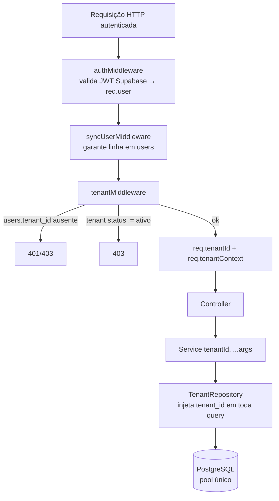
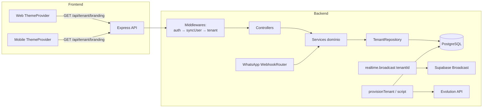
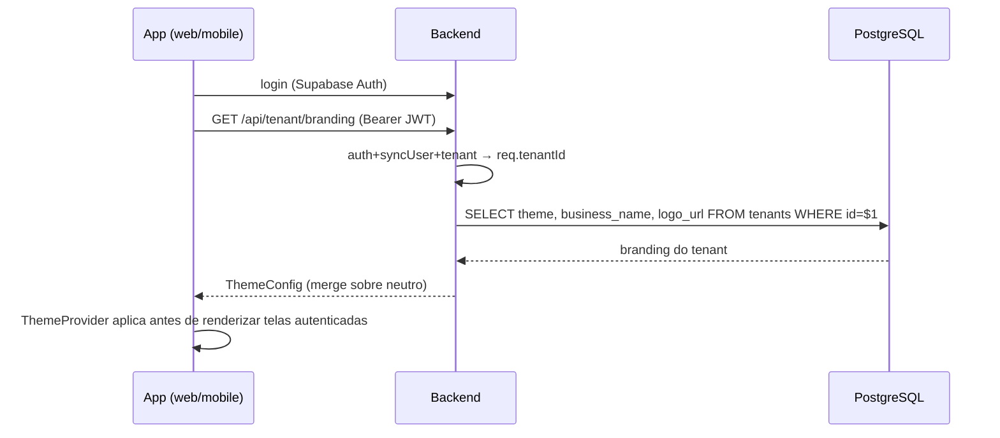

# Design Document

## Overview

Este documento descreve o design técnico para transformar o MVP mono-cliente em um produto white-label multi-tenant, conforme os requisitos aprovados em `requirements.md`. O modelo adotado é **banco/stack único compartilhado** com uma coluna `tenant_id` em toda tabela com escopo de tenant (Requirement 1), isolamento **na camada de aplicação** por meio de um **helper centralizado de acesso a dados** (Requirements 5 e 6), e branding/tema resolvidos **por tenant após o login** (Requirement 7), com um único app publicado (Requirement 11).

O design se ancora no código real do backend (Express + TypeScript + `pg` Pool, ESM com especificadores `.js`), do `packages/shared` (tipo `ThemeConfig`, validadores Zod, `isValidTransition`), e dos apps web (Vite/React) e mobile (Expo/RN).

Princípios de design que guiam as decisões:

1. **Um único ponto de imposição de tenant.** Todo acesso a dados com escopo de tenant passa por um helper (`TenantRepository`) que injeta `tenant_id`. Nenhum service monta SQL de tenant manualmente (R5).
2. **`tenantId` explícito, não implícito.** O `tenant_id` é resolvido no middleware e propagado como argumento explícito aos services, em vez de estado global via `AsyncLocalStorage` (ver Design Decisions).
3. **Schema final desde o início.** Como o projeto é greenfield, as migrations são reescritas para nascer multi-tenant, sem `ALTER TABLE` incrementais nem backfill (R1, itens 11–14).
4. **Comportamento preservado por tenant.** Ciclo de vida de pedidos, pagamentos, cardápio, usuários, resumo e realtime continuam idênticos ao MVP, agora escopados (R12).

### Mapeamento de Requisitos para Componentes

| Componente | Requisitos |
|---|---|
| Tabela `tenants` + `tenant_id` nas tabelas escopadas | R1 |
| Unicidade composta por tenant | R2 |
| `next_daily_number(tenant, date)` | R3 |
| `tenantMiddleware` (resolução de tenant) | R4, R10 |
| `TenantRepository` (helper centralizado) | R5, R6 |
| `BrandingService` + `/api/tenant/branding` + Theme Providers | R7, R11 |
| `WebhookRouter` + Evolution por tenant + sessões escopadas | R8 |
| `provisionTenant()` + script/endpoint de onboarding | R9 |
| `platform_admins` + `platformAdminMiddleware` | R10 |
| Canais de realtime namespaced | R12 |

## Architecture

### Fluxo de Resolução de Tenant (request)



### Diagrama de Componentes



### Fluxo de Branding pós-login



## Components and Interfaces

### 1. Tabela `tenants` e coluna `tenant_id` (R1, R2, R3)

Nova tabela raiz. Colunas escopadas passam a referenciá-la. Tabelas com escopo de tenant: `users`, `categories`, `menu_items`, `orders`, `order_items`, `daily_sequences`, `whatsapp_sessions`.

```sql
CREATE TABLE tenants (
  id UUID PRIMARY KEY DEFAULT gen_random_uuid(),
  business_name TEXT NOT NULL CHECK (char_length(business_name) BETWEEN 1 AND 120),
  logo_url TEXT,
  theme JSONB,                                  -- ThemeConfig parcial (override sobre o neutro)
  evolution_instance_name TEXT UNIQUE,          -- mapeia instância WhatsApp → tenant (R8)
  whatsapp_config JSONB,                         -- número, credenciais/refs adicionais
  timezone TEXT NOT NULL DEFAULT 'America/Sao_Paulo',
  status TEXT NOT NULL DEFAULT 'ativo' CHECK (status IN ('ativo','inativo')),
  provisioning_key TEXT UNIQUE,                 -- idempotência de onboarding (R9)
  created_at TIMESTAMPTZ NOT NULL DEFAULT NOW(),
  updated_at TIMESTAMPTZ NOT NULL DEFAULT NOW()
);
```

Cada tabela escopada recebe `tenant_id UUID NOT NULL REFERENCES tenants(id) ON DELETE RESTRICT` já na criação (sem `ALTER TABLE`). Uniques compostas (R2):

```sql
-- users
CREATE UNIQUE INDEX users_tenant_email_lower_idx ON users (tenant_id, LOWER(email));
-- categories
CREATE UNIQUE INDEX categories_tenant_name_lower_idx ON categories (tenant_id, LOWER(name));
-- menu_items (apenas itens ativos, por tenant)
CREATE UNIQUE INDEX menu_items_tenant_name_active_idx
  ON menu_items (tenant_id, LOWER(name)) WHERE status = 'ativo';
-- orders (numeração diária única por tenant)
CREATE UNIQUE INDEX orders_tenant_date_number_idx
  ON orders (tenant_id, order_date, daily_number);
```

Chaves primárias que mudam para compostas:

```sql
-- daily_sequences: PK passa de (order_date) para (tenant_id, order_date)
CREATE TABLE daily_sequences (
  tenant_id UUID NOT NULL REFERENCES tenants(id) ON DELETE RESTRICT,
  order_date DATE NOT NULL,
  last_number INT NOT NULL DEFAULT 0,
  PRIMARY KEY (tenant_id, order_date)
);

-- whatsapp_sessions: PK passa de (phone_number) para (tenant_id, phone_number) (R8.7)
CREATE TABLE whatsapp_sessions (
  tenant_id UUID NOT NULL REFERENCES tenants(id) ON DELETE RESTRICT,
  phone_number TEXT NOT NULL,
  state TEXT NOT NULL DEFAULT 'saudacao' CHECK (state IN ('saudacao','selecionando','resumo')),
  cart JSONB NOT NULL DEFAULT '[]'::jsonb,
  started_at TIMESTAMPTZ NOT NULL DEFAULT NOW(),
  last_activity_at TIMESTAMPTZ NOT NULL DEFAULT NOW(),
  PRIMARY KEY (tenant_id, phone_number)
);
```

Função de numeração diária por tenant (R3):

```sql
CREATE OR REPLACE FUNCTION next_daily_number(p_tenant_id UUID, p_date DATE)
RETURNS INT AS $$
DECLARE v_number INT;
BEGIN
  INSERT INTO daily_sequences (tenant_id, order_date, last_number)
  VALUES (p_tenant_id, p_date, 1)
  ON CONFLICT (tenant_id, order_date)
  DO UPDATE SET last_number = daily_sequences.last_number + 1
  RETURNING last_number INTO v_number;
  RETURN v_number;
END;
$$ LANGUAGE plpgsql;
```

#### Papel de Platform_Admin vs Tenant_Admin (R10)

Cada `Tenant_User` pertence a exatamente um tenant (`users.tenant_id NOT NULL`). O **Platform_Admin** é modelado em tabela separada, `platform_admins`, referenciando o `id` do usuário no Supabase Auth, **sem** `tenant_id`:

```sql
CREATE TABLE platform_admins (
  id UUID PRIMARY KEY,               -- id do usuário no Supabase Auth
  email TEXT NOT NULL UNIQUE,
  created_at TIMESTAMPTZ NOT NULL DEFAULT NOW()
);
```

Justificativa: mantém o invariante "todo usuário de tenant tem exatamente um tenant" (R4.1) sem exceções na tabela `users`, e separa fisicamente quem pode gerenciar tenants de quem opera dentro de um. Rotas de plataforma usam `platformAdminMiddleware` (consulta `platform_admins`) e **não** passam pelo `tenantMiddleware`.

#### Plano final de migrations (reescrito do zero) (R1.11–R1.14)

O runner `run-migrations.ts` é mantido (aplica `*.sql` em ordem numérica, registra em `_migrations`). Os arquivos atuais `001`–`010` são **substituídos** por um conjunto que já nasce multi-tenant e cria `tenants` primeiro:

| Arquivo | Conteúdo |
|---|---|
| `001_create_tenants.sql` | `tenants` + `platform_admins` |
| `002_create_users.sql` | `users` com `tenant_id NOT NULL FK` |
| `003_create_categories.sql` | `categories` com `tenant_id NOT NULL FK` |
| `004_create_menu_items.sql` | `menu_items` com `tenant_id` + FK composta para categoria do mesmo tenant |
| `005_create_orders.sql` | `orders` com `tenant_id`, `created_by` FK users |
| `006_create_order_items.sql` | `order_items` com `tenant_id` (denormalizado p/ isolamento direto) |
| `007_create_daily_sequences.sql` | PK `(tenant_id, order_date)` |
| `008_create_whatsapp_sessions.sql` | PK `(tenant_id, phone_number)` |
| `009_create_indices.sql` | todos os índices compostos por tenant |
| `010_create_next_daily_number.sql` | `next_daily_number(uuid, date)` |

O antigo `010_seed_menu.sql` (menu da Pastel com UUIDs fixos) é **removido** — o cardápio inicial passa a ser dado de onboarding (R9.6). `order_items` carrega `tenant_id` próprio (além de `order_id`) para que o helper possa filtrar diretamente por tenant sem depender sempre de JOIN em `orders`.

> Observação de integridade: para reforçar que um `menu_item` e sua `category` pertencem ao mesmo tenant, usa-se FK composta `(category_id, tenant_id) REFERENCES categories(id, tenant_id)` (exige `UNIQUE (id, tenant_id)` em `categories`). O mesmo padrão vale para `order_items → orders` e `orders → users`.

### 2. `tenantMiddleware` (R4, R10)

Novo middleware inserido **após** `authMiddleware` e `syncUserMiddleware`, antes dos controllers de negócio. Resolve o tenant a partir da linha do usuário.

```ts
// apps/backend/src/middleware/tenant.middleware.ts
export interface TenantContext {
  tenantId: string;
  timezone: string;
  status: 'ativo' | 'inativo';
}
export interface AuthenticatedRequest extends Request {
  user?: { id: string; email: string; role?: string };
  tenantId?: string;
  tenantContext?: TenantContext;
}
```

Lógica:

1. Carrega `SELECT u.tenant_id, t.status, t.timezone FROM users u JOIN tenants t ON t.id = u.tenant_id WHERE u.id = $1`.
2. Se não há linha / `tenant_id` nulo indeterminável a partir das credenciais → **401** (R4.7).
3. Se o usuário existe mas sem tenant associado válido → **403** "sem tenant associado" (R4.4).
4. Se `tenant.status <> 'ativo'` → **403** "tenant inativo" (R4.5).
5. Caso ok, define `req.tenantId` e `req.tenantContext` (R4.3) e chama `next()`.

Rotas de plataforma (`/api/platform/*`) usam `platformAdminMiddleware` no lugar do `tenantMiddleware`, ignorando o escopo de tenant (R10.2).

### 3. `TenantRepository` — Helper Centralizado de Acesso a Dados (R5, R6)

Ponto único que injeta `tenant_id`. Reside em `apps/backend/src/db/tenant-repository.ts`. Recebe `tenantId` **explícito** e um `client` opcional (para transações), envolvendo o `pool`.

```ts
export class MissingTenantContextError extends Error {}

export interface TenantRepository {
  // Leitura: sempre acrescenta "tenant_id = $tenant" ao WHERE
  select<T>(table: string, opts: { where?: SqlFragment; orderBy?: string }): Promise<T[]>;
  findOne<T>(table: string, opts: { where: SqlFragment }): Promise<T | null>;
  // Escrita: injeta tenant_id nas colunas do INSERT
  insert<T>(table: string, values: Record<string, unknown>): Promise<T>;
  // Update/Delete: restringe a linhas do tenant; retorna rowCount
  update(table: string, set: Record<string, unknown>, where: SqlFragment): Promise<number>;
  delete(table: string, where: SqlFragment): Promise<number>;
  // Escape hatch controlado para SQL complexo (agregações do summary):
  // exige placeholder de tenant e falha se ausente.
  raw<T>(sql: string, params: unknown[]): Promise<T[]>;
  withTransaction<R>(fn: (txRepo: TenantRepository) => Promise<R>): Promise<R>;
}

export function tenantRepository(tenantId: string, client?: PoolClient): TenantRepository;
```

Regras de imposição:

- Se `tenantId` for `undefined`/vazio, o factory lança `MissingTenantContextError` **antes** de qualquer I/O (R5.7, R6.2).
- `select`/`findOne` sempre concatenam `AND tenant_id = $n`. Leitura sem correspondência retorna lista vazia / `null`, nunca erro (R5.2).
- `insert` injeta `tenant_id` no conjunto de colunas, ignorando qualquer `tenant_id` divergente vindo do chamador.
- `update`/`delete` sempre incluem `tenant_id = $n` no `WHERE`; `rowCount = 0` sinaliza "não pertence ao tenant" → controller mapeia para **404** (R6.3, R6.4).
- `raw()` é a única via para SQL analítico (ex.: agregações de `summary.service.ts`); recebe SQL parametrizado onde o `tenant_id` já é um placeholder obrigatório, validado por convenção + teste.

#### Refatoração dos services

Os services deixam de importar `pool` diretamente e passam a receber `tenantId` como **primeiro argumento**, criando o repositório por requisição:

```ts
// antes
export async function getOrders(statuses: string[], date?: string) {
  const r = await pool.query(`... WHERE o.order_date = $1 ...`, [orderDate]);
}
// depois
export async function getOrders(tenantId: string, statuses: string[], date?: string) {
  const repo = tenantRepository(tenantId);
  const r = await repo.raw(
    `... WHERE tenant_id = $1 AND order_date = $2 ...`, [tenantId, orderDate]
  );
}
```

O controller extrai `req.tenantId` (garantido pelo `tenantMiddleware`) e o repassa. Cross-tenant: como toda query filtra por tenant, um `id` de outro tenant simplesmente "não existe" para aquela requisição → 404 (R6).

Enforcement de que nenhum caminho ignora o helper:
- `config/database.ts` deixa de exportar `pool` para uso direto em services; expõe o `pool` apenas ao `TenantRepository` e ao runner de migrations/onboarding (que operam a nível de plataforma).
- Regra de lint/teste: um teste de arquitetura verifica que nenhum arquivo em `src/services/**` importa `config/database.js`.

### 4. Numeração diária por tenant nos fluxos de criação (R3)

`createOrder` e `createWhatsAppOrder` passam a chamar `next_daily_number($tenantId, $date)` dentro da transação, e o `INSERT` em `orders` inclui `tenant_id`. O tratamento de violação de unicidade (`code === '23505'` em `daily_number`) → **409** "Conflito de numeração, tente novamente" é mantido, agora sobre o índice composto `orders_tenant_date_number_idx` (R3.7).

### 5. Branding & Theme Service (R7, R11)

Novo endpoint autenticado:

```
GET /api/tenant/branding
→ 200 { businessName, logoUrl, theme: Partial<ThemeConfig> }
```

`BrandingService` lê `tenants` pelo `req.tenantId` e retorna o `ThemeConfig` do tenant (merge do `theme` JSON sobre o **tema neutro da plataforma**). Responde em ≤ 2s (R7.7).

Frontend:

- **Web** — `loadTheme` deixa de depender só de `window.__THEME_CONFIG__`. Após o login, o `ThemeProvider` faz `fetch('/api/tenant/branding')` e aplica via CSS custom properties (mecanismo já existente de `deepMergeTheme` sobre o neutro). Antes de autenticar, aplica o neutro dentro de ~1s (R11.6). Falha/timeout → neutro (R7.8).
- **Mobile** — implementa o `loadTheme` (hoje um `// TODO` que retorna `defaultTheme`): após login, busca `/api/tenant/branding`, faz `deepMergeTheme(neutro, tenantTheme)` e aplica no `ThemeProvider` antes das telas autenticadas, sem novo build (R7.5). Cache local do último tema para partida rápida; revalida a cada login.

Remoção de hardcode (R11): `defaultTheme` em `apps/web/src/theme/theme.config.ts` e `apps/mobile/src/theme/theme.config.ts` passa a ser um **tema neutro da plataforma** (sem "Pastel das Meninas"); `apps/mobile/app.json` `name` e `apps/web/index.html` `<title>` passam a um nome genérico da plataforma; branding real vem sempre do backend em runtime.

### 6. WhatsApp por Tenant (R8)

Mapeamento instância→tenant via `tenants.evolution_instance_name` (UNIQUE, R8.1). O webhook da Evolution inclui o campo `instance` no corpo.

`WebhookRouter` (`bot/whatsapp.controller.ts` refatorado):

1. Extrai `instance` do payload; resolve tenant por `evolution_instance_name`.
2. Instância desconhecida, payload malformado, ausência de `instance` ou erro interno → **HTTP 200 sem criar dados** (R8.3, R8.4, R8.5). Nota: substitui o atual retorno **500** em erro inesperado.
3. Processa a mensagem em background com o `tenantId` resolvido (fire-and-forget), respondendo 200 em ≤10s (R8.6).

`whatsapp.service.ts` passa a receber `tenantId`: `getSession/createSession/updateSession/deleteSession` operam por `(tenant_id, phone_number)`; `fetchActiveMenuItems(tenantId)` usa o cardápio do tenant (R8.10); `createWhatsAppOrder` atribui o pedido a um admin **ativo daquele tenant** (`WHERE tenant_id=$1 AND role='admin' AND status='ativo'`); se não houver admin ativo, não cria o pedido e registra a falha (R8.9). `sendTextMessage` recebe o `instanceName` do tenant por chamada, em vez do `EVOLUTION_INSTANCE_NAME` global.

### 7. Onboarding / Provisionamento (R9)

`provisionTenant(input)` em `apps/backend/src/services/tenant-provision.service.ts`, com script CLI `scripts/create-tenant.ts` e endpoint opcional `POST /api/platform/tenants` (protegido por `platformAdminMiddleware`).

Transação (rollback total em falha — R9.7):

1. Valida entrada; rejeita antes de criar qualquer registro se inválida (R9.8).
2. Idempotência: se `provisioning_key` já existe, retorna o tenant existente sem duplicar (R9.9).
3. `INSERT tenants` (branding, tema, timezone, `evolution_instance_name`).
4. Seed de categorias/itens iniciais parametrizado (substitui o antigo `010_seed_menu.sql`) — Pastel das Meninas vira apenas um preset de onboarding (R9.6).
5. Cria usuário admin via `supabaseAdmin.auth.admin.createUser` + linha em `users` com `tenant_id` e `role='admin'` (R9.3).
6. Cria a instância Evolution e configura o webhook para `/api/webhook/evolution` (R9.4).

Sem alteração de código nem redeploy (R9.5): tudo é dado/side-effect em runtime.

### 8. Realtime namespaced por tenant (R12)

Canais passam a incluir o `tenantId`: `orders:queue:{tenantId}` e `orders:payment:{tenantId}`. `broadcast()` recebe o `tenantId` (ou o nome de canal já namespaced) dos callers em `order.service.ts`/`whatsapp.service.ts`.

`initRealtimeChannels()` não pode mais pré-inscrever uma lista global fixa. Adota-se **inscrição lazy** dentro de `broadcast()`: na primeira publicação de um canal, ele é inscrito e cacheado no `subscribedChannels`. Tradeoff: perde-se o "warm-up" de 10s do MVP, mas ganha-se escalabilidade com N tenants sem pré-inscrever centenas de canais ociosos. O frontend assina apenas os canais do seu próprio tenant; tentativa de assinar canal de outro tenant não recebe eventos (R12.9).

## Data Models

Tipos compartilhados em `packages/shared` ganham a noção de tenant/branding (sem quebrar os existentes):

```ts
export interface Tenant {
  id: string;
  businessName: string;
  logoUrl: string | null;
  theme: Partial<ThemeConfig> | null;
  timezone: string;
  status: 'ativo' | 'inativo';
}

export interface TenantBrandingResponse {
  businessName: string;
  logoUrl: string | null;
  theme: Partial<ThemeConfig>;   // aplicar via deepMergeTheme sobre o neutro
}
```

`ThemeConfig` (existente) permanece a fonte de verdade dos tokens; o `theme` do tenant é um `Partial<ThemeConfig>` (override). Registros de domínio (`OrderRecord`, etc.) não expõem `tenant_id` na API — ele é um detalhe de isolamento, não de payload.

## Error Handling

| Situação | Requisito | Resposta |
|---|---|---|
| `tenant_id` não resolvível a partir das credenciais | R4.7 | 401 |
| Usuário sem tenant associado (ou associação inválida) | R4.4 | 403 |
| Tenant com status ≠ `ativo` | R4.5 | 403 |
| Leitura de registro de outro tenant | R6.3 | 404 (como se não existisse) |
| Update/delete de registro de outro tenant | R6.4 | 404, sem alterar dado |
| Operação de dados sem `tenantId` no helper | R5.7, R6.2 | `MissingTenantContextError` → 500 (erro de programação; coberto por teste) |
| Tenant_Admin/Tenant_User em rota de gestão de tenants | R10.4 | 403 |
| Conflito de numeração diária (23505) | R3.7 | 409 (retry-able) |
| Transição de status inválida | R12.2 | 422 |
| Webhook: instância desconhecida/malformado/erro interno | R8.3–R8.5 | 200 sem criar dados |
| Onboarding: entrada inválida | R9.8 | erro antes de qualquer escrita |
| Onboarding: falha no meio | R9.7 | rollback total da transação |
| Falha ao obter branding | R7.8, R11.7 | aplica tema neutro, app continua |
| Falha da migração | R1.10 | transação revertida, schema intacto |

## Correctness Properties

Propriedades invariantes que devem valer para qualquer entrada e servem de base para os testes property-based (fast-check):

### Property 1: Isolamento total de leitura (R6)

Para quaisquer tenants A ≠ B e qualquer recurso, uma requisição do tenant A nunca retorna um registro cujo `tenant_id` seja B. Formalmente: `∀ r ∈ resultado(reqA) ⇒ r.tenant_id = A`.

**Validates: Requirements 6.1, 6.3, 6.6**

### Property 2: Isolamento total de escrita (R6)

Update/delete emitido no contexto de A nunca altera linha de B: `rowsAfetadas(op_A) ⊆ { linhas com tenant_id = A }`.

**Validates: Requirements 6.4, 6.5**

### Property 3: Injeção obrigatória de tenant (R5)

Toda operação através do `TenantRepository` ou executa com um `tenant_id` presente, ou lança `MissingTenantContextError` — nunca executa I/O sem filtro de tenant.

**Validates: Requirements 5.1, 5.7**

### Property 4: Numeração diária monotônica e isolada (R3)

Para um tenant T e data D, os `daily_number` atribuídos formam a sequência 1,2,3,… sem duplicatas nem lacunas causadas por concorrência; a sequência de T é independente da de qualquer outro tenant na mesma data.

**Validates: Requirements 3.2, 3.5, 3.6, 3.7**

### Property 5: Idempotência de onboarding (R9)

Reenviar o mesmo `provisioning_key` nunca cria um segundo tenant: `provisionTenant(k)` chamado N vezes resulta em exatamente um tenant.

**Validates: Requirements 9.9**

### Property 6: Atomicidade de onboarding (R9)

Após uma falha de provisionamento, não existe tenant parcialmente criado utilizável (nenhuma linha em `tenants` sem admin/menu correspondentes).

**Validates: Requirements 9.7, 9.8**

### Property 7: Webhook sem efeitos colaterais em erro (R8)

Para qualquer payload inválido/desconhecido, o número de linhas criadas/alteradas é zero e a resposta é HTTP 200.

**Validates: Requirements 8.3, 8.4, 8.5**

### Property 8: Roteamento determinístico de instância (R8)

Cada `evolution_instance_name` mapeia para no máximo um tenant; o pedido gerado pelo bot sempre recebe o `tenant_id` da sessão de origem.

**Validates: Requirements 8.1, 8.2, 8.8, 8.11**

### Property 9: Fallback de branding seguro (R7)

Se a obtenção do branding falha, o tema aplicado é exatamente o neutro da plataforma e o app permanece utilizável.

**Validates: Requirements 7.8, 11.7**

## Testing Strategy

Ferramentas já presentes: **Vitest + fast-check** (backend/web/shared) e **Jest + fast-check** (mobile).

- **Isolamento cross-tenant (R6) — property-based:** para cada recurso (orders, order_items, menu_items, categories, users, whatsapp_sessions, summary), gerar dados de dois tenants A e B e provar que operações do tenant A nunca leem/alteram registros de B (404 em leitura/escrita cruzada).
- **Helper centralizado (R5):** testes unitários de `TenantRepository` (injeção de `tenant_id` em select/insert/update/delete; `MissingTenantContextError` sem contexto); teste de arquitetura garantindo que `src/services/**` não importa `config/database.js`.
- **Numeração diária por tenant (R3) — property-based:** contadores independentes por tenant/data; reinício em nova data; unicidade sob concorrência (mantendo o caminho 23505→409).
- **Resolução de tenant (R4):** 401/403/403 conforme ausência de credencial/tenant/tenant inativo; `req.tenantId` propagado.
- **Webhook routing (R8):** instância válida roteia ao tenant certo; desconhecida/malformada/erro → 200 sem efeitos; pedido do bot atribuído a admin do tenant; falha se não há admin ativo.
- **Onboarding (R9):** rollback em falha; idempotência por `provisioning_key`; validação de entrada.
- **Branding (R7):** endpoint retorna tema do tenant; fallback neutro em falha/timeout; mobile aplica tema do backend.
- **Migrations (R1.14):** em CI, rodar as migrations a partir de um banco vazio e validar schema final (colunas `tenant_id NOT NULL`, FKs, uniques compostas) sem intervenção manual.

## Design Decisions

1. **`tenantId` explícito vs `AsyncLocalStorage`.** Optou-se por propagar `tenantId` como argumento explícito dos services. É mais testável (services são funções puras quanto ao tenant, sem estado global oculto), evita armadilhas de contexto perdido em callbacks/`setTimeout` (o bot usa fire-and-forget), e torna óbvio, na assinatura, que a operação é tenant-scoped. Custo: assinaturas mais verbosas — aceitável frente ao ganho de clareza e segurança.
2. **Isolamento na aplicação via helper único, sem RLS.** Conforme decisão do produto. O risco (uma query esquecer o filtro) é mitigado concentrando todo acesso no `TenantRepository`, removendo o `pool` do alcance dos services e adicionando testes de arquitetura + property-based de isolamento. Fica registrado que RLS poderia ser adicionado depois como defesa em profundidade sem reescrever os services.
3. **Migrations reescritas do zero.** Como não há dados em produção, o schema nasce final (multi-tenant), evitando uma cadeia de `ALTER TABLE`/backfill frágil e mais lenta de aplicar. `tenants` é criada primeiro; FKs compostas garantem coerência de tenant entre tabelas relacionadas.
4. **Platform_Admin em tabela separada.** Preserva o invariante "todo usuário de tenant tem exatamente um tenant" e isola o poder de gerenciar tenants das operações de negócio. Rotas de plataforma não passam pelo `tenantMiddleware`.
5. **Uma instância Evolution por tenant — risco de escala.** Atende ao requisito de número próprio por cliente, mas 100–200 instâncias WhatsApp têm custo operacional relevante (memória/conexões na Evolution API, provisionamento e reconexão de QR Code por cliente). Fica explicitamente sinalizado como risco de escalabilidade a ser monitorado; possíveis mitigações futuras (múltiplas instâncias Evolution, filas) ficam fora do escopo deste design.
6. **Realtime com inscrição lazy por canal.** Substitui o pré-warm-up global fixo, incompatível com N tenants. Aceita-se um custo de primeira publicação por canal em troca de escalabilidade.
