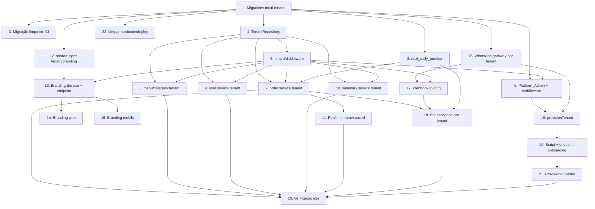

# Implementation Plan

## Overview

Plano incremental para transformar o MVP mono-cliente em white-label multi-tenant, seguindo a ordem de dependências: fundação de dados (migrations multi-tenant) → helper de acesso e resolução de tenant → refatoração do domínio por tenant → realtime namespaced → branding/white-label → WhatsApp por tenant → onboarding → limpeza e verificação. Tarefas marcadas com `*` são opcionais de teste (property-based/unitários) e podem ser executadas junto ou após a tarefa-pai. Cada tarefa referencia os requisitos que satisfaz e, quando aplicável, as Correctness Properties do design.

## Tasks

- [x] 1. Reescrever migrations para schema multi-tenant do zero
  - Substituir os arquivos `001`–`010` em `apps/backend/migrations/` por um conjunto que nasce multi-tenant, criando `tenants` antes de qualquer tabela que a referencie, sem `ALTER TABLE` incrementais nem passos de backfill
  - Criar `001_create_tenants.sql` com a tabela `tenants` (id, business_name com CHECK 1–120, logo_url, theme jsonb, evolution_instance_name UNIQUE, whatsapp_config jsonb, timezone default `America/Sao_Paulo`, status default `ativo` com CHECK, provisioning_key UNIQUE, timestamps) e a tabela `platform_admins`
  - Criar as tabelas escopadas (`users`, `categories`, `menu_items`, `orders`, `order_items`, `daily_sequences`, `whatsapp_sessions`) já com `tenant_id UUID NOT NULL REFERENCES tenants(id) ON DELETE RESTRICT`, incluindo `UNIQUE (id, tenant_id)` onde necessário e FKs compostas (`menu_items→categories`, `order_items→orders`, `orders→users`) para garantir coerência de tenant
  - Ajustar PKs compostas: `daily_sequences (tenant_id, order_date)` e `whatsapp_sessions (tenant_id, phone_number)`
  - Criar índices/uniques compostos por tenant em `009_create_indices.sql` (users lower(email), categories lower(name), menu_items ativo, orders date+number, etc.)
  - Remover o antigo `010_seed_menu.sql` (o cardápio inicial passa a ser dado de onboarding)
  - _Requirements: 1.1, 1.4, 1.5, 1.7, 1.9, 1.11, 1.12, 1.13, 1.14, 2.1, 2.2, 2.3, 2.4_

- [x] 2. Implementar a função `next_daily_number(tenant_id, date)`
  - Criar `010_create_next_daily_number.sql` com `next_daily_number(p_tenant_id UUID, p_date DATE)` usando `INSERT ... ON CONFLICT (tenant_id, order_date) DO UPDATE ... RETURNING`
  - _Requirements: 3.1, 3.3, 3.4, 3.8_

- [x] 2.1 Escrever teste property-based de numeração diária por tenant
  - Provar contadores independentes por tenant/data, reinício em nova data e unicidade sob concorrência (Property 4)
  - _Requirements: 3.2, 3.5, 3.6, 3.7_

- [x] 3. Validar execução limpa das migrations a partir de banco vazio
  - Garantir que `run-migrations.ts` aplica o novo conjunto do zero e produz o schema final sem intervenção manual; adicionar checagem em CI
  - _Requirements: 1.9, 1.10, 1.14_

- [x] 4. Criar o helper centralizado de acesso a dados (`TenantRepository`)
  - Implementar `apps/backend/src/db/tenant-repository.ts` com `tenantRepository(tenantId, client?)` expondo `select`, `findOne`, `insert`, `update`, `delete`, `raw` e `withTransaction`
  - Lançar `MissingTenantContextError` antes de qualquer I/O quando `tenantId` estiver ausente; injetar `tenant_id` em SELECT/INSERT/UPDATE/DELETE; leitura sem correspondência retorna vazio/null (não erro)
  - Restringir o acesso ao `pool` de `config/database.ts` para que services não o importem diretamente
  - _Requirements: 5.1, 5.2, 5.3, 5.4, 5.5, 5.7_

- [x] 4.1 Escrever testes unitários e de arquitetura do `TenantRepository`
  - Verificar injeção de `tenant_id` em cada operação, `MissingTenantContextError` sem contexto (Property 3), e teste de arquitetura garantindo que `src/services/**` não importa `config/database.js`
  - _Requirements: 5.1, 5.6, 5.7_

- [x] 5. Implementar o middleware de resolução de tenant
  - Criar `apps/backend/src/middleware/tenant.middleware.ts` com `TenantContext`, augment de `AuthenticatedRequest` (`tenantId`, `tenantContext`) e a lógica de resolução via JOIN `users`/`tenants`
  - Retornar 401 quando o tenant não é determinável, 403 quando o usuário não tem tenant associado válido, 403 quando o tenant está inativo; anexar `req.tenantId`/`req.tenantContext` no caso de sucesso
  - Encadear o middleware após `auth` e `syncUser` nas rotas de negócio em `index.ts`
  - _Requirements: 4.1, 4.2, 4.3, 4.4, 4.5, 4.6, 4.7_

- [x] 5.1 Escrever testes do middleware de resolução de tenant
  - Cobrir os caminhos 401/403/403 e a propagação de `req.tenantId`
  - _Requirements: 4.2, 4.4, 4.5, 4.7_

- [x] 6. Introduzir papéis Platform_Admin e o middleware de plataforma
  - Criar `platformAdminMiddleware` que consulta `platform_admins`; montar rotas `/api/platform/*` sem o `tenantMiddleware`
  - Garantir 403 para Tenant_Admin/Tenant_User em operações de gestão de tenants e registrar trilha de auditoria nas ações de plataforma
  - _Requirements: 10.1, 10.2, 10.3, 10.4, 10.5, 10.6, 10.7_

- [x] 7. Refatorar `order.service.ts` para escopo de tenant
  - Alterar `getOrders`, `getOrderById`, `createOrder`, `updateOrderStatus`, `registerPayment`, `updateOrderItems`, `deleteOrder` para receber `tenantId` e usar o `TenantRepository`
  - `createOrder` chama `next_daily_number($tenantId, $date)` e insere `tenant_id`; manter o tratamento 23505→409 sobre o índice composto
  - Mapear ausência de linha escopada para 404 (comportamento cross-tenant)
  - Atualizar `order.controller.ts` para repassar `req.tenantId`
  - _Requirements: 3.2, 3.7, 6.1, 6.3, 6.4, 12.1, 12.2, 12.3_

- [x] 7.1 Escrever testes property-based de isolamento de pedidos
  - Provar que o tenant A não lê/altera pedidos do tenant B (Properties 1 e 2) e que transições inválidas retornam 422
  - _Requirements: 6.1, 6.3, 6.4, 12.1, 12.2_

- [x] 8. Refatorar `menu.service.ts` e `category.service.ts` para escopo de tenant
  - Passar `tenantId` e usar o `TenantRepository`; aplicar unicidade composta (categoria por tenant, item ativo por tenant); mapear cross-tenant para 404
  - Atualizar os respectivos controllers
  - _Requirements: 2.2, 2.3, 6.1, 6.3, 6.4, 12.3_

- [x] 9. Refatorar `user.service.ts` para escopo de tenant
  - Passar `tenantId`; aplicar unicidade `(tenant_id, lower(email))`; ajustar `syncUserMiddleware` para associar o usuário ao tenant correto e para a lógica de "primeiro admin" por tenant
  - _Requirements: 2.1, 2.5, 2.6, 4.1, 6.1, 6.3, 6.4, 12.4_

- [x] 10. Refatorar `summary.service.ts` para escopo de tenant
  - Passar `tenantId` para `getDailySummary`/`getMonthlySummary` via `TenantRepository.raw` com placeholder de tenant obrigatório; manter agregação em `America/Sao_Paulo` e o cache por tenant/mês
  - _Requirements: 6.1, 12.5, 12.6_

- [x] 10.1 Escrever testes de isolamento de cardápio, usuários e resumo
  - Cobrir isolamento cross-tenant para menu/categorias/usuários/summary (Property 1)
  - _Requirements: 6.1, 6.3, 6.4_

- [x] 11. Tornar os canais de realtime namespaced por tenant
  - Alterar `config/realtime.ts` para inscrição lazy em `broadcast()` e canais `orders:queue:{tenantId}` / `orders:payment:{tenantId}`; remover a pré-inscrição global fixa de `initRealtimeChannels`
  - Atualizar os callers em `order.service.ts` e `whatsapp.service.ts` para passar o `tenantId`
  - _Requirements: 12.7, 12.8, 12.9_

- [x] 12. Estender `packages/shared` com tipos de tenant e branding
  - Adicionar `Tenant` e `TenantBrandingResponse` (usando `Partial<ThemeConfig>`) e validadores Zod correspondentes
  - _Requirements: 7.1, 7.6_

- [x] 13. Implementar o Branding Service e o endpoint de branding
  - Criar `GET /api/tenant/branding` que lê `tenants` por `req.tenantId` e retorna `businessName`, `logoUrl` e `theme` (merge sobre o tema neutro), respondendo em ≤ 2s
  - _Requirements: 7.1, 7.6, 7.7, 11.3_

- [x] 14. Aplicar branding por tenant no app web
  - Ajustar `apps/web/src/theme/theme.config.ts` para buscar o branding após login e aplicar via ThemeProvider/CSS vars; tornar `defaultTheme` neutro; aplicar neutro em ≤ 1s antes de autenticar; fallback neutro em falha/timeout
  - Remover o nome fixo do `<title>` em `apps/web/index.html`
  - _Requirements: 7.2, 7.3, 7.8, 11.2, 11.5, 11.6, 11.7_

- [x] 15. Aplicar branding por tenant no app mobile
  - Implementar `loadTheme` em `apps/mobile/src/theme/theme.config.ts` (remover o TODO) para buscar o branding do backend após login e aplicar via ThemeProvider antes das telas autenticadas, sem novo build; cache local do último tema; fallback neutro
  - Tornar `defaultTheme` neutro e alterar `name` em `apps/mobile/app.json` para um nome genérico da plataforma
  - _Requirements: 7.2, 7.4, 7.5, 7.8, 11.1, 11.5, 11.7_

- [x] 15.1 Escrever testes de branding (web e mobile)
  - Verificar aplicação do tema do tenant e fallback neutro em falha/timeout (Property 9)
  - _Requirements: 7.8, 11.7_

- [x] 16. Criar a abstração de gateway de WhatsApp por tenant
  - Refatorar `apps/backend/src/bot/evolution-api.client.ts` para resolver a instância/URL a partir do tenant e enviar via o `evolution_instance_name` do tenant por chamada (em vez do `EVOLUTION_INSTANCE_NAME` global)
  - _Requirements: 8.1_

- [x] 17. Rotear o webhook da Evolution para o tenant correto
  - Refatorar `bot/whatsapp.controller.ts` para extrair `instance` do payload e resolver o tenant por `evolution_instance_name`
  - Responder sempre HTTP 200 sem criar dados para instância desconhecida, payload malformado ou erro interno (substituir o retorno 500 atual); processar em background com o `tenantId` resolvido em ≤ 10s
  - _Requirements: 8.2, 8.3, 8.4, 8.5, 8.6_

- [x] 18. Escopar o bot de WhatsApp por tenant
  - Alterar `whatsapp.service.ts` para operar sessões por `(tenant_id, phone_number)`, buscar o cardápio ativo do tenant, e atribuir o pedido do bot a um admin ativo daquele tenant (falhar e registrar indicação se não houver)
  - _Requirements: 8.7, 8.8, 8.9, 8.10, 8.11_

- [x] 18.1 Escrever testes de roteamento e isolamento do WhatsApp
  - Cobrir roteamento por instância, webhook sempre-200 sem efeitos, atribuição ao admin do tenant e isolamento de sessão (Properties 7 e 8)
  - _Requirements: 8.2, 8.3, 8.4, 8.5, 8.8, 8.9, 8.11_

- [x] 19. Implementar o serviço de provisionamento de tenant
  - Criar `apps/backend/src/services/tenant-provision.service.ts` com `provisionTenant(input)` transacional: validar entrada, checar idempotência por `provisioning_key`, inserir `tenants`, semear categorias/itens iniciais parametrizados, criar admin via `supabaseAdmin` + linha em `users`, e provisionar a instância Evolution + webhook; rollback total em falha
  - _Requirements: 9.1, 9.2, 9.3, 9.4, 9.5, 9.6, 9.7, 9.8, 9.9_

- [x] 20. Expor onboarding via script e endpoint de plataforma
  - Criar `scripts/create-tenant.ts` (CLI) e `POST /api/platform/tenants` (protegido por `platformAdminMiddleware`) chamando `provisionTenant`
  - _Requirements: 9.1, 9.5, 10.2_

- [x] 20.1 Escrever testes de onboarding
  - Cobrir rollback em falha (Property 6), idempotência por `provisioning_key` (Property 5) e validação de entrada
  - _Requirements: 9.7, 9.8, 9.9_

- [x] 21. Provisionar a "Pastel das Meninas" como primeiro tenant
  - Adicionar um preset de onboarding com o cardápio da Pastel (substituindo o antigo seed global) e provisioná-la via `provisionTenant`
  - _Requirements: 9.6_

- [x] 22. Limpar valores hardcoded e parametrizar deploy
  - Revisar `docker-compose.yml`/`.env.example`/infra para remover placeholders específicos de cliente (domínio, e-mail de admin) e usar valores genéricos ou parametrizados por variável de ambiente
  - _Requirements: 11.1, 11.2, 11.4_

- [x] 23. Verificação de ponta a ponta multi-tenant
  - Rodar `pnpm test`, `pnpm typecheck` e as migrations em banco limpo; validar dois tenants operando isoladamente (pedidos, menu, resumo, realtime, WhatsApp) sem vazamento
  - _Requirements: 6.1, 6.2, 6.3, 6.4, 6.5, 6.6, 12.7, 12.8_

## Task Dependency Graph



```json
{
  "waves": [
    { "wave": 1, "tasks": ["1"] },
    { "wave": 2, "tasks": ["2", "3", "4", "12", "16", "22"] },
    { "wave": 3, "tasks": ["5", "13"] },
    { "wave": 4, "tasks": ["6", "14", "15", "17"] },
    { "wave": 5, "tasks": ["7", "8", "9", "10", "19"] },
    { "wave": 6, "tasks": ["11", "18", "20"] },
    { "wave": 7, "tasks": ["21"] },
    { "wave": 8, "tasks": ["23"] }
  ]
}
```

## Notes

- Tarefas com `*` (ex.: 2.1, 4.1, 7.1) são testes opcionais property-based/unitários; recomenda-se executá-las junto da tarefa-pai para travar as Correctness Properties do design.
- A tarefa 1 é a fundação: praticamente todas as demais dependem do schema multi-tenant e da tabela `tenants`.
- As tarefas 4 (TenantRepository) e 5 (tenantMiddleware) são pré-requisitos das refatorações de domínio (7–10) — não escopar os services antes de o helper e o middleware existirem.
- Isolamento é validado de forma incremental por recurso (7.1, 10.1) e consolidado na verificação de ponta a ponta (23).
- O caminho de WhatsApp (16→17→18) e o de onboarding (19→20→21) podem prosseguir em paralelo às refatorações de domínio, desde que a tarefa 1 esteja concluída.
