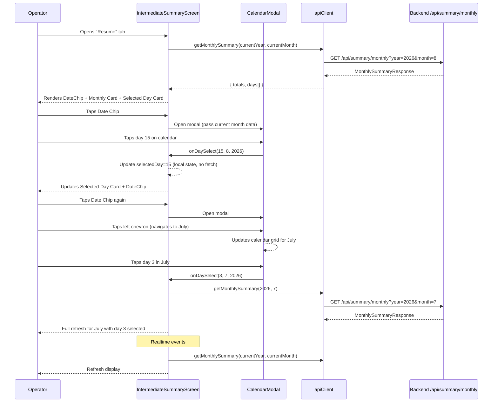

# Design Document: Summary Intermediate Screen (Resumo Financeiro)

## Overview

This feature replaces the existing simple 3-metric intermediate summary screen with a full **financial summary screen** ("Resumo Financeiro"). The new screen provides:

- **Date Chip** — Touchable date display at the top that opens the calendar modal
- **Monthly Summary Card** — Four sub-cards showing accumulated totals (Pedidos, Faturamento, Recebido, Pendente)
- **Selected Day Card** — Per-day stats (orders, revenue, paid ratio) with a CTA to the full summary
- **Calendar Modal** — Full-screen modal overlay containing the Date Selector (month navigation), Legend, and interactive Calendar grid

A new backend endpoint (`GET /api/summary/monthly`) provides monthly totals and per-day breakdowns in a single request. The existing full summary screen ("Resumo Financeiro" detail) remains accessible via the "Ver Resumo Completo" button.

### Key Design Decisions

1. **Single API call per month**: One endpoint returns both monthly accumulators and per-day breakdown, minimizing network round-trips and enabling instant day selection without refetching.
2. **Calendar in modal**: The interactive calendar is contained in a modal overlay rather than inline on the main screen. This keeps the main screen compact and focused on key metrics. The modal opens via a touchable date chip.
3. **Navigation preserved**: Stack navigation within the summary tab group is kept. The intermediate screen is the tab root; the full summary is pushed on top.
4. **Calendar is fully client-rendered**: Given the per-day data from the API, the calendar grid, dots, and selection are pure client-side logic — no additional requests on day tap.
5. **Timezone on server**: All date grouping happens server-side using `America/Sao_Paulo`, ensuring consistency regardless of the client's timezone.
6. **Reuse existing utilities**: `formatPrice` and `computeTotalRevenue` remain applicable. New helpers are added for Portuguese month names and date formatting.

## Architecture

```mermaid
graph TD
    A[Tab Navigator - "Resumo"] --> B[Summary Stack Navigator]
    B --> C[IntermediateSummaryScreen]
    C -->|"Ver Resumo Completo"| D[DailySummaryScreen]
    D -->|Back| C

    C --> E[useRealtime hook]
    C --> F[apiClient.getMonthlySummary]
    E --> G[Supabase Realtime]
    F --> H[Backend GET /api/summary/monthly]

    C --> I[DateChip]
    C --> J[MonthlySummaryCard]
    C --> K[SelectedDayCard]
    C -->|Opens modal| L[CalendarModal]
    L --> M[DateSelector]
    L --> N[CalendarLegend]
    L --> O[CalendarCard]
```

### Navigation Architecture

The existing nested stack structure within the summary tab remains unchanged:

```
app/(tabs)/summary/
├── _layout.tsx         # Stack navigator for summary tab
├── index.tsx           # IntermediateSummaryScreen (rewritten)
└── full-summary.tsx    # DailySummaryScreen (receives date param)
```

### Main Screen Layout (top to bottom)

```
┌─────────────────────────────────┐
│ AppBar: "Resumo Financeiro"     │
├─────────────────────────────────┤
│ Date Chip: "15 de Agosto, 2026" │ ← Touchable, opens Calendar Modal
├─────────────────────────────────┤
│ ScrollView (padding 16, gap 16) │
│ ┌─────────────────────────────┐ │
│ │ Monthly Summary Card        │ │
│ │ "Acumulado em [Mês]"        │ │
│ │ ┌────────┐ ┌────────┐      │ │
│ │ │Pedidos │ │Faturamt│      │ │
│ │ └────────┘ └────────┘      │ │
│ │ ┌────────┐ ┌────────┐      │ │
│ │ │Recebido│ │Pendente│      │ │
│ │ └────────┘ └────────┘      │ │
│ └─────────────────────────────┘ │
│ ┌─────────────────────────────┐ │
│ │ Selected Day Card           │ │
│ │ "15 de Agosto, 2026"        │ │
│ │ Pedidos  Faturamento  Pagos │ │
│ │ [  Ver Resumo Completo    ] │ │
│ └─────────────────────────────┘ │
└─────────────────────────────────┘

### Calendar Modal Layout (overlay)

┌─────────────────────────────────┐
│ Modal backdrop (semi-transparent)│
│ ┌─────────────────────────────┐ │
│ │ Close button (X or tap out) │ │
│ │ Date Selector               │ │
│ │  < Agosto 2026 >            │ │
│ │ Legend (dots row)           │ │
│ │ Calendar Card               │ │
│ │ Dom Seg Ter Qua Qui Sex Sáb │ │
│ │  1   2   3   4   5   6   7  │ │
│ │  ...                         │ │
│ └─────────────────────────────┘ │
└─────────────────────────────────┘
```

## Components and Interfaces

### New Components

#### `IntermediateSummaryScreen` (rewrite)
**Location**: `apps/mobile/src/screens/IntermediateSummaryScreen.tsx`

Complete rewrite. Manages month state, selected day state, data fetching, calendar modal visibility, and composes all sub-components.

**Internal state**:
```typescript
interface ScreenState {
  year: number;
  month: number;           // 1-12
  selectedDay: number;     // 1-31
  monthlySummary: MonthlySummaryResponse | null;
  loading: boolean;
  refreshing: boolean;
  error: string | null;
  calendarModalVisible: boolean;
}
```

#### `CalendarModal`
**Location**: `apps/mobile/src/components/CalendarModal.tsx`

A React Native `Modal` overlay containing the Date Selector, Legend, and Calendar grid. Opened by tapping the Date Chip on the main screen. Closes when a day is selected or when the user taps outside / presses a close button.

**Props**:
```typescript
interface CalendarModalProps {
  visible: boolean;
  year: number;
  month: number;
  selectedDay: number;
  daysWithOrders: number[];
  onDaySelect: (day: number, month: number, year: number) => void;
  onClose: () => void;
}
```

**Behavior**:
- Contains DateSelector at the top for month navigation (local state within modal for browsing months)
- Contains CalendarLegend below the selector
- Contains CalendarCard with interactive day cells
- On day tap: calls `onDaySelect(day, currentModalMonth, currentModalYear)` and auto-closes
- On close without selection: calls `onClose()`, retaining previous selection
- Semi-transparent backdrop (rgba(0,0,0,0.4))

#### `DateChip`
**Location**: `apps/mobile/src/components/DateChip.tsx`

A touchable element displaying the currently selected date, positioned below the AppBar.

**Props**:
```typescript
interface DateChipProps {
  day: number;
  month: number;
  year: number;
  onPress: () => void;
}
```

**Pixel-perfect specs**:
- Touchable container with flexDirection row, alignItems center, gap 6
- Displays formatted date "[dia] de [Mês], [Ano]" (14px, weight 500, color #3D2020)
- Calendar icon "calendar_today" or down-chevron to indicate tappability
- Optional subtle background/border to indicate interactivity

#### `MonthlySummaryCard`
**Location**: `apps/mobile/src/components/MonthlySummaryCard.tsx`

Displays "Acumulado em [Mês]" title and four sub-cards in a 2×2 grid.

**Props**:
```typescript
interface MonthlySummaryCardProps {
  monthName: string;       // Portuguese month name
  totalOrders: number;
  totalRevenue: number;    // cents
  totalReceived: number;   // cents
  totalPending: number;    // cents
}
```

**Pixel-perfect specs**:
- Card: white bg, borderRadius 12, padding 14, column gap 12
- Sub-cards container: 2 rows, each row is flexDirection row, gap 10
- Each sub-card: borderRadius 10, padding 10h/12v, height 60, flex 1 (fill)
- Icon wrap: 34×34, borderRadius 17, bg = statusColor@12%
- Value: 15px weight 600, color = statusColor
- Label: 10px weight 400, color #8B6B5A

#### `SelectedDayCard`
**Location**: `apps/mobile/src/components/SelectedDayCard.tsx`

Displays selected day's summary and navigation button.

**Props**:
```typescript
interface SelectedDayCardProps {
  date: Date;
  orderCount: number;
  revenue: number;         // cents
  paidOrders: number;
  totalOrders: number;
  onViewFullSummary: () => void;
}
```

**Pixel-perfect specs**:
- Card: bg rgba(123,45,45,0.06), borderRadius 12, paddingHorizontal 14, paddingVertical 16, gap 8
- Date text: 14px weight 500 color #3D2020
- Stats row: flexDirection row, justifyContent space-between (evenly distributed)
- Stat value: 20px weight 500, color per type (#7B2D2D for pedidos/faturamento, #2E7D32 for pagos)
- Stat label: 11px weight 400, color #8B6B5A
- Button: bg #7B2D2D, borderRadius 18, height 36, text 13px weight 400 white, full width (alignSelf stretch)

#### `CalendarCard`
**Location**: `apps/mobile/src/components/CalendarCard.tsx`

Interactive monthly calendar grid. Rendered inside the CalendarModal.

**Props**:
```typescript
interface CalendarCardProps {
  year: number;
  month: number;           // 1-12
  selectedDay: number;
  daysWithOrders: number[]; // day numbers that have orders
  onDayPress: (day: number) => void;
}
```

**Pixel-perfect specs**:
- Card: white bg, borderRadius 12, padding 12, column gap 4
- Weekday headers: "Dom Seg Ter Qua Qui Sex Sáb"
- Day cell: height 40, flexDirection column, alignItems center, justifyContent flex-start (start)
- Day number: 14px weight 400 color #3D2020
- Order dot: 6px circle, color #D4812B (amber)
- Selected dot: 6px circle, color #831515 (dark red)
- Cells for adjacent months: empty (no text, no dots)

#### `DateSelector`
**Location**: `apps/mobile/src/components/DateSelector.tsx`

Month navigation with chevrons. Rendered inside the CalendarModal.

**Props**:
```typescript
interface DateSelectorProps {
  year: number;
  month: number;
  onPrevious: () => void;
  onNext: () => void;
}
```

**Pixel-perfect specs**:
- Container: flexDirection row, alignItems center, justifyContent center
- Chevrons: 24px, color #7B2D2D (Material Icons "chevron_left" / "chevron_right")
- Month text: 16px weight 500 color #3D2020, centered between chevrons

#### `CalendarLegend`
**Location**: `apps/mobile/src/components/CalendarLegend.tsx`

Row of colored dot indicators. Rendered inside the CalendarModal.

**Props**: None (static component)

**Pixel-perfect specs**:
- Container: flexDirection row, gap 16, alignItems center
- Each item: flexDirection row, gap 6, alignItems center
- Dots: 6px circle
- Amber dot (#D4812B): "Dia com pedidos"
- Dark red dot (#831515): "Dia selecionado"
- Text: 11px weight 400, color #8B6B5A

### Modified Components / Files

#### `apps/mobile/src/services/types.ts` — ApiClient interface
Add new method:
```typescript
getMonthlySummary(year: number, month: number): Promise<MonthlySummaryResponse>;
```

#### `apps/mobile/src/services/real-client.ts`
Add `getMonthlySummary` implementation calling `GET /api/summary/monthly?year=X&month=Y`.

#### `packages/shared/src/types/summary.ts`
Add new shared type:
```typescript
export interface MonthlySummaryResponse {
  year: number;
  month: number;
  totals: {
    totalOrders: number;
    totalRevenue: number;   // cents (paid + pending)
    totalReceived: number;  // cents (paid only)
    totalPending: number;   // cents
  };
  days: DayBreakdown[];
}

export interface DayBreakdown {
  day: number;              // 1-31
  orderCount: number;
  revenue: number;          // cents
  paidOrders: number;
}
```

#### `apps/backend/src/controllers/summary.controller.ts`
Add `getMonthlySummary` handler.

#### `apps/backend/src/routes/summary.routes.ts`
Add route: `GET /monthly` with authMiddleware + syncUserMiddleware.

### Utility Functions

#### Existing (reused as-is)
- `formatPrice(priceInCentavos: number): string` — formats cents to "R$ X,XX"
- `computeTotalRevenue(summary: DailySummary): number` — paid + pending

#### New utilities in `apps/mobile/src/utils/format.ts`

```typescript
const PORTUGUESE_MONTHS = [
  'Janeiro', 'Fevereiro', 'Março', 'Abril', 'Maio', 'Junho',
  'Julho', 'Agosto', 'Setembro', 'Outubro', 'Novembro', 'Dezembro',
];

/** Returns Portuguese month name for 1-based month number */
export function getPortugueseMonthName(month: number): string {
  return PORTUGUESE_MONTHS[month - 1];
}

/** Formats date as "[dia] de [Mês], [Ano]" e.g. "15 de Agosto, 2026" */
export function formatSelectedDate(day: number, month: number, year: number): string {
  return `${day} de ${getPortugueseMonthName(month)}, ${year}`;
}
```

#### New utility in `apps/mobile/src/utils/calendar.ts`

```typescript
/** Returns the number of days in a given month (1-based) */
export function getDaysInMonth(year: number, month: number): number {
  return new Date(year, month, 0).getDate();
}

/** Returns the weekday index (0=Sunday) of the first day of the month */
export function getFirstDayOfMonth(year: number, month: number): number {
  return new Date(year, month - 1, 1).getDay();
}

/**
 * Given per-day breakdown, returns the default selected day:
 * first day with orders, or 1 if no orders exist.
 */
export function getDefaultSelectedDay(days: DayBreakdown[]): number {
  if (days.length === 0) return 1;
  const sorted = [...days].sort((a, b) => a.day - b.day);
  return sorted[0].day;
}

/** Generates calendar grid rows for a given month */
export function generateCalendarGrid(year: number, month: number): (number | null)[][] {
  const daysInMonth = getDaysInMonth(year, month);
  const firstWeekday = getFirstDayOfMonth(year, month);
  const rows: (number | null)[][] = [];
  let currentDay = 1;

  for (let week = 0; week < 6; week++) {
    const row: (number | null)[] = [];
    for (let dow = 0; dow < 7; dow++) {
      if (week === 0 && dow < firstWeekday) {
        row.push(null);
      } else if (currentDay > daysInMonth) {
        row.push(null);
      } else {
        row.push(currentDay);
        currentDay++;
      }
    }
    rows.push(row);
    if (currentDay > daysInMonth) break;
  }
  return rows;
}
```

## Data Models

### New Shared Types

```typescript
// packages/shared/src/types/summary.ts (additions)

export interface MonthlySummaryResponse {
  year: number;
  month: number;
  totals: {
    totalOrders: number;
    totalRevenue: number;   // cents (paid + pending)
    totalReceived: number;  // cents (paid only)
    totalPending: number;   // cents
  };
  days: DayBreakdown[];
}

export interface DayBreakdown {
  day: number;              // 1-31
  orderCount: number;
  revenue: number;          // cents (paid + pending)
  paidOrders: number;
}
```

### Backend SQL Query

```sql
-- Monthly aggregation (totals)
SELECT
  COUNT(*)::int AS total_orders,
  COALESCE(SUM(total_amount_cents), 0)::bigint AS total_revenue,
  COALESCE(SUM(total_amount_cents) FILTER (WHERE payment_status = 'pago'), 0)::bigint AS total_received,
  COALESCE(SUM(total_amount_cents) FILTER (WHERE payment_status = 'pendente'), 0)::bigint AS total_pending
FROM orders
WHERE order_date >= $1 AND order_date <= $2;

-- Per-day breakdown
SELECT
  EXTRACT(DAY FROM order_date)::int AS day,
  COUNT(*)::int AS order_count,
  COALESCE(SUM(total_amount_cents), 0)::bigint AS revenue,
  COUNT(*) FILTER (WHERE payment_status = 'pago')::int AS paid_orders
FROM orders
WHERE order_date >= $1 AND order_date <= $2
GROUP BY EXTRACT(DAY FROM order_date)
ORDER BY day;
```

### Data Flow



## Correctness Properties

*A property is a characteristic or behavior that should hold true across all valid executions of a system — essentially, a formal statement about what the system should do. Properties serve as the bridge between human-readable specifications and machine-verifiable correctness guarantees.*

### Property 1: Monthly Summary Card displays correct computed values

*For any* valid `MonthlySummaryResponse` with non-negative totals, the Monthly Summary Card SHALL display: Pedidos = `totals.totalOrders` (as integer), Faturamento = `formatPrice(totals.totalRevenue)`, Recebido = `formatPrice(totals.totalReceived)`, Pendente = `formatPrice(totals.totalPending)`, and the title SHALL contain the correct Portuguese month name for the given month number.

**Validates: Requirements 2.1, 2.2, 2.3, 2.4, 2.5**

### Property 2: Selected Day Card displays correct derived values

*For any* valid date (day, month, year) and day summary data, the Selected Day Card SHALL display: the date formatted as "[day] de [MonthName], [year]", Pedidos = orderCount, Faturamento = `formatPrice(revenue)`, and Pagos = "[paidOrders]/[totalOrders]".

**Validates: Requirements 3.1, 3.2**

### Property 3: Calendar grid generation correctness

*For any* valid year (1970–2100) and month (1–12), the generated calendar grid SHALL: (a) contain only day numbers within [1, daysInMonth] or null for empty cells, (b) place day 1 at the correct weekday column index, and (c) produce between 4 and 6 rows.

**Validates: Requirements 6.1, 6.6**

### Property 4: Order indicator dots match per-day breakdown

*For any* per-day breakdown array and rendered calendar, the set of days displaying an Order_Indicator_Dot SHALL be exactly equal to the set of day numbers present in the breakdown array.

**Validates: Requirements 6.3**

### Property 5: Default day selection algorithm

*For any* per-day breakdown array, `getDefaultSelectedDay` SHALL return the smallest day number present in the array, or 1 if the array is empty.

**Validates: Requirements 5.4, 3.6**

### Property 6: Monthly API aggregation correctness

*For any* set of orders within a given month, the `/api/summary/monthly` endpoint SHALL return: `totals.totalOrders` = count of all orders, `totals.totalRevenue` = sum of all `total_amount_cents`, `totals.totalReceived` = sum of `total_amount_cents` where `payment_status = 'pago'`, `totals.totalPending` = sum of `total_amount_cents` where `payment_status = 'pendente'`, and each entry in `days[]` SHALL have the correct count and sum for orders on that specific day.

**Validates: Requirements 7.2, 7.3**

### Property 7: Timezone date attribution

*For any* order created near a day boundary, the `/api/summary/monthly` endpoint SHALL attribute it to the correct date in the `America/Sao_Paulo` timezone, not UTC.

**Validates: Requirements 7.5**

## Error Handling

| Scenario | Behavior |
|----------|----------|
| Initial fetch in progress | Display `ActivityIndicator` centered with "Carregando..." text |
| Fetch fails (network error, 401, 500) | Display error message + "Tentar novamente" button |
| Retry pressed | Re-execute `getMonthlySummary()`, show loading state |
| Pull-to-refresh | Show RefreshControl spinner, re-fetch current month |
| Realtime event while error state | Attempt silent re-fetch |
| Invalid month/year params (API) | Return HTTP 400 with `{ error: "INVALID_PARAMS", message: "..." }` |
| Month with no orders | Show Monthly Card with all zeros, empty calendar (no dots), Selected Day Card shows zeros for day 1 |
| Day with no orders selected | Show zeros in Selected Day Card; "Ver Resumo Completo" still navigable |

### Error Recovery

- On retry, the screen transitions back to loading state and retries the fetch
- Realtime events continue to trigger re-fetches even after an error, allowing passive recovery
- Pull-to-refresh is always available regardless of current state (error or success)
- Month navigation while in error state triggers a fresh fetch for the new month

## Testing Strategy

### Property-Based Tests (fast-check)

The feature uses `fast-check` (already a devDependency) for property-based testing of pure functions and API logic.

**Configuration**: Minimum 100 iterations per property test.
**Tag format**: `Feature: summary-intermediate-screen, Property {N}: {description}`

#### Frontend property tests (`apps/mobile/src/__tests__/properties/`)

| Property | What's tested | Generator |
|----------|---------------|-----------|
| P1 | MonthlySummaryCard renders correct values | Random MonthlySummaryResponse objects |
| P2 | SelectedDayCard renders correct derived values | Random (day, month, year, dayData) tuples |
| P3 | `generateCalendarGrid` correctness | Random (year, month) in valid ranges |
| P4 | Order dots match days array | Random daysWithOrders arrays + month |
| P5 | `getDefaultSelectedDay` algorithm | Random DayBreakdown arrays (including empty) |

#### Backend property tests (`apps/backend/src/__tests__/properties/`)

| Property | What's tested | Generator |
|----------|---------------|-----------|
| P6 | Monthly aggregation endpoint logic | Random order sets with varying dates, amounts, payment statuses |
| P7 | Timezone attribution | Orders near midnight boundaries with São Paulo offset |

### Unit Tests (Jest + React Testing Library)

Example-based tests covering:

1. **AppBar rendering**: Title "Resumo Financeiro" and back arrow present
2. **Navigation**: Back arrow navigates back; "Ver Resumo Completo" pushes full summary with date
3. **Month navigation**: Left/right chevrons decrement/increment month, wrap at year boundaries
4. **Day selection**: Tapping a calendar day updates Selected Day Card
5. **Default selection**: On mount, current day is selected; on month change, first day with orders
6. **Realtime refresh**: Events on `orders:queue` and `orders:payment` trigger refetch
7. **Pull-to-refresh**: Triggers data refetch for current month
8. **Loading state**: Shows ActivityIndicator during fetch
9. **Error state**: Shows error message and "Tentar novamente" button
10. **Retry**: Pressing retry re-fetches data
11. **Empty month**: All zeros displayed gracefully
12. **API validation**: 400 for missing/invalid year or month params
13. **API auth**: 401 without token

### Test File Structure

```
apps/mobile/src/__tests__/
├── properties/
│   ├── monthly-summary-card.property.test.ts
│   ├── selected-day-card.property.test.ts
│   ├── calendar-grid.property.test.ts
│   └── default-day-selection.property.test.ts
└── unit/
    └── intermediate-summary-screen.test.tsx

apps/backend/src/__tests__/
├── properties/
│   ├── summary-monthly-aggregation.property.test.ts
│   └── summary-timezone.property.test.ts
└── unit/
    └── summary-monthly-controller.test.ts
```
