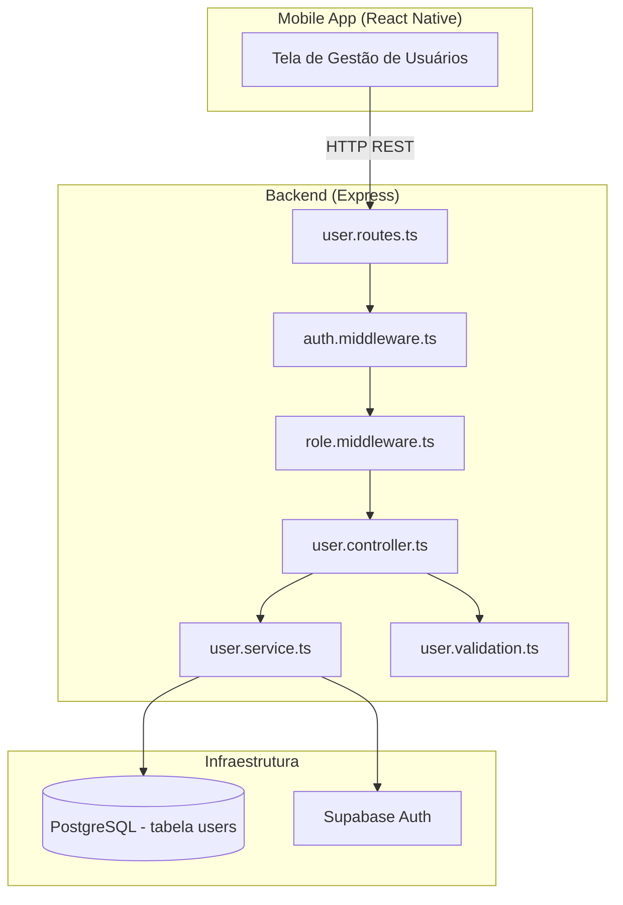
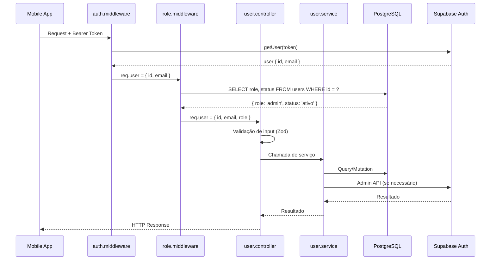
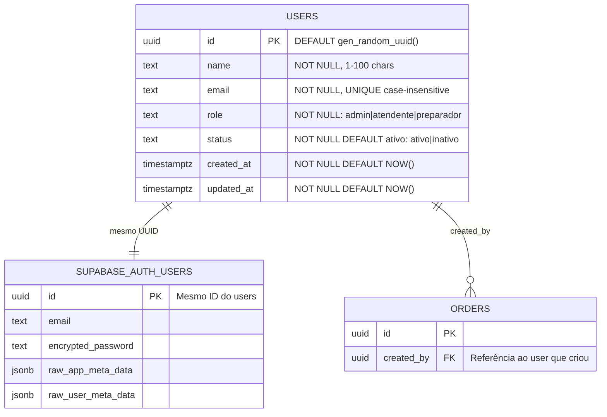
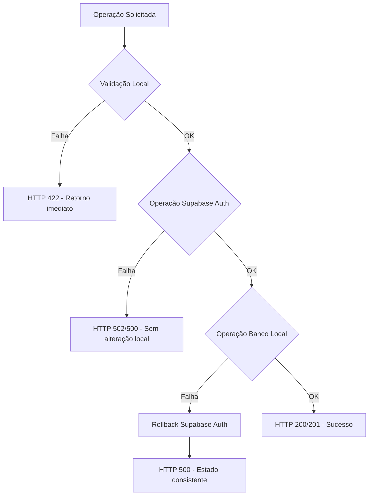

# Design Document: User CRUD

## Overview

Este documento descreve o design técnico para o módulo de CRUD de usuários do sistema de pedidos. O módulo permite que administradores criem, listem, editem, desativem/reativem e excluam usuários do sistema, além de redefinir senhas. A implementação se integra com o Supabase Auth existente para gerenciamento de credenciais e sessões, e utiliza a tabela `users` do PostgreSQL para dados de domínio.

### Decisões Técnicas Principais

1. **Duas fontes de verdade coordenadas**: Supabase Auth gerencia credenciais/tokens; tabela `users` gerencia dados de negócio (role, status, nome).
2. **Verificação de role em tempo real**: O middleware consulta a role no banco a cada requisição (não confia apenas no token JWT).
3. **Validação com Zod**: Segue o padrão existente do projeto para validação de input.
4. **Transações para consistência**: Operações que alteram ambos Supabase Auth e tabela local usam rollback manual em caso de falha parcial.
5. **Soft delete via status `inativo`** para preservar histórico; hard delete disponível para usuários sem pedidos associados.

---

## Architecture

### Diagrama de Componentes



### Fluxo de Requisição



---

## Components and Interfaces

### 1. Rotas (`src/routes/user.routes.ts`)

```typescript
// POST   /api/users           → createUser
// GET    /api/users           → listUsers
// GET    /api/users/:id       → getUserById
// PUT    /api/users/:id       → updateUser
// PATCH  /api/users/:id/status → toggleUserStatus (desativar/reativar)
// DELETE /api/users/:id       → deleteUser
// PATCH  /api/users/:id/password → resetPassword
```

Todas as rotas usam `authMiddleware` + `adminMiddleware`.

### 2. Middleware de Role (`src/middleware/role.middleware.ts`)

```typescript
export interface AuthenticatedUserWithRole {
  id: string;
  email: string;
  role: 'admin' | 'atendente' | 'preparador';
}

export interface AdminRequest extends Request {
  user?: AuthenticatedUserWithRole;
}

/**
 * Middleware que verifica a role do usuário no banco de dados.
 * - Consulta a tabela users pelo id do token.
 * - Se usuário não existir no banco: 401 (sessão inválida).
 * - Se usuário inativo: 403 (desativado).
 * - Se role != 'admin': 403 (acesso restrito).
 * - Enriquece req.user com role.
 */
export async function adminMiddleware(
  req: AdminRequest,
  res: Response,
  next: NextFunction
): Promise<void>;
```

### 3. Controller (`src/controllers/user.controller.ts`)

Responsável por:
- Extrair e validar input da requisição via Zod schemas
- Chamar a camada de serviço
- Mapear resultados para respostas HTTP padronizadas

**Assinaturas:**

```typescript
export async function createUser(req: AdminRequest, res: Response): Promise<void>;
export async function listUsers(req: AdminRequest, res: Response): Promise<void>;
export async function getUserById(req: AdminRequest, res: Response): Promise<void>;
export async function updateUser(req: AdminRequest, res: Response): Promise<void>;
export async function toggleUserStatus(req: AdminRequest, res: Response): Promise<void>;
export async function deleteUser(req: AdminRequest, res: Response): Promise<void>;
export async function resetPassword(req: AdminRequest, res: Response): Promise<void>;
```

### 4. Service (`src/services/user.service.ts`)

Camada de lógica de negócio que coordena operações entre PostgreSQL e Supabase Auth.

```typescript
export interface CreateUserInput {
  name: string;
  email: string;
  password: string;
  role: 'admin' | 'atendente' | 'preparador';
}

export interface UpdateUserInput {
  name?: string;
  email?: string;
  role?: 'admin' | 'atendente' | 'preparador';
}

export interface UserRecord {
  id: string;
  name: string;
  email: string;
  role: 'admin' | 'atendente' | 'preparador';
  status: 'ativo' | 'inativo';
  created_at: string;
  updated_at: string;
}

export interface ListUsersFilters {
  role?: 'admin' | 'atendente' | 'preparador';
  status?: 'ativo' | 'inativo';
}

export async function createUser(input: CreateUserInput): Promise<UserRecord>;
export async function listUsers(filters: ListUsersFilters): Promise<UserRecord[]>;
export async function getUserById(id: string): Promise<UserRecord | null>;
export async function updateUser(id: string, input: UpdateUserInput, requesterId: string): Promise<UserRecord>;
export async function deactivateUser(id: string, requesterId: string): Promise<UserRecord>;
export async function activateUser(id: string): Promise<UserRecord>;
export async function deleteUser(id: string, requesterId: string): Promise<void>;
export async function resetPassword(id: string, newPassword: string): Promise<void>;
```

### 5. Validação (`src/validation/user.validation.ts`)

```typescript
import { z } from 'zod';

export const roleSchema = z.enum(['admin', 'atendente', 'preparador']);

export const createUserSchema = z.object({
  name: z.string()
    .min(1, 'Nome deve ter entre 1 e 100 caracteres')
    .max(100, 'Nome deve ter entre 1 e 100 caracteres')
    .refine(s => s.trim().length > 0, 'Nome deve ter entre 1 e 100 caracteres'),
  email: z.string()
    .max(254, 'Formato de e-mail inválido')
    .email('Formato de e-mail inválido'),
  password: z.string()
    .min(8, 'A senha deve ter entre 8 e 72 caracteres')
    .max(72, 'A senha deve ter entre 8 e 72 caracteres'),
  role: roleSchema,
});

export const updateUserSchema = z.object({
  name: z.string()
    .min(1, 'Nome deve ter entre 1 e 100 caracteres')
    .max(100, 'Nome deve ter entre 1 e 100 caracteres')
    .refine(s => s.trim().length > 0, 'Nome deve ter entre 1 e 100 caracteres')
    .optional(),
  email: z.string()
    .max(254, 'Formato de e-mail inválido')
    .email('Formato de e-mail inválido')
    .optional(),
  role: roleSchema.optional(),
}).refine(data => Object.keys(data).length > 0, 'Pelo menos um campo deve ser informado');

export const resetPasswordSchema = z.object({
  password: z.string()
    .min(8, 'A senha deve ter entre 8 e 72 caracteres')
    .max(72, 'A senha deve ter entre 8 e 72 caracteres'),
});

export const toggleStatusSchema = z.object({
  status: z.enum(['ativo', 'inativo']),
});
```

---

## Data Models

### Migração: Alteração da tabela `users`

A tabela existente precisa ser evoluída para suportar os novos requisitos:

```sql
-- Migration 011: Evolve users table for CRUD
ALTER TABLE users ADD COLUMN IF NOT EXISTS name TEXT;
ALTER TABLE users ADD COLUMN IF NOT EXISTS status TEXT NOT NULL DEFAULT 'ativo'
  CHECK (status IN ('ativo', 'inativo'));
ALTER TABLE users ADD COLUMN IF NOT EXISTS updated_at TIMESTAMPTZ NOT NULL DEFAULT NOW();

-- Adicionar role 'admin' ao CHECK constraint existente
ALTER TABLE users DROP CONSTRAINT IF EXISTS users_role_check;
ALTER TABLE users ADD CONSTRAINT users_role_check
  CHECK (role IN ('admin', 'atendente', 'preparador'));

-- Remover coluna encrypted_password (credenciais ficam no Supabase Auth)
ALTER TABLE users DROP COLUMN IF EXISTS encrypted_password;

-- Índice para busca case-insensitive de email
CREATE UNIQUE INDEX IF NOT EXISTS users_email_lower_idx ON users (LOWER(email));

-- Índice para filtro por role e status
CREATE INDEX IF NOT EXISTS users_role_status_idx ON users (role, status);
```

### Modelo de Domínio



### Formato de Resposta da API

```typescript
// Resposta de usuário individual
interface UserResponse {
  id: string;
  name: string;
  email: string;
  role: 'admin' | 'atendente' | 'preparador';
  status: 'ativo' | 'inativo';
  createdAt: string;  // ISO 8601
  updatedAt: string;  // ISO 8601
}

// Resposta de listagem
interface ListUsersResponse {
  users: UserResponse[];
  total: number;
}

// Resposta de erro
interface ErrorResponse {
  statusCode: number;
  error: string;     // Código: VALIDATION_ERROR, CONFLICT, FORBIDDEN, NOT_FOUND, etc.
  message: string;   // Mensagem descritiva em português
}
```

---


## Correctness Properties

*Uma propriedade é uma característica ou comportamento que deve ser verdadeiro em todas as execuções válidas de um sistema — essencialmente, uma declaração formal sobre o que o sistema deve fazer. Propriedades servem como ponte entre especificações legíveis por humanos e garantias de corretude verificáveis por máquina.*

### Property 1: Criação preserva dados de entrada e define status ativo

*Para qualquer* nome válido (1–100 caracteres, não composto apenas por espaços), e-mail válido (RFC 5322, ≤254 chars), senha válida (8–72 chars) e role válida (admin|atendente|preparador), a criação de um usuário deve retornar um registro com os mesmos valores de nome, email e role fornecidos, e com status='ativo'.

**Validates: Requirements 1.1**

### Property 2: Unicidade de e-mail case-insensitive

*Para quaisquer* dois e-mails que diferem apenas em capitalização (ex: "User@Email.com" e "user@email.com"), o sistema deve rejeitar a criação ou atualização que resulte em duplicidade, independentemente da ordem das operações.

**Validates: Requirements 1.2, 3.2**

### Property 3: Nomes compostos apenas por espaços são rejeitados

*Para qualquer* string composta inteiramente por caracteres de espaço em branco (espaços, tabs, newlines), a criação ou atualização de usuário deve ser rejeitada com erro de validação.

**Validates: Requirements 1.6, 3.8**

### Property 4: Usuários não-admin são bloqueados em endpoints de gestão

*Para qualquer* usuário autenticado com role `atendente` ou `preparador`, todas as requisições a endpoints de gestão de usuários devem ser rejeitadas com HTTP 403.

**Validates: Requirements 1.8, 6.1**

### Property 5: Campos obrigatórios ausentes são identificados na rejeição

*Para qualquer* subconjunto não-vazio de campos obrigatórios omitidos do body da requisição de criação, a resposta de erro deve listar os nomes dos campos ausentes.

**Validates: Requirements 1.9**

### Property 6: Listagem retorna todos os usuários com campos obrigatórios

*Para qualquer* conjunto de usuários cadastrados no sistema, a listagem deve retornar todos eles, e cada registro deve conter id, nome, e-mail, role e status.

**Validates: Requirements 2.1**

### Property 7: Listagem ordenada alfabeticamente por nome (case-insensitive)

*Para qualquer* conjunto de usuários retornado pela listagem, a sequência de nomes deve estar em ordem alfabética crescente utilizando comparação case-insensitive.

**Validates: Requirements 2.2**

### Property 8: Filtro por role retorna apenas usuários correspondentes

*Para qualquer* filtro de role aplicado e qualquer conjunto de usuários no banco, todos os usuários retornados devem possuir exatamente a role filtrada, e nenhum usuário com a role filtrada deve ser omitido.

**Validates: Requirements 2.4**

### Property 9: Filtro por status retorna apenas usuários correspondentes

*Para qualquer* filtro de status aplicado e qualquer conjunto de usuários no banco, todos os usuários retornados devem possuir exatamente o status filtrado.

**Validates: Requirements 2.5**

### Property 10: Atualização modifica apenas os campos fornecidos

*Para qualquer* conjunto parcial de campos válidos (nome, email, role) enviados na atualização, apenas esses campos devem ser alterados no registro; os demais campos devem permanecer inalterados.

**Validates: Requirements 3.1**

### Property 11: Invariante de pelo menos um admin ativo

*Para qualquer* operação que resultaria na ausência de usuários com role `admin` e status `ativo` no sistema (alteração de role, desativação ou exclusão do último admin ativo), o sistema deve rejeitar a operação.

**Validates: Requirements 3.5, 4.4, 5.2**

### Property 12: Round-trip desativação/reativação restaura status ativo

*Para qualquer* usuário com status `ativo`, desativá-lo e em seguida reativá-lo deve resultar em um registro com status `ativo` idêntico ao original (exceto updated_at).

**Validates: Requirements 4.1, 4.2**

### Property 13: Usuário inativo não pode autenticar

*Para qualquer* usuário com status `inativo`, tentativas de login devem ser rejeitadas com HTTP 403, independentemente de as credenciais estarem corretas.

**Validates: Requirements 4.3**

### Property 14: Exclusão remove usuário completamente

*Para qualquer* usuário sem pedidos associados, após a exclusão confirmada, o usuário não deve existir na tabela de usuários nem no Supabase Auth.

**Validates: Requirements 5.1**

### Property 15: Usuários com pedidos não podem ser excluídos

*Para qualquer* usuário que possui ao menos um pedido associado no histórico, a tentativa de exclusão deve ser rejeitada com HTTP 422.

**Validates: Requirements 5.5**

### Property 16: Reset de senha aceita qualquer senha de comprimento válido

*Para qualquer* string com comprimento entre 8 e 72 caracteres (inclusive), o reset de senha deve ser aceito e processado com sucesso.

**Validates: Requirements 7.1**

---

## Error Handling

### Estratégia de Rollback

Para operações que envolvem Supabase Auth + tabela local:

```typescript
// Padrão: criar no Supabase Auth primeiro, depois persistir localmente
async function createUser(input: CreateUserInput): Promise<UserRecord> {
  // 1. Criar no Supabase Auth
  const { data: authUser, error: authError } = await supabaseAdmin.auth.admin.createUser({
    email: input.email,
    password: input.password,
    email_confirm: true,
  });
  
  if (authError) throw new ExternalServiceError('Falha na criação do usuário', 502);

  try {
    // 2. Persistir no banco local
    const user = await pool.query(
      `INSERT INTO users (id, name, email, role, status) VALUES ($1, $2, $3, $4, 'ativo') RETURNING *`,
      [authUser.user.id, input.name, input.email.toLowerCase(), input.role]
    );
    return mapToUserRecord(user.rows[0]);
  } catch (dbError) {
    // 3. Rollback: remover do Supabase Auth
    await supabaseAdmin.auth.admin.deleteUser(authUser.user.id);
    throw new InternalError('Erro ao criar usuário');
  }
}
```

### Códigos de Erro Padronizados

| Código HTTP | Erro | Cenário |
|---|---|---|
| 401 | UNAUTHORIZED | Token ausente, inválido ou usuário excluído |
| 403 | FORBIDDEN | Role insuficiente ou usuário inativo |
| 404 | NOT_FOUND | Usuário não encontrado |
| 409 | CONFLICT | E-mail já cadastrado |
| 422 | VALIDATION_ERROR | Dados inválidos, último admin, auto-operação |
| 500 | INTERNAL_ERROR | Erro interno, falha em rollback |
| 502 | BAD_GATEWAY | Supabase Auth indisponível |

### Tratamento de Falhas Parciais



---

## Testing Strategy

### Abordagem Dual

O projeto já utiliza **fast-check** para testes baseados em propriedades e **vitest** como runner. Manteremos essa abordagem:

- **Testes de Propriedade (PBT)**: Validam propriedades universais com 100+ iterações usando fast-check
- **Testes Unitários**: Validam exemplos específicos, edge cases e cenários de erro com mocks
- **Testes de Integração**: Validam fluxos completos contra banco real (opcional, via Docker)

### Biblioteca de Property-Based Testing

- **fast-check** v4.9+ (já instalada no projeto)
- Mínimo de 100 iterações por propriedade (`{ numRuns: 100 }`)
- Cada teste de propriedade referencia o design property correspondente

### Estrutura de Arquivos de Teste

```
src/__tests__/
  properties/
    user-creation.property.test.ts    → Properties 1, 2, 3, 5
    user-listing.property.test.ts     → Properties 6, 7, 8, 9
    user-update.property.test.ts      → Properties 10, 11
    user-status.property.test.ts      → Properties 12, 13
    user-deletion.property.test.ts    → Properties 14, 15
    user-access.property.test.ts      → Property 4
    user-password.property.test.ts    → Property 16
  unit/
    user-controller.test.ts           → Edge cases, error handling, mocks
    role-middleware.test.ts            → Middleware behavior
    user-validation.test.ts           → Zod schema edge cases
```

### Tag Format

Cada teste de propriedade será identificado com:
```typescript
/**
 * Feature: user-crud, Property {N}: {título da propriedade}
 * Validates: Requirements X.Y
 */
```

### Generators Reutilizáveis

```typescript
// Generators para o domínio de usuários
const validName = fc.string({ minLength: 1, maxLength: 100 })
  .filter(s => s.trim().length > 0);

const validEmail = fc.emailAddress()
  .filter(e => e.length <= 254);

const validPassword = fc.string({ minLength: 8, maxLength: 72 });

const validRole = fc.constantFrom('admin', 'atendente', 'preparador');

const invalidRole = fc.string({ minLength: 1, maxLength: 50 })
  .filter(s => !['admin', 'atendente', 'preparador'].includes(s));

const whitespaceOnlyName = fc.stringOf(
  fc.constantFrom(' ', '\t', '\n', '\r'),
  { minLength: 1, maxLength: 100 }
);
```

### Cobertura de Testes por Requisito

| Requisito | Property Tests | Unit Tests |
|---|---|---|
| Req 1 (Criação) | Properties 1, 2, 3, 4, 5 | Rollback Supabase, edge cases |
| Req 2 (Listagem) | Properties 6, 7, 8, 9 | Empty list, error states |
| Req 3 (Edição) | Properties 2, 3, 10, 11 | Rollback, not found |
| Req 4 (Desativação) | Properties 11, 12, 13 | Self-deactivation, idempotence |
| Req 5 (Exclusão) | Properties 11, 14, 15 | Rollback, self-deletion |
| Req 6 (Acesso) | Property 4 | Token expirado, user excluído |
| Req 7 (Senha) | Property 16 | Supabase failure, not found |
